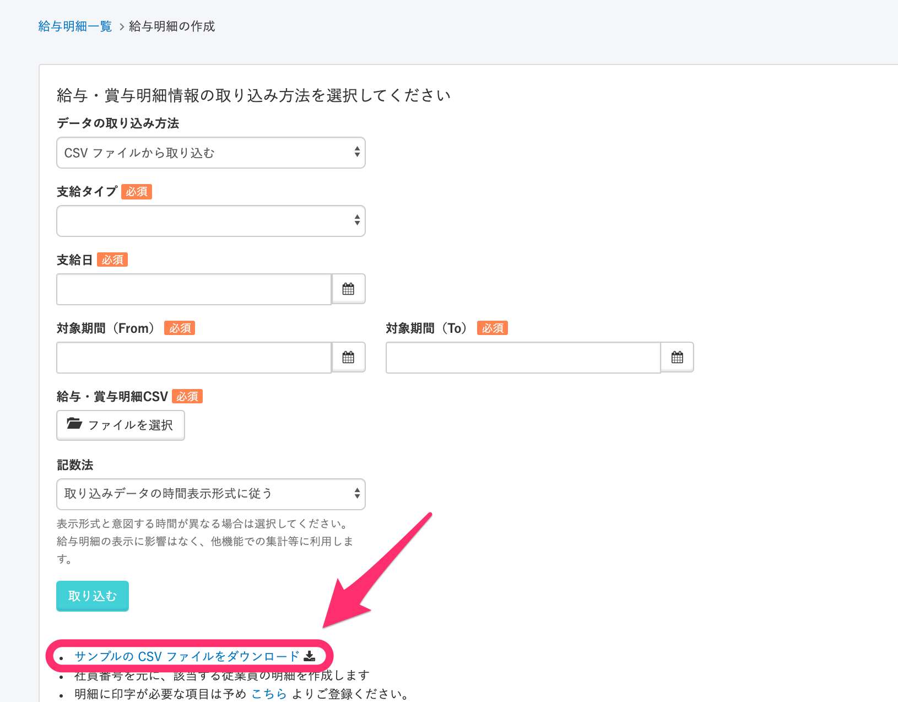
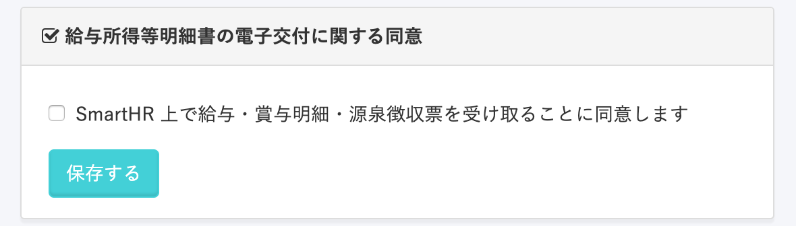
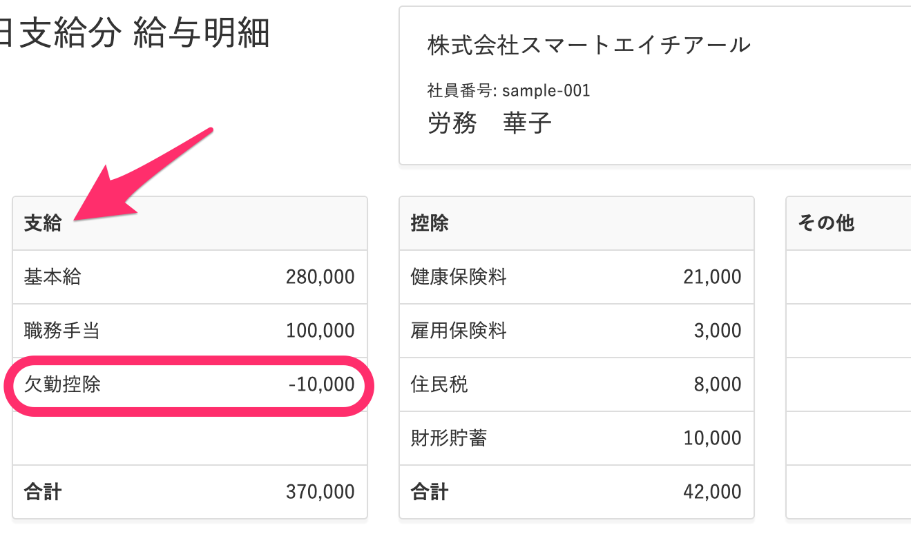
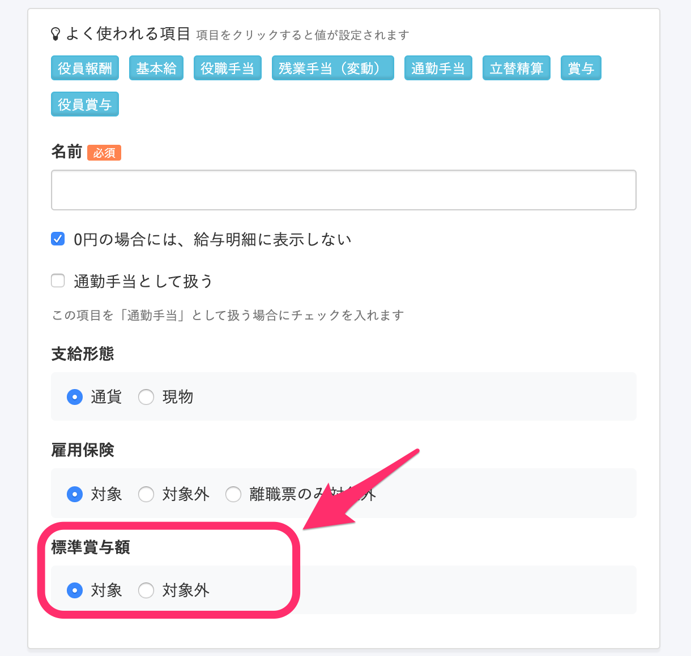
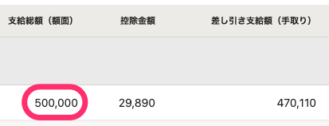

給与明細の準備中に問い合わせの多い質問と回答をご紹介します。

# Q. 給与明細のサンプルCSVファイルはありますか？

## A. はい、給与明細情報を取り込む画面に、サンプルのCSVファイルをダウンロードできるリンクがあります。

CSVを使った給与データの準備については、以下をご覧ください。

[給与明細機能とは > 事前準備② 給与データの準備](https://knowledge.smarthr.jp/hc/ja/articles/360026107314#i-3)

# Q. 電子交付に関する同意をとれますか？

## A. はい、デフォルト設定では従業員が初めてSmartHRにログインする画面で同意を得るようになっています。

また、同意の有無を確認することもできます。確認方法は以下をご覧ください。

[電子交付に関する同意の有無を確認する](https://knowledge.smarthr.jp/hc/ja/articles/360026265073)

同意を得る方法については、以下をご覧ください。

[「電子交付に関する同意」に未同意の従業員がいる場合は？](https://knowledge.smarthr.jp/hc/ja/articles/360035049894)

# Q. 欠勤控除や遅刻早退控除、代休控除はどのように登録したらよいでしょうか？

## A. \[支給\]の項目として登録ください。

「支給」であってもマイナス金額でのCSVアップロードが可能です。

明細に印字する項目については、以下をご覧ください。

[給与明細機能とは > 事前準備① 明細項目の登録](https://knowledge.smarthr.jp/hc/ja/articles/360026107314#i)

# Q. 給与明細項目の標準賞与額 \[対象\] / \[対象外\] は何に影響しますか？

## A. \[賞与支払届\]を作成する際、明細のタイプが\[賞与\]になっている明細のうち、標準賞与額が\[対象\]となっている項目が計算対象となります。

賞与支払届の作成については、以下をご覧ください。

[賞与支払届を作成する](https://knowledge.smarthr.jp/hc/ja/articles/360036904573)

# Q. 明細情報のCSVファイルを取り込むと、500,000円が500円と表示されてしまうときの対処法は？

## A. 金額にカンマ（,）を使用していないかご確認ください。

CSVファイルではカンマを区切り文字として使用するため、金額にカンマが含まれているとカンマ以下の数字が切り捨てられてしまいます。

たとえば、50万円と入力したい場合は、「500000」のようにカンマを使用しないで入力してください。

「500,000」のように入力すると、「500」として取り込まれてしまいます。

なお、桁区切りのカンマは取り込み後に自動的に表示されます。

