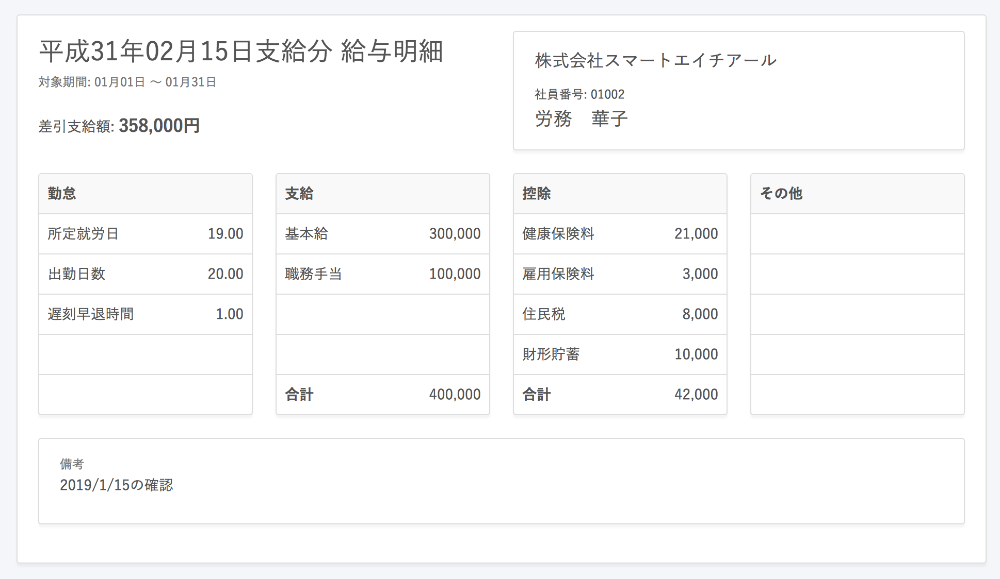

Excelや給与計算ソフトから出力した計算結果（CSVファイル）をSmartHRに取り込み、給与明細・賞与明細を従業員に配布できる機能です。

従業員は各自SmartHRにログインし、配布された給与明細・賞与明細を確認できます。

今まで行っていた印刷・手渡し・郵送での配布といった作業を軽減します。

給与明細と賞与明細の作成方法や明細項目は共通で、明細の見出しの表示のみ異なります。

▼ 給与明細サンプル

マネーフォワード クラウド給与データを、直接SmartHRに取り込むことも可能です。（CSVデータは不要です）
詳しくは下記のページをご確認ください。

:::related
[マネーフォワード クラウド給与の給与明細データをSmartHRに取り込む](https://knowledge.smarthr.jp/hc/ja/articles/360026105654)
:::

# 1\. 明細項目の登録

CSVインポートを行う前に、明細に印字する項目を追加します。
明細項目の設定方法は以下のページをご覧ください。

■ ひと項目ずつ手入力で設定する場合

[給与明細項目を設定する](https://knowledge.smarthr.jp/hc/ja/articles/360026265193)

■ 一括登録（CSVデータの取り込み）する場合

[未登録の給与明細項目を一括登録する](https://knowledge.smarthr.jp/hc/ja/articles/360026265173)

# 2\. 給与明細・賞与明細データを準備し、取り込む

下記のページで詳しい手順をご案内しています。

[給与・賞与明細情報を取り込む](https://knowledge.smarthr.jp/hc/ja/articles/360059997153)

# 3\. 内容を確認し、従業員に通知する

下記のページで詳しい手順をご案内しています。

[給与明細の内容を確認する](https://knowledge.smarthr.jp/hc/ja/articles/360059781313)

[給与明細を確定・公開する](https://knowledge.smarthr.jp/hc/ja/articles/360057942354)

# 給与明細の追加・更新（修正）・削除

取り込んだ給与明細は、追加・更新・削除が可能です。

下記のページで詳しい手順をご案内しています。

[給与明細を追加・更新・削除する](https://knowledge.smarthr.jp/hc/ja/articles/360026264973)
