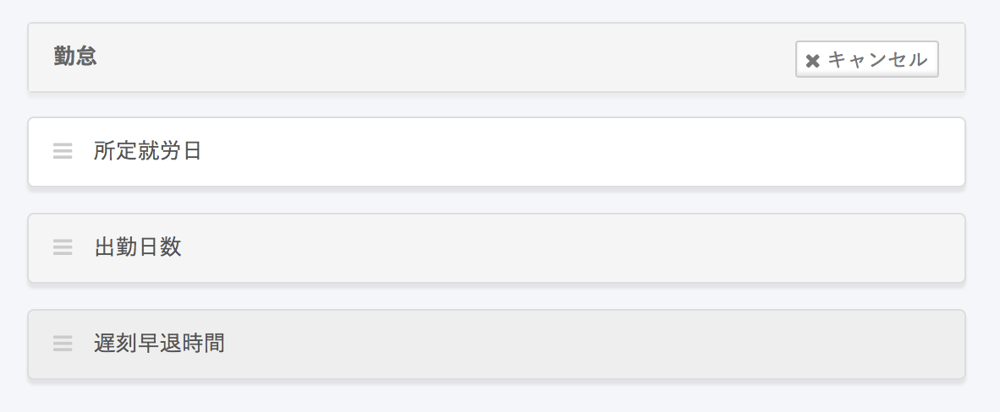

SmartHRで給与明細を発行するには、給与計算ソフトからダウンロードした計算結果（CSVファイル）にある項目を、SmartHRに登録しておく必要があります。

# 項目を追加できる項目種別

給与項目を追加できる項目種別は以下のとおりです。

| 項目種別 | 設定例 | 備考 |
| --- | --- | --- |
| 支給 | 基本給, 職務手当, インセンティブ, 通勤手当, etc |   |
| 控除 | 健康保険, 厚生年金保険, 雇用保険, 所得税, 住民税, etc |   |
| 勤怠 | 出勤日数, 所定休日出勤日数, 有給日数, etc | 単位（時間か日）を指定できます |
| その他 | 差引支給額, 支給合計, 控除合計, 累積出勤時間, 累積所得 |   差引支給額, 支給合計, 控除合計 はそれぞれ1つまで登録できます（複数登録はできません）  合計に関する項目は「その他」に含まれています   |

# トップページ左側の［給与明細］をクリック

トップページ左側にある  **［給与明細］**  をクリックすると、 **［給与明細一覧］** 画面へ移動します。

# 初めて追加する場合

## 1\. ［登録する］をクリック

初めて給与明細項目を追加する場合は、 **［登録する］**  をクリックしてください。

## 2\. ［項目を登録する］をクリック

初めて給与明細項目を追加する場合の画面はこのような表示になります。

 **［勤怠］［支給］**  など各グループにある **［+項目を登録する］** をクリックすると、項目の新規追加画面へ移動します。

## 3\. 設定して［登録する］をクリック

任意の項目名および、その項目に対する各種設定を選択し、 **［登録する］**  をクリックします。

下図は、 **［支給］** グループの場合の項目設定画面です。

手続き機能で作成する書類に、給与明細の値を反映させるかどうかを設定できます。

- **通勤手当として扱う**：「雇用保険被保険者離職証明書」「休業開始時賃金証明書」「 雇用保険被保険者六十歳到達時等賃金証明書」の［賃金額A（通勤手当）］に値を反映させたい場合にチェックを入れます。
- **支給形態**
    - **通貨**：「賞与支払届」の［ア（通貨）］に賞与明細上の値を反映させたい場合に選択します。
    - **現物**：「賞与支払届」の［イ（現物）］に賞与明細上の値を反映させたい場合に選択します。
- **雇用保険**：「雇用保険被保険者離職証明書」「休業開始時賃金証明書」「 雇用保険被保険者六十歳到達時等賃金証明書」の［賃金額A（給与）］に値を反映させたい場合に **［対象］** を選択します。
     **［対象外］** と **［離職票のみ対象外］** を選択した場合には反映されません。
- **標準賞与額**： 「賞与支払届」を作成する際、賞与明細上の値を計算対象としたい場合には **［対象］** を選択します。

項目設定については、以下のヘルプページもあわせて参照してください。

- [Q. ［通勤手当として扱う］のチェックを入れるとどこに反映されますか？](https://knowledge.smarthr.jp/hc/ja/articles/4402689192857)
- [賞与支払届の「ア（通貨）」「イ（現物）」に金額が反映されない場合の対処法は？](https://knowledge.smarthr.jp/hc/ja/articles/360039938093)
- [給与明細の金額を雇用保険被保険者離職証明書に反映するには？](https://knowledge.smarthr.jp/hc/ja/articles/360038707174)
- [Q. 給与明細項目の標準賞与額 \[対象\] / \[対象外\] は何に影響しますか？](https://knowledge.smarthr.jp/hc/ja/articles/360043583053#toc--7)

# すでに登録したことがある場合

項目を登録したことがある場合は下図の表示となります。

 **［こちら］**  をクリックして、 **［給与明細項目］**  画面へ移動してください。

## 項目の編集・表示／非表示・削除

項目の右側にある **［…］メニュー** をクリックすると、項目を**編集・表示／非表示・削除**できます。

## 項目の並び替え

 **［勤怠］［支給］［控除］［合計・その他］**  に 2つ以上の項目が登録されている場合は、項目の並び替えが可能です。

### 1\. ［編集する］をクリック

項目の右側の **［編集する］** をクリックしてください。

### 2\. ［並べ替える］をクリック

 **［並べ替える］** をクリックしてください。

### 3\. ドラッグアンドドロップで順番を入れ替える

ドラッグアンドドロップで順番を入れ替えられます。

# 注意点

## 給与明細項目は同じ名前を重複して登録できません。

項目の種別が異なっている場合でも、同じ項目名は使用できません。

すでに登録している同一の項目名を削除してから登録するか、別の項目名で登録する必要があります。

## 従業員に配布済みの項目名は変更できません。

従業員に配布済みの給与明細内ですでに使用した項目名は変更できません。

異なる項目名で表示させたい場合は、新しく給与明細を作成する前に表示させたくない項目を「非表示」または「削除」し、新しく項目を追加してください。

非表示とした項目は、設定画面では下図のように背景色が薄いグレーで表示されます。

## 項目を削除しても、作成済みの給与明細から項目が消えることはありません。

しかし、削除によって下記2つの影響がありますのでご注意ください。

#### 1\. 「0円の場合には、給与明細に表示しない」設定が解除されます

「0円の場合には、給与明細に表示しない」設定をしていた項目を削除すると、削除とともに設定が解除されます。

そのため、過去の給与明細では非表示だったものが表示されてしまうことがありますのでご注意ください。

#### 2\. 項目順が変わる可能性があります

 **【削除前の画面例】** 

 **【削除後の画面例】** 

