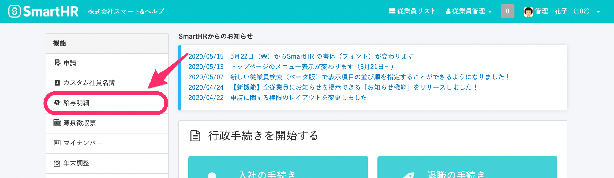
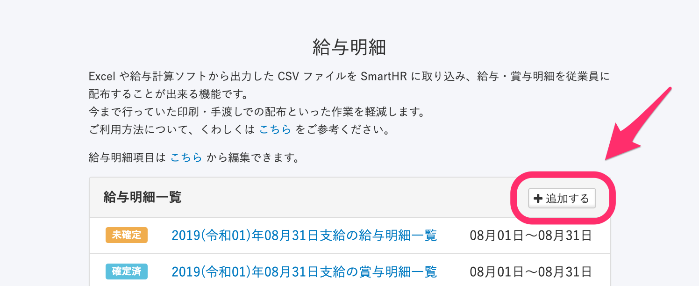
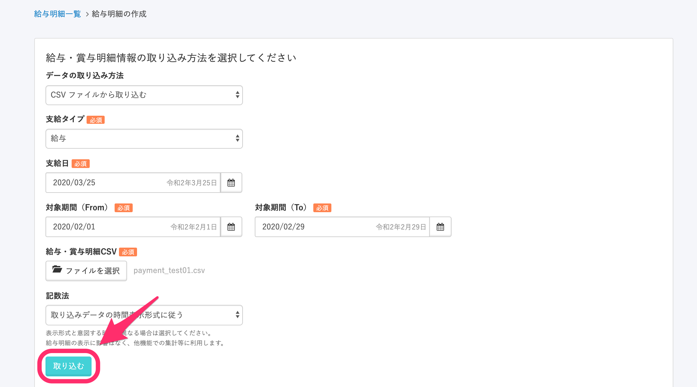
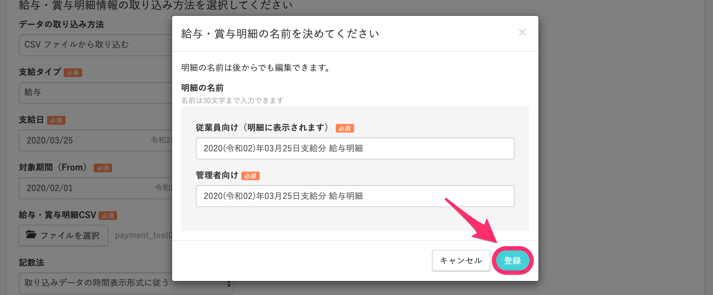
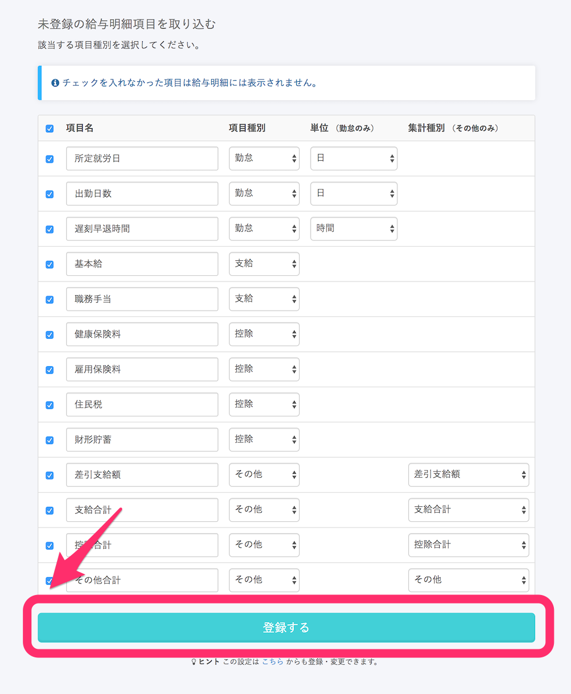
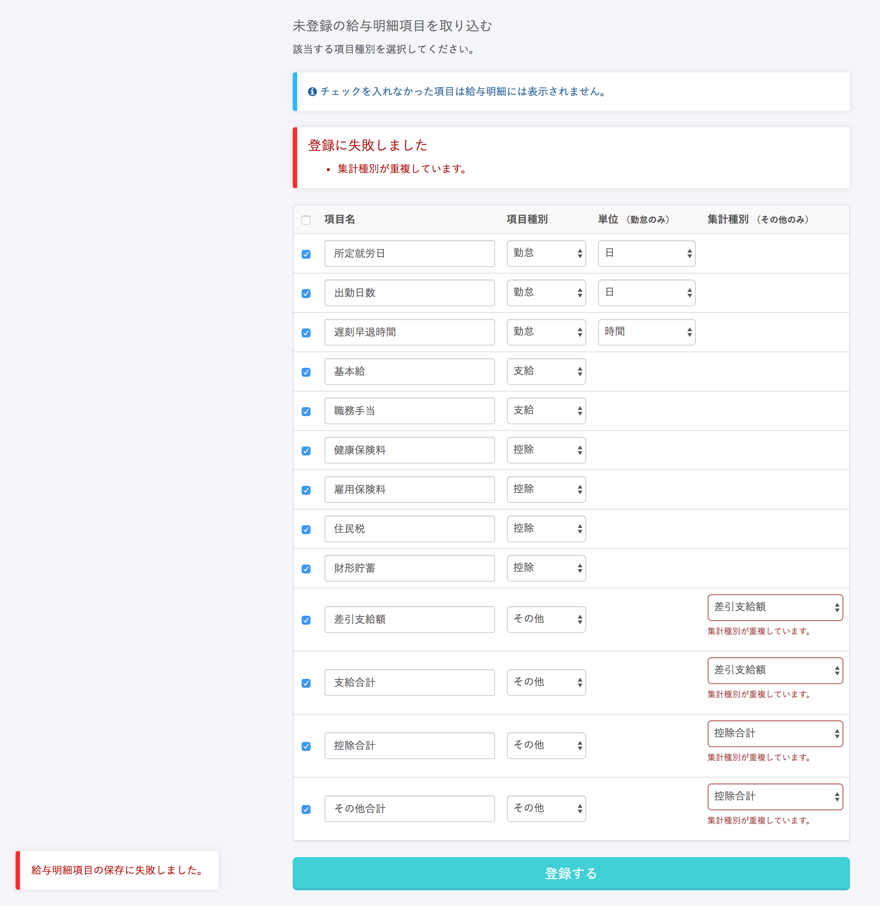
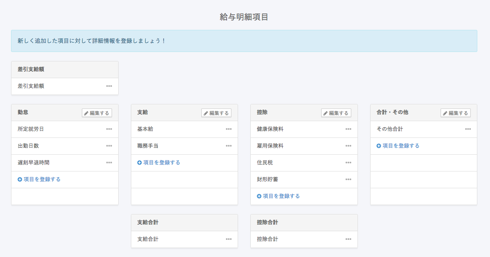

未登録の項目が給与明細データにある場合、明細項目として一括で登録できます。

:::alert
本手順では明細項目のみが登録され、**給与データに含まれている明細情報は登録されません。**
給与明細情報を登録する場合は、本手順の後に、改めて給与データの登録を行ってください。
:::

# 1\. \[機能\] > \[給与明細\] をクリック

トップページ左側にある **\[給与明細\]** をクリックすると、**\[給与明細一覧\]** 画面へ移動します。

# 2\. \[追加する\] をクリック

右上にある **\[追加する\]** をクリックします。

# 3\. \[給与・賞与明細CSV\] > \[取り込む\] をクリック

各項目を指定し、**\[給与・賞与明細CSV\]** で未登録の項目が含まれた給与明細データ（CSV）を選択したら、**\[取り込む\]** をクリックします。

事業所情報の登録が1つの場合、**\[支給日\]、\[対象期間\]** は事業所設定で登録されている情報が自動的に設定されます。（手動で変更することも可能です）

# 4\. \[登録\] をクリック

明細の名前を変更する場合はそれぞれ名前を編集し、**\[登録\]** をクリックすると、**\[未登録の給与明細項目を取り込む\]** 画面に移動します。

:::alert
未登録の項目がない場合は、**\[登録\]** をクリックした時点で明細データの取り込み処理が開始されます。
:::

# 5\. 給与明細に表示したい項目にチェックを入れ、\[登録する\] をクリック

未登録の給与明細項目が一覧で表示されます。

給与明細に表示したい項目にチェックを入れ、各項目の設定を選択し、**\[登録する\]** をクリックしてください。

設定可能な明細項目種別は以下の通りです

| 項目種別 | 設定例 | 備考 |
| --- | --- | --- |
| 支給 | 基本給, 職務手当, インセンティブ, 通勤手当, etc |   |
| 控除 | 健康保険, 厚生年金保険, 雇用保険, 所得税, 住民税, etc |   |
| 勤怠 | 出勤日数, 所定休日出勤日数, 有給日数, etc | 単位（時間か日）を指定することが可能です |
| その他・ 合計 | 差引支給額, 支給合計, 控除合計, 累積出勤時間, 累積所得 | 差引支給額, 支給合計, 控除合計 はそれぞれ1つのみの 登録となります（複数登録はできません） |

## 注意点

**\[集計種別（その他のみ）\]** の **\[差引支給額\]・\[支給合計\]・\[控除合計\]** はひとつの項目名に対してひとつずつしか設定することができません。

重複する場合は、下図のようなエラーになりますので、設定を変更してご登録ください。

:::tips
**\[未登録の給与明細項目を取り込む\]** 画面のチェックの有無に限らず、未登録項目は登録されます。
（チェックの有無は給与明細に表示するか否かの設定となります。）
:::

項目名の編集や項目内容の設定を変更したい場合は、下記のページの手順で変更してください。

[給与明細項目を設定する](https://knowledge.smarthr.jp/hc/ja/articles/360026265193)

