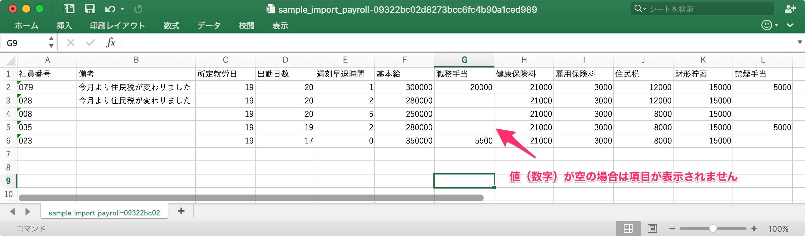
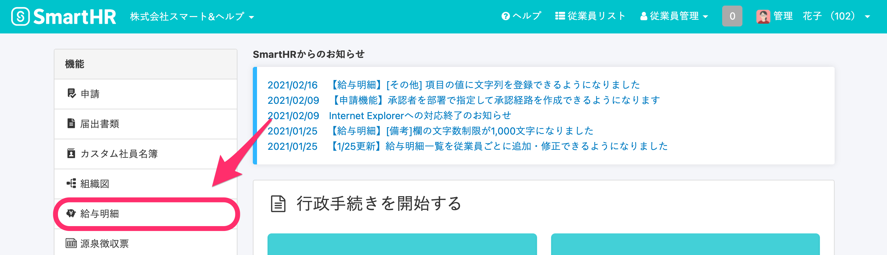
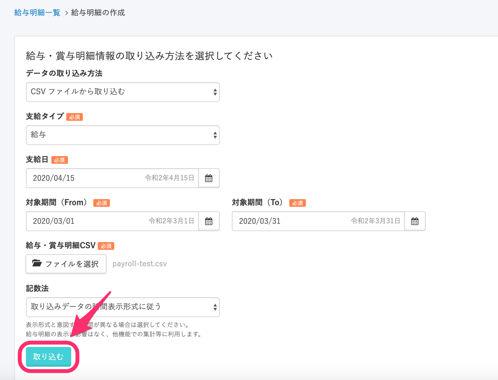
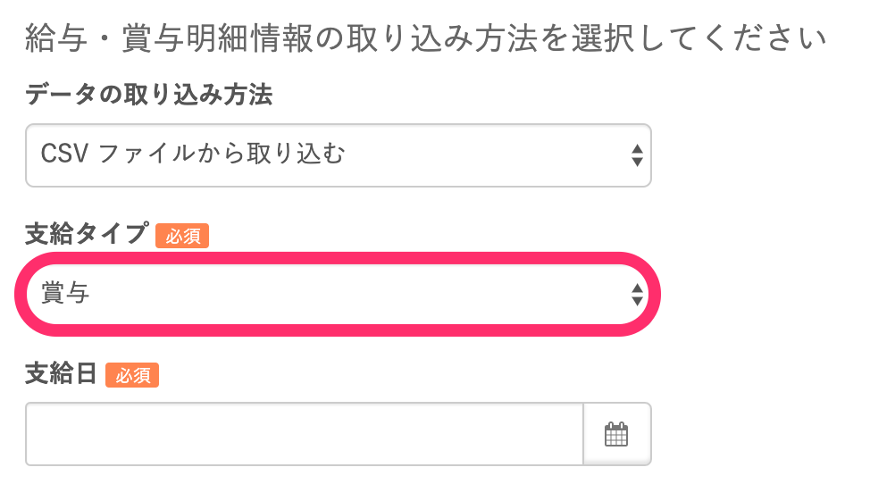
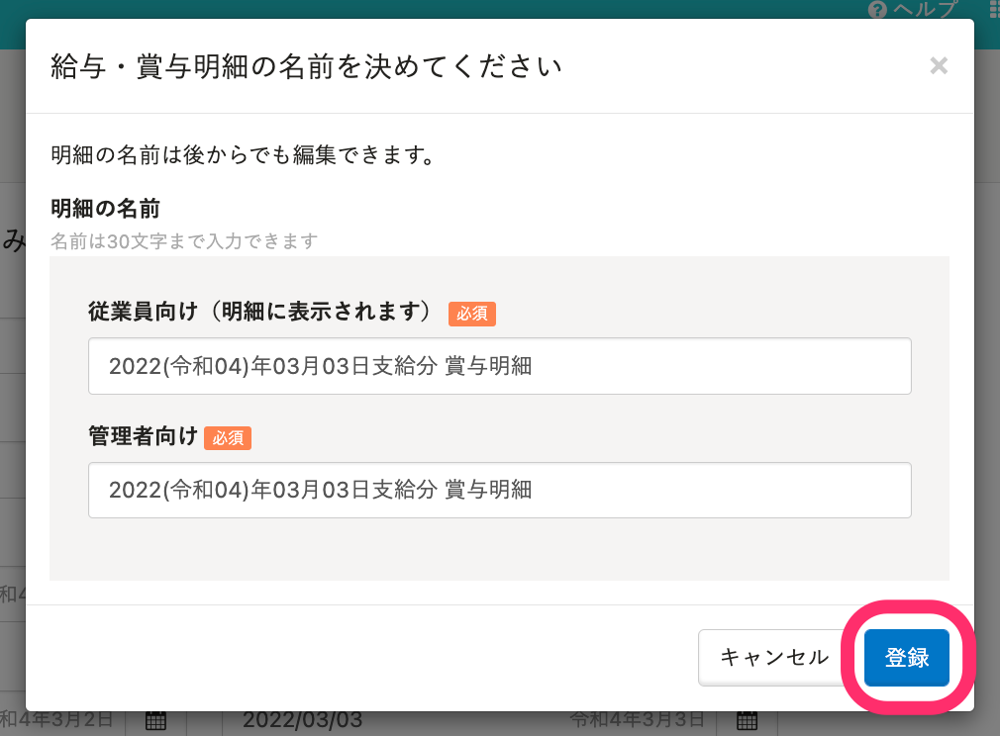
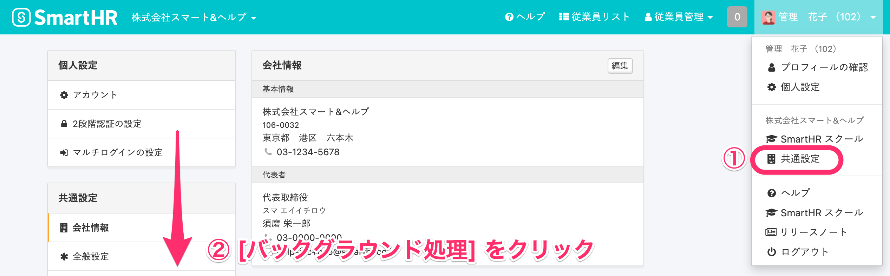
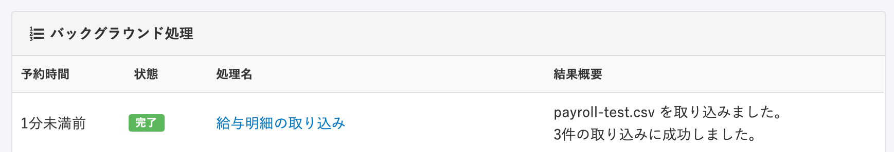
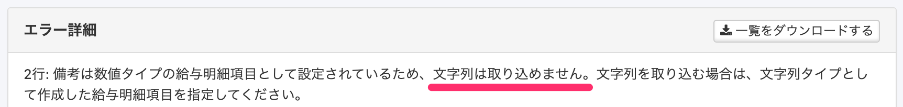

給与計算ソフトなどで作成した給与・賞与明細情報のCSVファイルをSmartHRに取り込むと、従業員へ配付・通知が行なえます。

取り込む前に明細項目の設定が必要なため、項目設定をしていない場合は以下のページを参考に設定してください。

:::related
[給与明細項目を設定する](https://knowledge.smarthr.jp/hc/ja/articles/360026265193)
[給与明細機能とは](https://knowledge.smarthr.jp/hc/ja/articles/360026107314)
:::

# CSVファイルを準備する

給与明細情報・賞与明細情報をまとめたデータをCSV形式で用意します。

サンプルのテンプレートファイルを活用してください。

[サンプルのCSVファイルのテンプレートをダウンロード](https://d69zwendhxygf.cloudfront.net/assets/sample_import_payroll-ef96e998b2dd81650ec22903db5f5aba8d3e765214bd2eda1e5c571b489a0ff3.csv)

:::alert
- SmartHRには給与計算機能はありません。給与計算された結果をCSVデータで取り込むことによって給与明細書が生成される仕組みとなっています。
- 金額の入力には、カンマ（,）を使用しないでください。取り込みの際にカンマ以下の数字が切り捨てられます。詳しくは、下記のよくある質問を参照してください。
    [Q. 明細情報のCSVファイルを取り込むと、500,000円が500円と表示されてしまうときの対処法は？](https://knowledge.smarthr.jp/hc/ja/articles/360043583053#toc--9)
:::

## CSVの各セルで入力可能な文字列について

| カラム名 | 必須 | 説明 |
| --- | --- | --- |
| 社員番号 | ◯ |   必ずA列に記載してください。 社員番号を元に、該当する従業員の明細を作成します。   |
| 備考 | – |   最大1000文字まで入力できます。改行も可能です。 （※ PDFには6行目以後は印字されません） 例：今月より社会保険料が変更になりました   |
| 明細項目 | ◯ |   SmartHRに登録した項目名を記載してください。明細にもそのまま印字されます。入力の文字数制限はありませんが、長い場合はPDF出力で正しく表示されないことがあるため、全角10文字以下、半角英数字20文字以下で記載してください。 例：基本給、健康保険料、所定就労日など   |

:::related
[給与明細の時間の項目は、コロン（：）を使って入力できる？](https://knowledge.smarthr.jp/hc/ja/articles/360026106434)
:::
:::tips
CSVの値が空の場合、該当する従業員の給与明細には項目も表示されません。

:::

# CSVファイルを取り込む

## 1\. ［機能］>［給与明細］をクリック

トップページ左の **［機能］** 欄にある **［給与明細］** をクリックします。

## 2\. ［追加する］をクリック

給与明細一覧画面に表示された **［追加する］** をクリックすると、給与明細の作成画面に移動できます。

## 3\. 給与・賞与明細情報の取り込み方法を選択し［取り込む］をクリック

 **［データの取り込み方法］［支給タイプ］［支給日］［対象期間］［記数法］** を入力し、CSVファイルを選択したら **［取り込む］** をクリックします。

賞与明細の場合は、 **［支給タイプ］** で **［賞与］** を選択してください。

## 4\. ［登録］をクリック

明細の名前を変更する場合はそれぞれ名前を編集し、 **［登録］** をクリックすると、明細データの取り込み処理が始まります。

## 5\. ［共通設定］>［バックグラウンド処理］をクリック

 **［共通設定］>［バックグラウンド処理］** をクリックすると取り込みの結果が確認できます。

取り込みに失敗していた場合は、エラー詳細を確認のうえ、再度登録してください。

:::alert
### 「文字列は取り込めません」とエラーが出た場合は？
数値の項目に文字列を取り込もうとした場合、エラーになります。

以下のヘルプページを参考に、給与明細項目の設定を確認してください。
[給与明細項目を設定する](https://knowledge.smarthr.jp/hc/ja/articles/360026265193#toc--6)
:::

取り込んだ内容を確認し、従業員に配付・通知する手順は、下記のヘルプページを参照してください。

:::related
[給与明細の内容を確認する](https://knowledge.smarthr.jp/hc/ja/articles/360059781313)
[給与明細を確定・公開する](https://knowledge.smarthr.jp/hc/ja/articles/360057942354)
:::
