作成した給与明細に誤りがあった場合は、再度ファイルをアップロードすることで修正できます。

また、不要な明細は個別削除・一括削除が可能です。

:::alert
「マネーフォワード クラウド給与」と「freee人事労務」から連携した給与明細は、一覧全体の削除のみできます。
追加・更新・個別削除はできないため、追加・更新・削除のボタンが表示されません。
詳しくは当ページ「マネーフォワード クラウド給与・freee人事労務から連携した給与明細の注意点」項目をご覧ください。
:::

# 給与明細を追加・更新する

CSVファイルを使い、作成済みの給与明細一覧に給与明細を新たに追加したり、すでに登録済みの給与明細の内容を上書きしたりできます。

## 1\. トップページにある［給与明細］をクリック

トップページの左にある **［給与明細］** をクリックすると、給与明細の一覧画面に移動します。

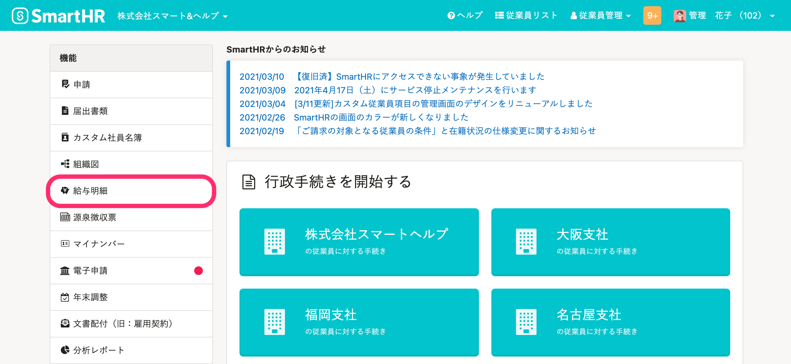

## 2\. 修正したい給与明細をクリック

 **［給与明細一覧］** から明細を追加・更新したい一覧名をクリックすると、各給与明細一覧の操作画面に移動します。

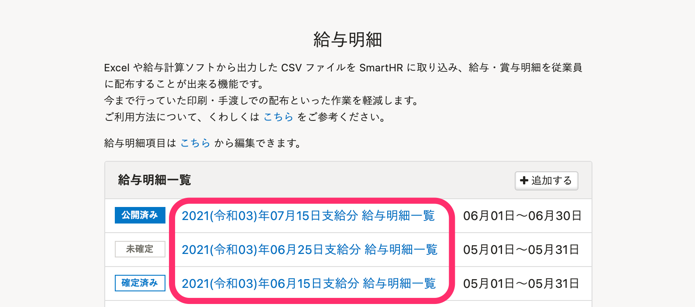

## 3.［給与明細の追加・更新］をクリック

給与明細一覧のステータスが  **［未確定］** の場合、給与明細一覧右上にある **［給与明細を追加・更新］** をクリックすると、給与明細の追加・更新画面が表示されます。

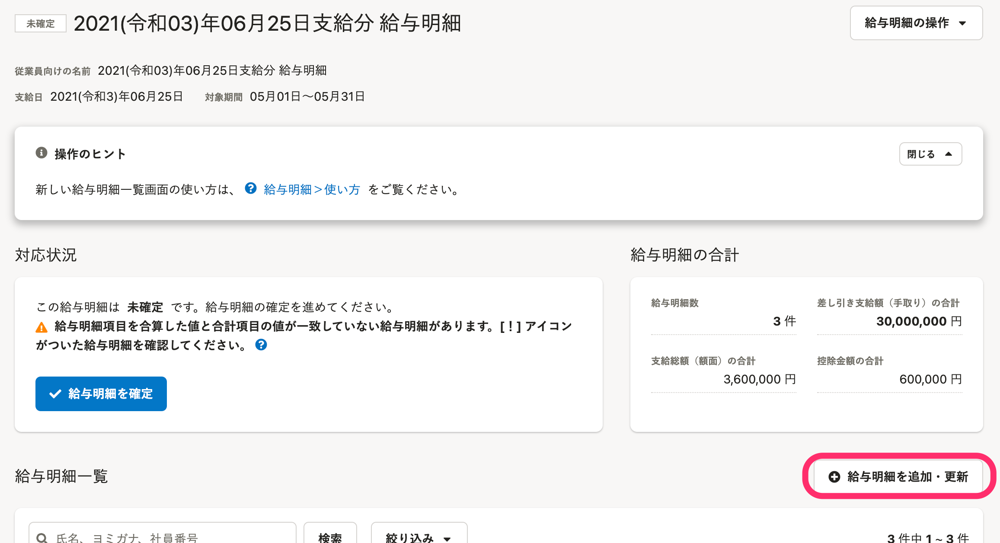

:::tips
給与明細一覧のステータスが［ **確定済み］［公開済み］** の場合は、確定を解除し、［ **未確定］** に戻す必要があります。
 **［対応状況］** 欄の右下の［ **確定解除］** をクリックして、ステータスを **［未確定］** にしてから、追加・更新の操作をしてください。
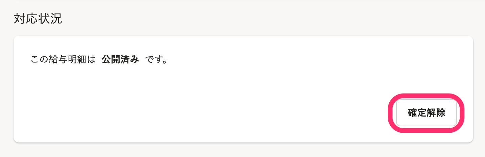
:::

## 4\. CSVファイルを選択し、［追加・更新］をクリック

 **［ファイルを選択］** からCSVファイルを選択し、［ **追加・更新］** をクリックすると、バックグラウンド処理が開始され、処理が完了すると給与明細が追加・更新されます。

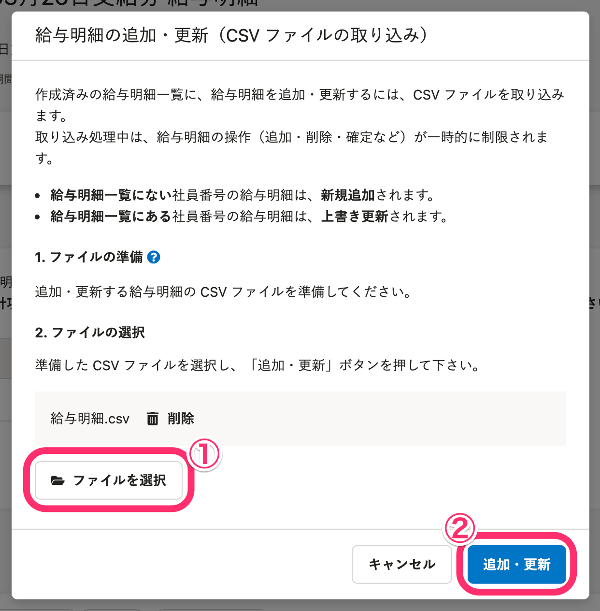

給与明細一覧にない社員番号の給与明細は新規追加され、一覧にある社員番号の給与明細は上書き更新されます。

例えば001〜010の社員番号の給与明細が登録されている場合、社員番号005のデータは上書き更新され、社員番号011のデータは追加登録されます。

CSVファイルの作り方は、最初に給与明細データを取り込むときと同じです。

:::related
[給与・賞与明細情報を取り込む](https://knowledge.smarthr.jp/hc/ja/articles/360059997153)
:::

# 給与明細を削除する

## 給与明細を個別に削除する

### 1\. 給与明細一覧画面で［削除］をクリック

 **［給与明細一覧］** の右側にある **［削除］** をクリックすると、その給与明細を削除して良いかを確認する画面が表示されます。

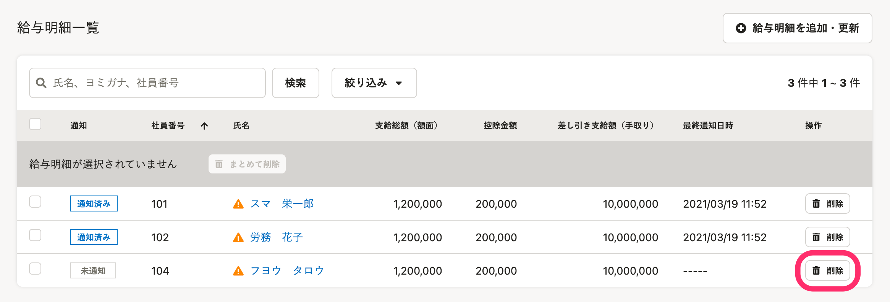

### 2\. 削除対象を確認し、［削除］をクリック

確認画面では、削除対象となる給与明細の社員番号と従業員氏名が表示されます。

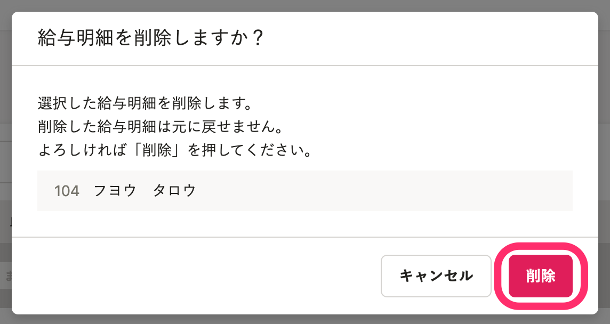

確認し、問題がなければ［ **削除］** をクリックしてください。

給与明細が削除されます。

## 給与明細を複数選択して削除する

### 1\. 給与明細一覧画面で、削除したい給与明細を選択し、［まとめて削除］をクリック

給与明細一覧画面で、削除したい給与明細の左側のチェックボックスにチェックを入れ、一覧上部にある［ **まとめて削除］** をクリックすると、確認画面が表示されます。

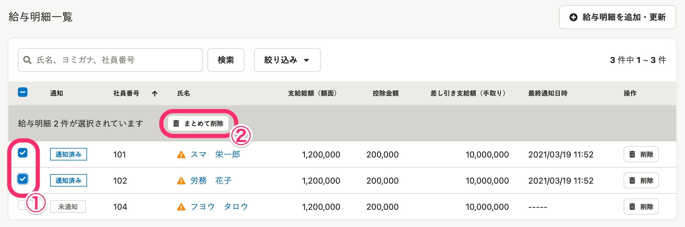

### 2\. 対象の件数を確認し、［削除］をクリック

確認画面では、削除対象となる給与明細の件数が表示されます。

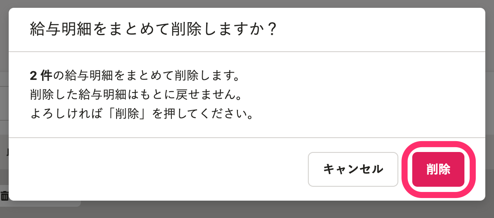

確認し、問題がなければ、［ **削除］** をクリックしてください。

選択した給与明細が削除されます。

## 給与明細一覧全体を削除する

個々の明細単位ではなく、「◯月◯日支給分」という一覧単位での削除も可能です。

### 1\. 給与明細一覧画面右上の［給与明細の操作 **］** メニューにある［給与明細を削除 **］** をクリック

給与明細画面右上にある［ **給与明細の操作］** メニューにある、 **［給与明細を削除］** をクリックすると、確認画面が表示されます。

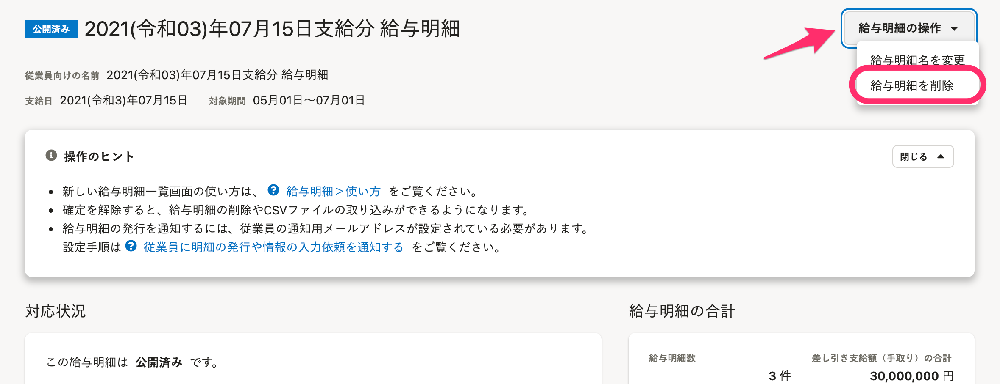

### 2\. 内容を確認し、［削除］をクリック

内容を確認し、 **［削除］** をクリックすると、給与明細一覧全体が削除されます。

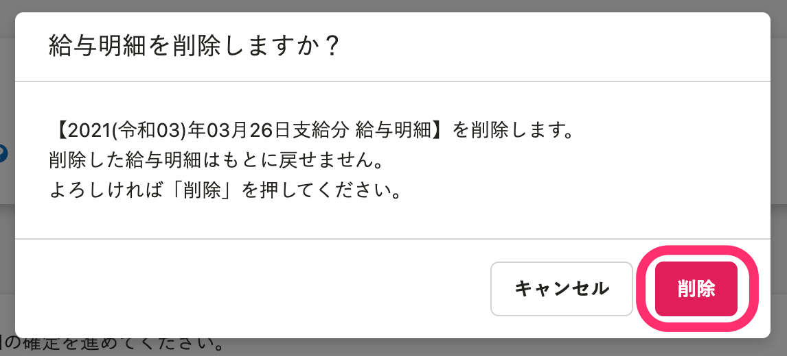

# マネーフォワード クラウド給与・freee人事労務から連携した給与明細の注意点

「マネーフォワード クラウド給与」と「freee人事労務」から連携した給与明細は、一覧全体の削除のみできます。

追加・更新・個別削除はできないため、下図のように追加・更新・削除のボタンが表示されません。

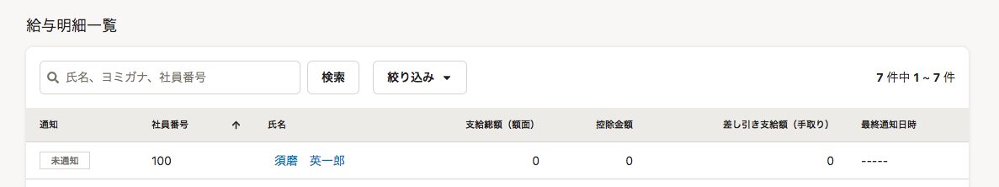

連携元に登録している給与明細情報とズレが生じることを防ぐため、給与明細を取り込んだあとの操作はできないようにしています。

追加・更新・削除が必要な場合は、該当月の給与明細をすべて削除し、マネーフォワード クラウド給与またはfreee人事労務で追加・更新・削除をしてから、再度、給与明細を取り込んでください。

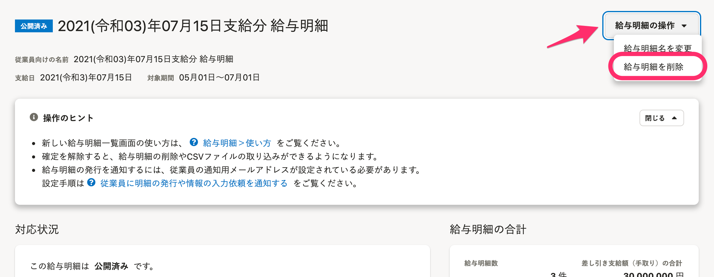

# 給与明細の削除に関するよくある質問

## Q. 給与明細を削除して再公開すると、従業員に通知されますか？

### A. 給与明細の確定後、［給与明細の公開］画面で［公開と同時に通知する］のチェックを外せば、通知されません。

給与明細を削除しても通知されませんが、再度、給与明細を公開する場合は **［通知設定］** で通知の有無を設定できます。

通知が不要な場合は、給与明細の確定後、 **［給与明細の公開］** 画面で **［公開と同時に通知する］** のチェックを外してください。

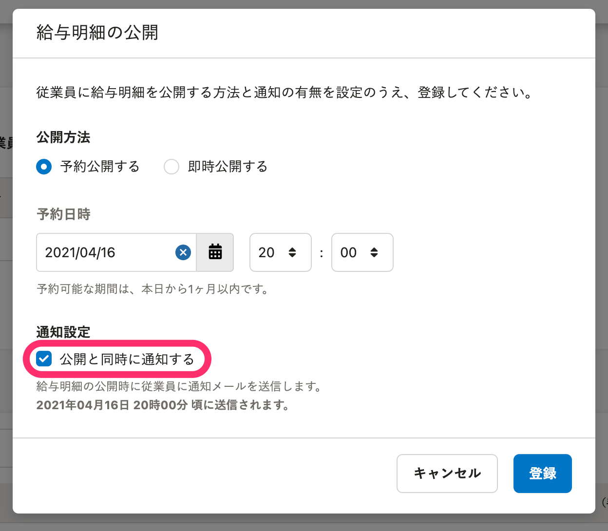

## Q. すでに通知済みの給与明細を削除した場合、従業員は通知メールから給与明細にアクセスできなくなりますか？

### A. いいえ、問題なくアクセスできます。

従業員への通知メールに記載しているURLからは、給与明細のトップページにアクセスします。

給与明細を削除しても、通知メールに記載のURLには影響しません。
