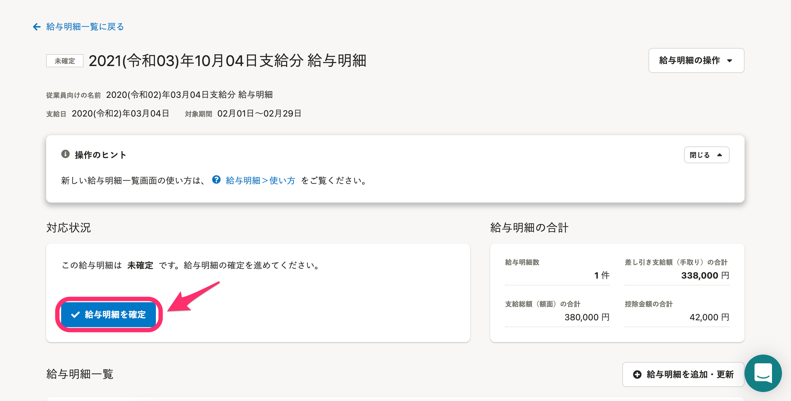
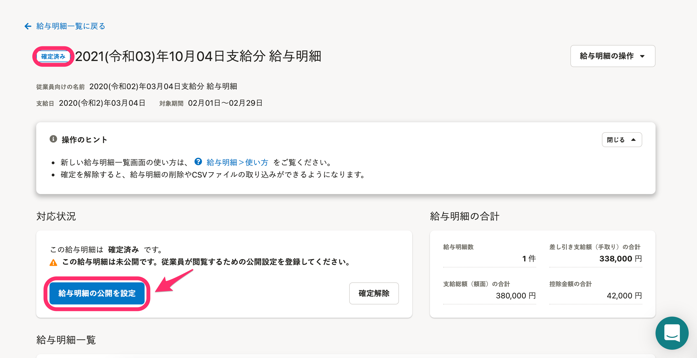
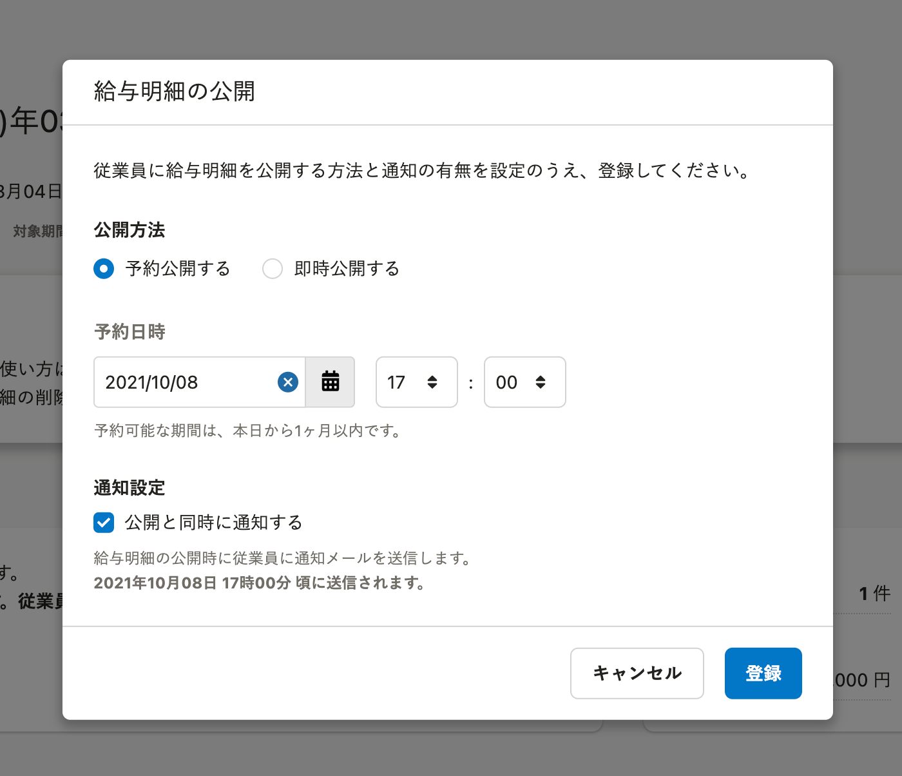

給与明細一覧のステータスは、  **［未確定］** → **［確定済み］（** → **［公開予約中］** ）→ **［公開済み］** と遷移します。

従業員に公開する前に、確定させる必要があります。

:::tips
 **［給与明細の合計］** は、権限設定の **［操作できる範囲］** が **［すべての従業員］** の場合のみ表示されます。
:::

# 給与明細を確定する

給与明細一覧画面の **［対応状況］** の欄にある **［給与明細を確定］** をクリックすると、一覧のステータスが **［確定済み］** になり、公開設定ができるようになります。

# 給与明細を公開する

## 公開方法

従業員に給与明細を公開する方法は、「予約公開」と「即時公開」の2通りがあります。

予約公開の場合は、公開設定日時から1ヶ月以内の任意の日時を設定できます。

即時公開の場合は、 **［登録］** をクリックすると同時に公開されます。

## 通知設定

 **［公開と同時に通知する］** にチェックが入っている状態で **［登録］** をクリックすると、設定した公開日時になると同時に、従業員に対してSmartHR上の通知とメール通知が送られます。

メール通知は、処理の都合上、公開日時よりも遅れて送信されます。
