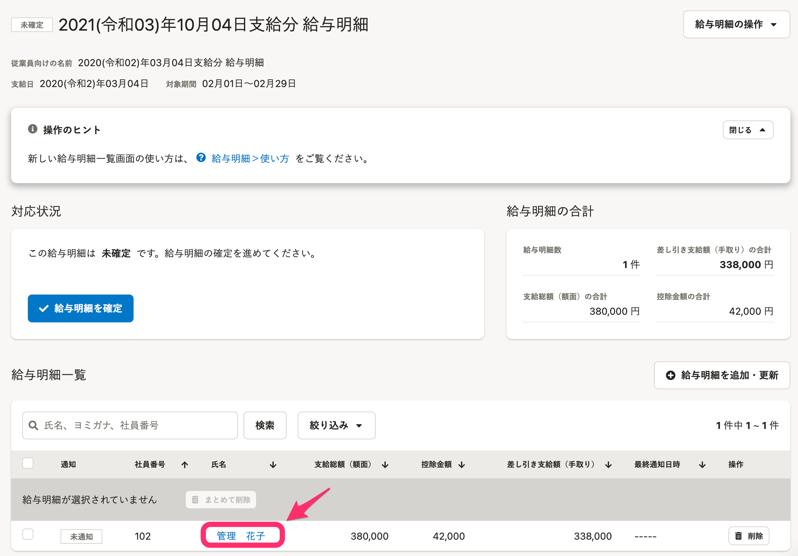
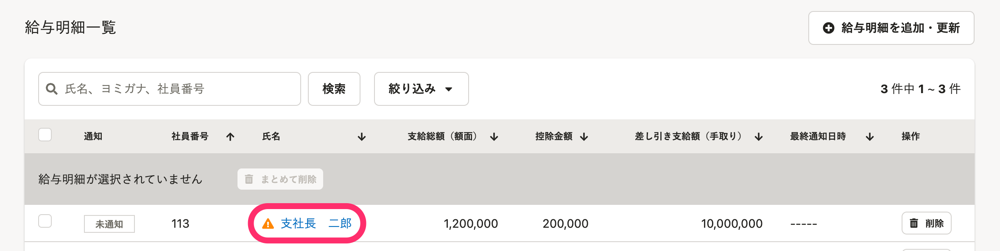

# 給与明細の内容を確認する

給与明細一覧の氏名部分をクリックすると、給与明細の内容を個別に確認できます。

個別の給与明細画面の右上の **［PDFでダウンロード］** から、PDFのダウンロードもできます。

また給与明細一覧画面の **［給与明細の合計］** の欄に、金額のサマリーも表示されています。

取り込まれた内容に問題がない場合、給与明細の確定・公開に進んでください。

:::related
[給与明細を確定・公開する](https://knowledge.smarthr.jp/hc/ja/articles/360057942354)
:::
:::tips
 **［給与明細の合計］** は、権限設定の **［操作できる範囲］** が **［すべての従業員］** の場合のみ表示されます。
:::

## ［！］アイコンが表示されている場合

明細の項目の合計と各種合計が一致していない場合、一覧に **［！］** アイコンが表示されます。

詳しくは下記のページをご覧ください。

[給与明細に \[！\] アイコンが表示されるのはなぜ？](https://knowledge.smarthr.jp/hc/ja/articles/360026264333)

:::tips
確認した結果、修正や削除が必要になった場合の手順は、下記のページをご覧ください。
[給与明細を追加・更新・削除する](https://knowledge.smarthr.jp/hc/ja/articles/360026264973)
:::
