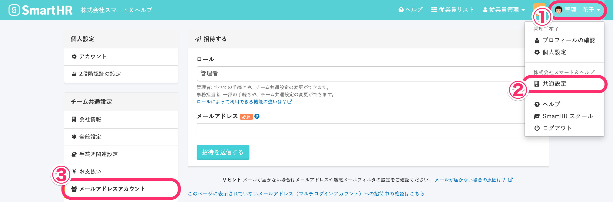
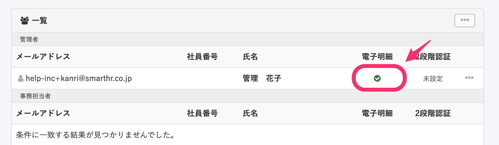
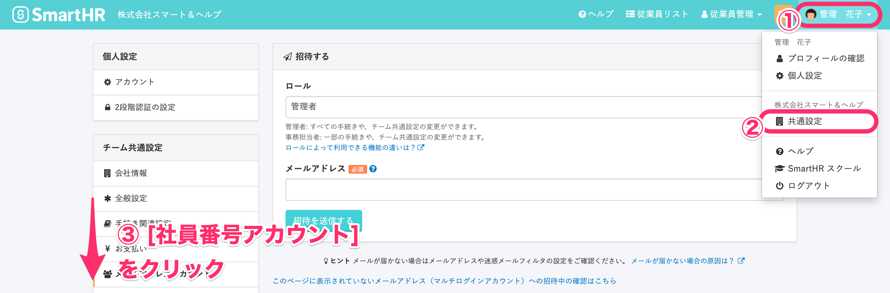
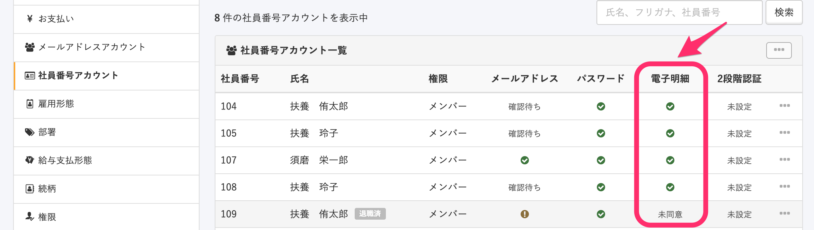

管理者は従業員が  **［給与所得等明細書の電子交付に関する同意］**  をしているかどうかを以下の手順で確認できます。

# メールアドレスアカウントの従業員

## 1. ［画面右上のアカウント名］>［共通設定］>［メールアドレスアカウント］をクリック

 **画面右上のアカウント名 >［共通設定］** をクリックすると、画面左に **［共通設定］** メニューが表示されます。

 **［共通設定］** メニューにある、 **［メールアドレスアカウント］** をクリックしてください。

## 2.［一覧］より、対象者の［電子明細］を確認

 **［メールアドレスアカウント］** をクリックすると表示される **［一覧］** より、対象のユーザーの **［電子明細］** を確認します。

:::tips
- **チェックマーク**＝設定済み
-  **［未同意］** ＝未同意
:::

# 社員番号アカウントの従業員

## 1.［画面右上のアカウント名］>［共通設定］>［社員番号アカウント］をクリック

 **画面右上のアカウント名 >［共通設定］** をクリックし、画面左に表示される **［共通設定］** にある **［社員番号アカウント］** をクリックしてください。

## 2.［一覧］より、対象者の［電子明細］を確認

:::tips
- **チェックマーク**＝設定済み
-  **［未同意］**  ＝未同意
:::
