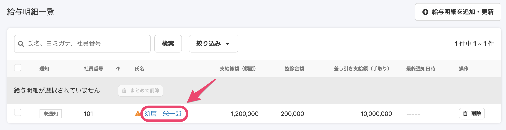
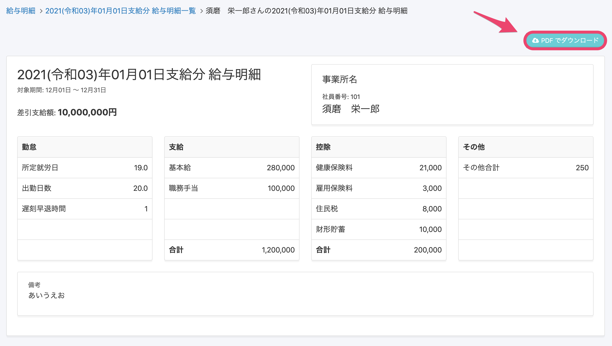
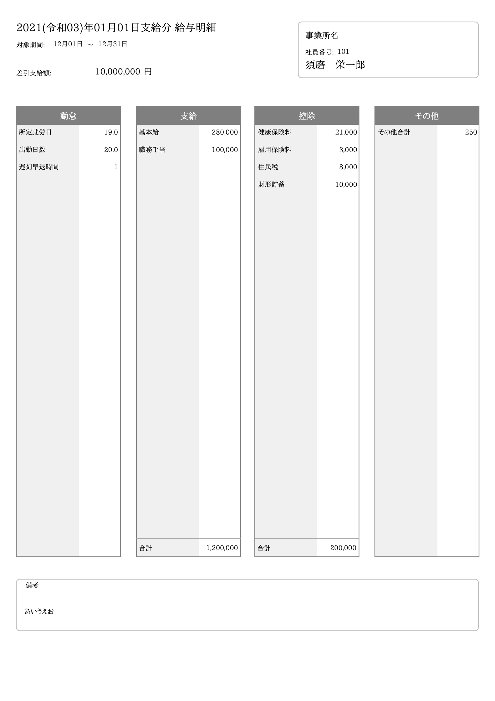
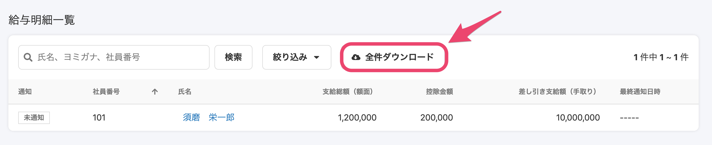
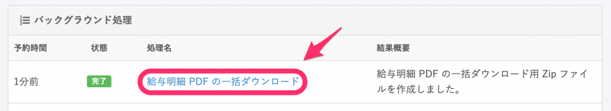
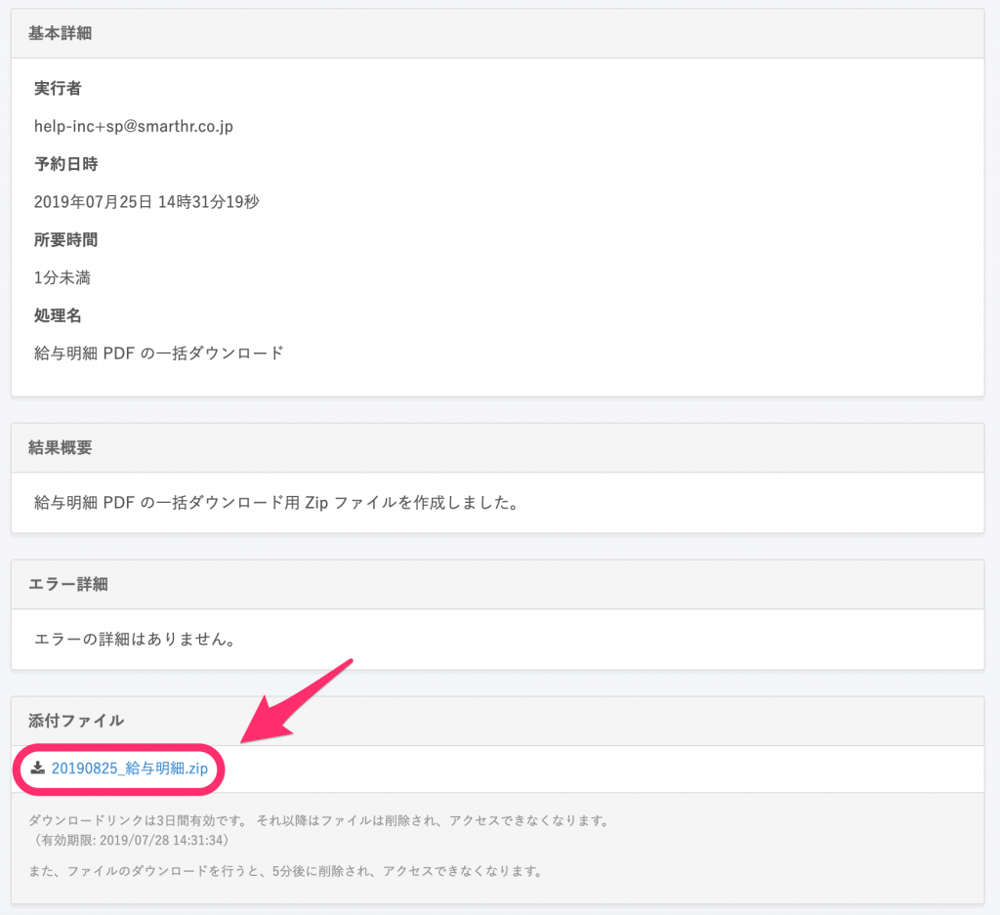

給与明細機能で給与明細を配付することで、従業員自身がSmartHRにログインし、明細を確認できます。

ただし、いわゆるガラケーなどの携帯電話端末をお使いの場合など、SmartHRを利用した明細の確認が難しいときには、明細の印刷をご利用ください。

このページでは、給与明細の印刷について2つの方法を説明します。

:::tips
**\[給与明細一覧\]** の **\[閲覧\]** 権限があれば、**\[従業員関連\]** の**\[操作できる範囲\]** 内の従業員の給与明細をそれぞれ印刷、また一括ダウンロードして印刷できます。
権限の設定は、**\[共通設定\]** > **\[権限\]** の各編集画面から確認できます。
:::

給与明細確定までの流れは、下記のページをご覧ください。

:::related
[給与明細機能とは](https://knowledge.smarthr.jp/hc/ja/articles/360026107314)
:::

# 給与明細を1人分ずつ印刷する

## 1\. 給与明細を印刷したい従業員をクリック

確定済みの給与明細一覧画面で、給与明細を印刷したい従業員名をクリックすると明細画面に遷移します。

## 2\. 明細画面右上の \[PDFでダウンロード\] をクリック

**\[PDFでダウンロード\]** をクリックすると **社員番号\_姓\_名\_支給日.pdf** というファイルがダウンロードされるので、印刷してご利用ください。

# 給与明細を一括でダウンロードして印刷する

## 1\. \[全件ダウンロード\] をクリック

確定済みの給与明細一覧画面にある、**\[全件ダウンロード\]** をクリックすると、バックグラウンド処理が開始されます。

バックグラウンド処理の結果は、 **\[共通設定\] > \[バックグラウンド処理\]** から確認できます。

## 2\. Zipファイルをダウンロードする

バックグラウンド処理が終わると、給与明細PDFをまとめたZipファイルがダウンロードできるようになります。

バックグラウンド処理結果一覧画面から、 **\[給与明細PDFの一括ダウンロード\]** をクリックし、詳細画面の添付ファイル欄にあるZipファイルをダウンロードしてください。

## 3\. Zipファイルを展開し、給与明細PDFを印刷する

ダウンロードしたZipファイルを展開すると、一覧に含まれていたPDFを確認できます。

各PDFのファイル名は **社員番号\_姓\_名\_支給日.pdf** となっています。

印刷が必要な給与明細を開き、印刷してください。

（※お使いのPDFビューアーにより、表示や操作方法は異なります）
