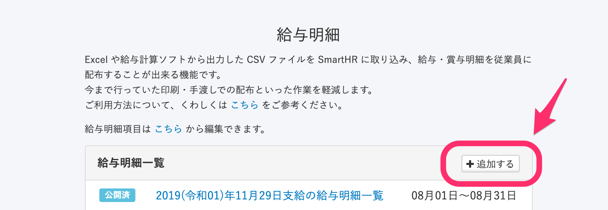
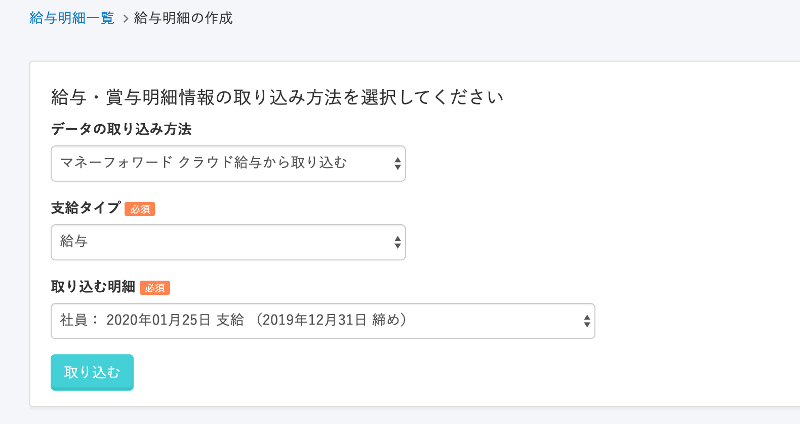
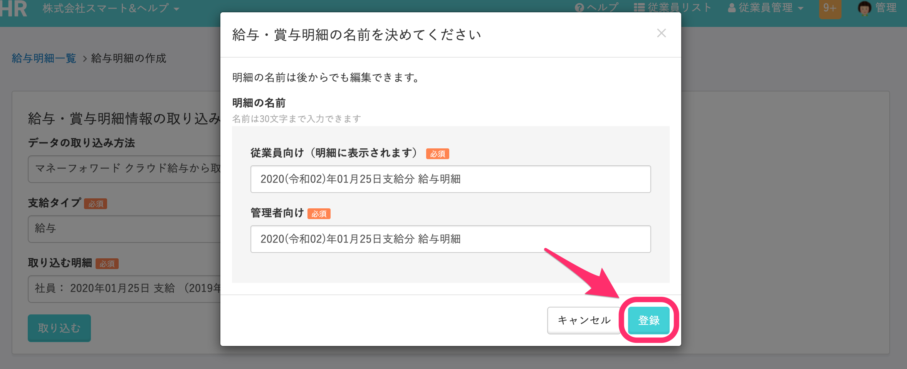
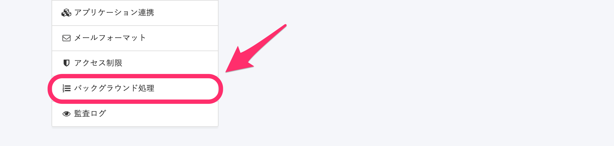
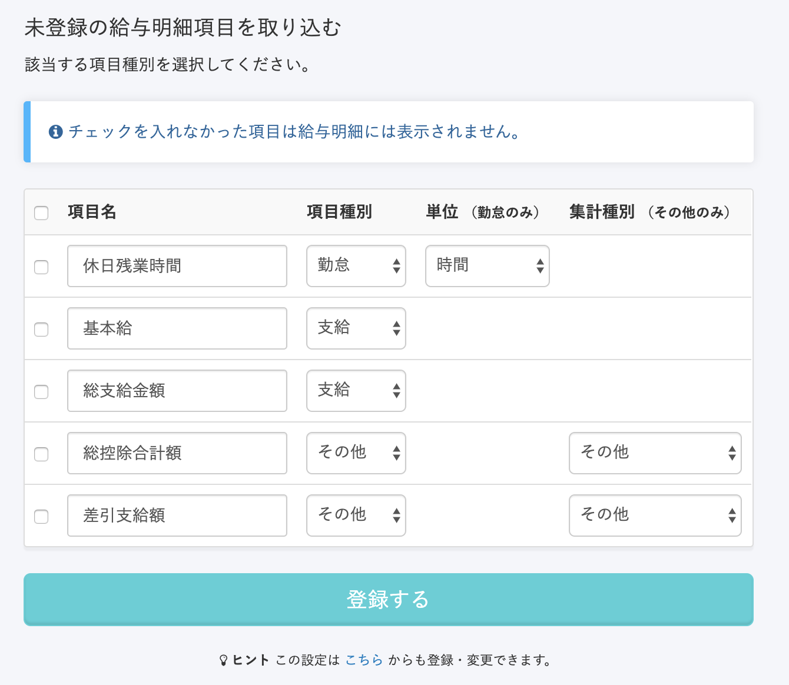
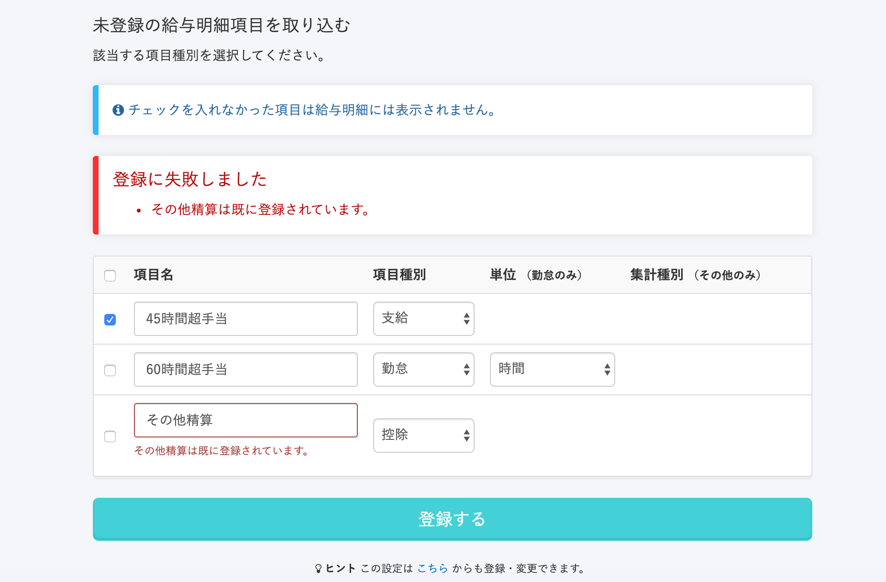
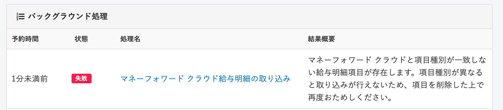
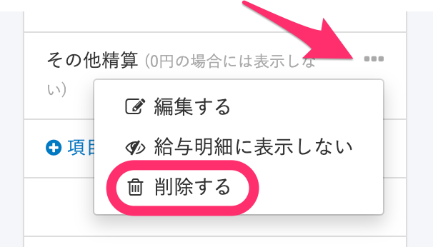

給与計算ソフト [マネーフォワード クラウド給与](https://payroll.moneyforward.com/) で給与計算を行ない **「確定」** された給与明細の情報を、API連携を使ってSmartHRに取り込めます。

:::alert
SmartHRでのアプリケーション連携の初回設定がお済みでない場合は、下記のページを参考に連携を完了してからご利用ください。
[【マネーフォワード クラウド給与】連携設定（初回設定）](https://knowledge.smarthr.jp/hc/ja/articles/360050078134)
:::

# 1.［給与明細］>［+追加する］をクリック

トップページ左の **［機能一覧］** から **［給与明細］** 画面に移動して、 **［＋追加する］** をクリックすると給与明細の取り込み画面に移動します。

# 2.［支給タイプ］と［取り込む明細］を選択して ［取り込む］をクリック

 **［データの取り込み方法］** は **［マネーフォワード クラウド給与から取り込む］** を選択します。

 **［支給タイプ］** と **［取り込む明細］** をそれぞれ選択し、 **［取り込む］** をクリックすると、明細の名前を決めるダイアログが表示されます。

# 3.［登録］をクリック

明細の名前を変更する場合はそれぞれ名前を編集し、 **［登録］** をクリックすると、給与明細の取り込み処理が始まります。

# 4\. 取り込み処理の完了を確認する

取り込み処理が完了すると、メールにてお知らせが届きます。

また、進捗状況は **［共通設定］>［バックグラウンド処理］** から確認できます。

# こんなときどうする？

## 取り込みを行なったら項目登録画面が出る

はじめて給与明細機能を利用する場合や、マネーフォワード クラウド給与上で項目名が新しく追加された場合に表示されます。

SmartHRに給与明細データを取り込む前に、SmartHRでも明細項目を登録する必要があります。

項目の登録後、再度、給与明細データを取り込んでください。

- 従業員さまが閲覧する給与明細に表示をする項目名にチェックを入れる。
- 各項目の種別（勤怠・支給・控除・その他）を設定する。
- 集計種別の3つの種別（差引支給額・支給合計・控除合計）は、既に登録されている項目も含めてそれぞれ1つずつしか登録できません。

この設定は、下記のページの手順であとから変更も可能です。

[給与明細項目を設定する](https://knowledge.smarthr.jp/hc/ja/articles/360026265193)

## 取り込みを行なったらエラーメッセージが表示される

マネーフォワード クラウド給与とSmartHRに登録されている**項目名**は同じでも、**種別**（勤怠・支給・控除・その他）の設定に誤りがある場合に、以下の画面のようなエラーが表示されます。

状況例：

- 「不就労控除」の項目がSmartHRには「控除」で登録されていたが、マネーフォワード クラウド給与には「支給」で登録されている。
- 「課税支給合計」、「現金支給額」などの項目がSmartHRには「支給」で登録されていたが、マネーフォワード クラウド給与には「その他」で登録されている。

SmartHRに登録されている給与明細項目の中から、エラーメッセージに表示される項目を削除し、再度 **［マネーフォワード クラウド給与から取り込む］** を行なってください。

:::tips
取り込んだことのある項目を削除しても、作成済みの給与明細から項目が消えることはありません。
ただし、表示される項目順が変わる可能性があります。
詳しくは下記ページの「項目の編集・表示/非表示・削除」項目をご覧ください。
[給与明細項目を設定する](https://knowledge.smarthr.jp/hc/ja/articles/360026265193)
:::

## ［値が0の場合には、給与明細に表示しない］のチェックを外しても、給与明細項目が表示されない

給与明細項目の設定で **［値が0の場合には、給与明細に表示しない］** のチェックを外しても、マネーフォワード クラウド給与の項目の値が「空欄」「0」の場合は、SmartHRの給与明細に表示されません。

 **［値が0の場合には、給与明細に表示しない］** の反映は、CSVファイルから取り込む場合のみ適用されます。

:::related
[マネーフォワード クラウド給与からCSVで出力した給与明細を取り込む](https://knowledge.smarthr.jp/hc/ja/articles/360026264053)
:::
