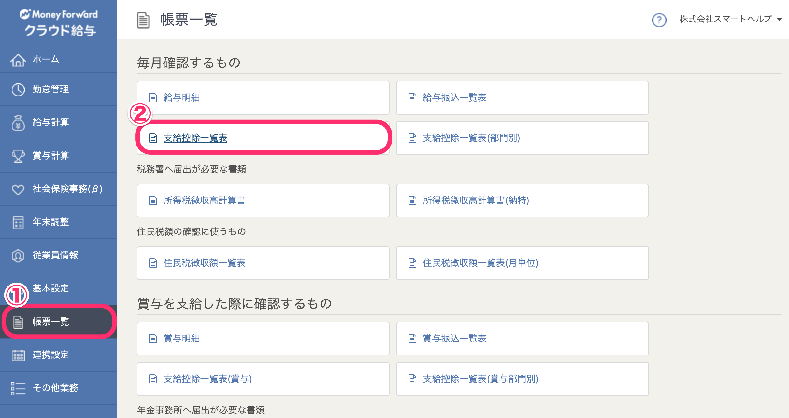
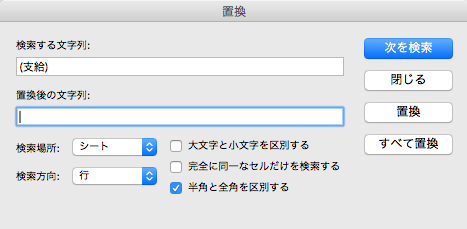
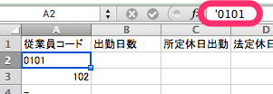
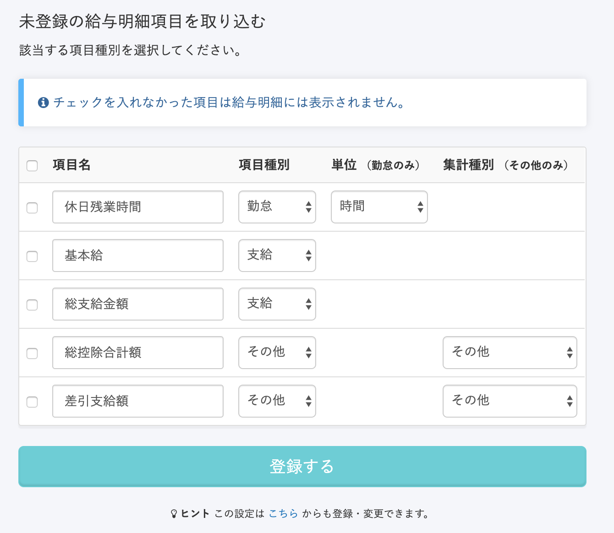
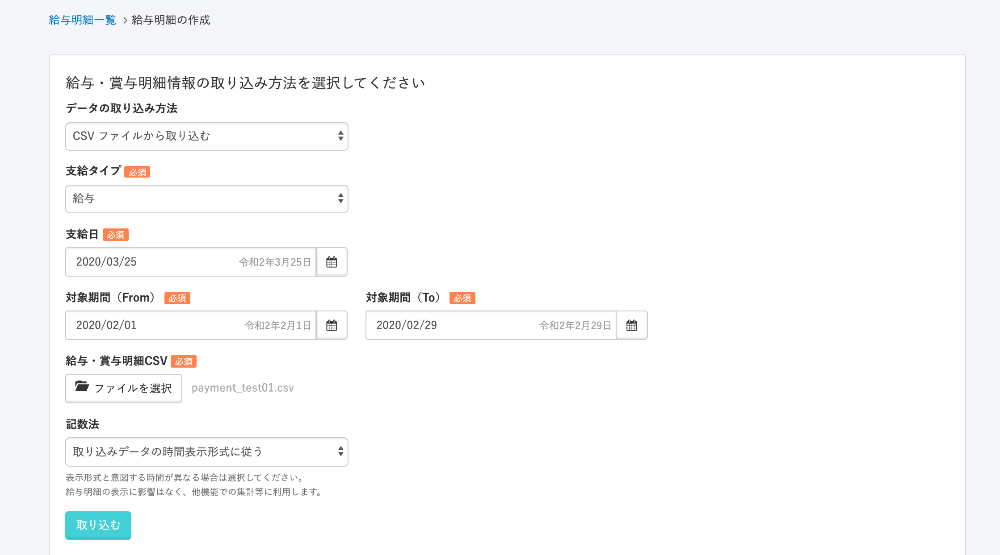

給与計算ソフト [マネーフォワード クラウド給与](https://payroll.moneyforward.com/) から出力したCSVファイルを使って給与明細を取り込めます。

CSVを使わず直接マネーフォワード クラウド給与から給与明細データを取り込む場合は、下記のヘルプページをご覧ください。

[マネーフォワード クラウド給与の給与明細データをSmartHRに取り込む](https://knowledge.smarthr.jp/hc/ja/articles/360026105654)

:::alert
SmartHRでのアプリケーション連携の初回設定がお済みでない場合は、下記のページを参考に連携を完了してからご利用ください。
[【マネーフォワード クラウド給与】連携設定（初回設定）](https://knowledge.smarthr.jp/hc/ja/articles/360050078134)
:::

# 1.マネーフォワード クラウド給与で確定処理を行う

マネーフォワード クラウド給与で計算を行い、 **\[確定\]** をしてください。

# 2.マネーフォワード クラウド給与からCSVをダウンロードする

左メニューの **\[帳票一覧\]  > \[支給控除一覧表\]** から、CSVをダウンロードしてください。

（※ **給与画面のメニュー > \[支給/控除/勤怠CSVダウンロード\]** でダウンロードしたCSVは従業員コードにTABが入っているため、SmartHRにはアップロードできない場合があります。

下記の画像のように、左メニューの **\[帳票一覧\]  > \[支給控除一覧表\]** からCSVをダウンロードしてください。）

# 3.不要な項目を削除する

- A列の「従業員」を削除してください。
- CSVのA列が「従業員コード」にしてください。
- その他、「扶養人数」、「税額表」、「健保標準報酬」、「子ども・子育て拠出金(会社)」といった、主に事業者向けの給与明細としての項目とならないものは削除いただくことをおすすめします。

イメージとしては、マネーフォワード クラウド給与の左メニューの **\[帳票一覧\] > \[給与明細\]** で表示されない項目を削除いただければと思います。

# 4.項目名の修正

マネーフォワード クラウド給与からダウンロードしたCSVには項目名に、(支給)、(控除)といった名称がついています。

この名称が不要な場合は、項目名から削除してください。

エクセルの機能で、編集 > 置換 で一括置換するのが便利です。

# 5\. 社員番号を確認する

SmartHRに登録されている社員番号が0から始まる場合、マネーフォワード クラウド給与でダウンロードし修正したCSVをそのままアップロードすることができません。

CSVの社員番号の頭に0を追加した状態で保存をしてください。

例：SmartHRに登録されている社員番号が0101、0102の場合、CSVのセルの中で頭にアポストロフィーをつけて0を表示させてください。この画像の例の場合、102は新規の「102」としてアップロードされます。（または登録にない場合はエラーメッセージが表示されます）

# 6\. SmartHRにCSVをアップロードする

## （1）はじめて給与明細機能を利用する場合

SmartHRに給与項目が登録されていないため、項目画面が表示されます。

項目を選択して登録し、あらためてCSVのアップロードを行ってください。

:::alert
**予期しないエラーの画面が表示された場合**
項目数が多いCSVの場合、一度に取り込むことができない状態となっております。
恐れ入りますが、項目数を30項目ずつに分割したものをアップロードしてください。
:::

項目の設定が完了すれば、給与明細のアップロード時の分割の必要はありません。

なお、あらかじめ項目を登録しておく方法もあります。

詳しい手順は下記のページをご覧ください。

[給与明細項目を設定する](https://knowledge.smarthr.jp/hc/ja/articles/360026265193) 

:::alert
**項目名について**
SmartHRに「基本給」と登録されている場合に、CSVが「基本給(支給)」となっていると、別の項目として認識されてしまいます。
上記4.項目名の修正の内容をご確認いただきご対応ください。
:::

## （2）給与明細の利用が二度目以降の場合

前回のアップロードから、項目に増加がなければ、すぐに給与明細のアップロードが行われます。

項目に増加があった場合は、上記と同じ項目登録画面が表示されますので、項目登録後、あらためてCSVのアップロードをお願いします。

### あらためて給与明細のCSVをSmartHRにアップロードする

再度、期間など指定していただき、アップロードを行ってください。

