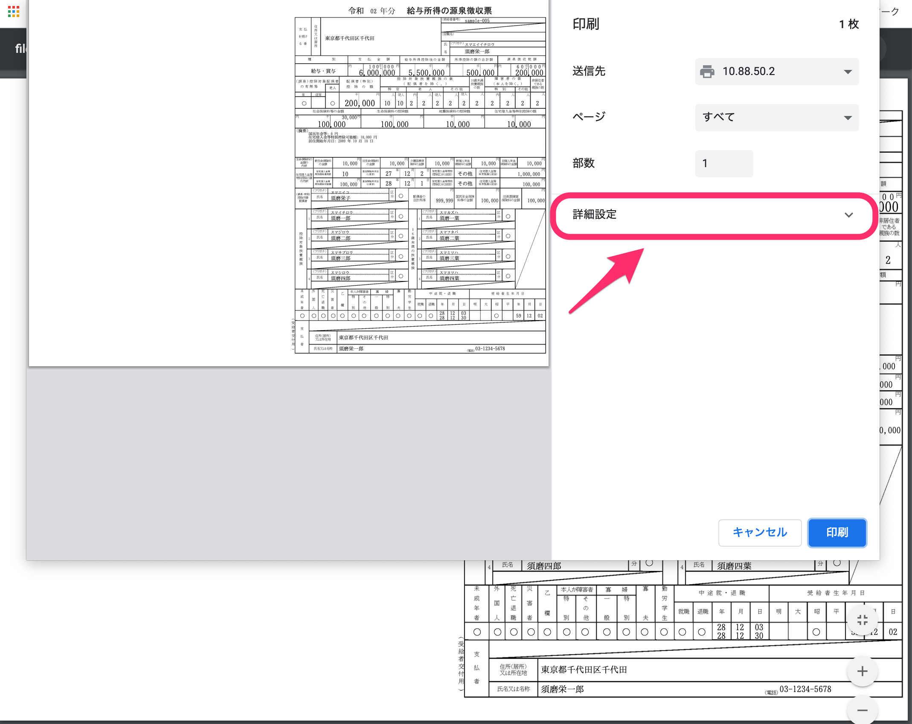
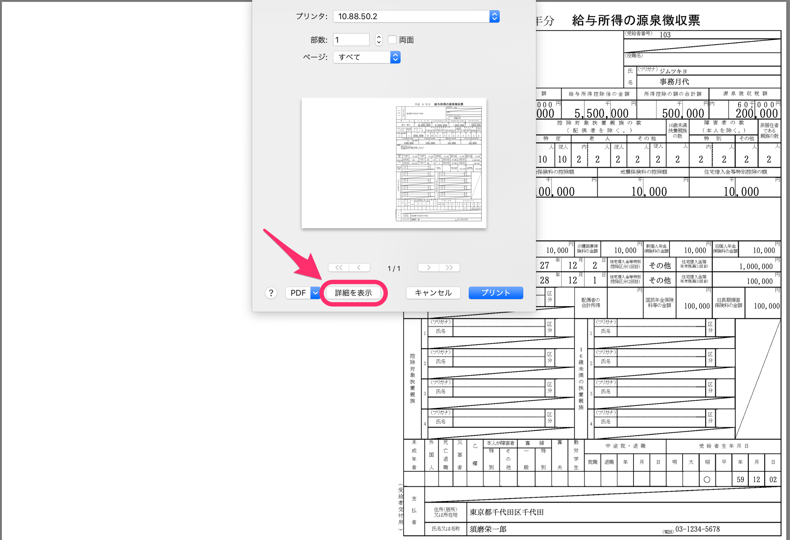
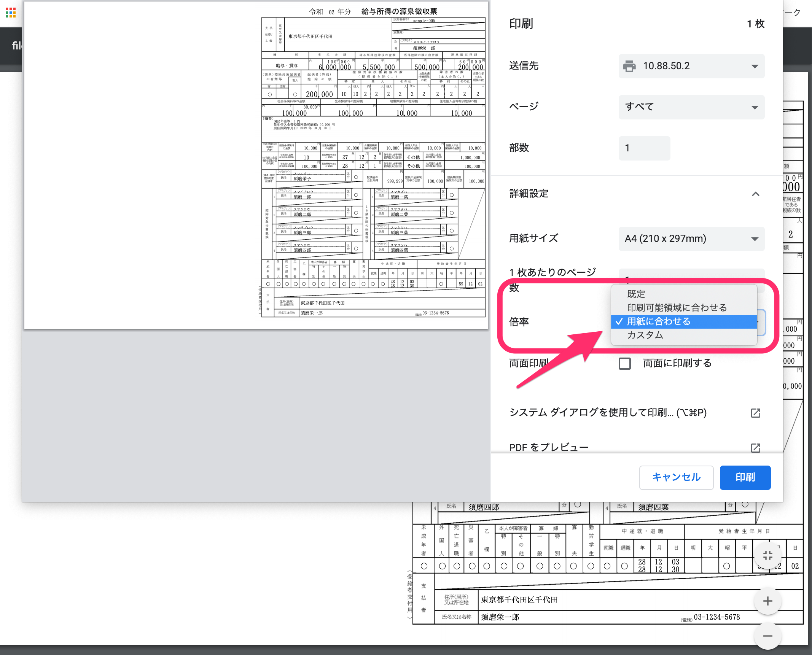
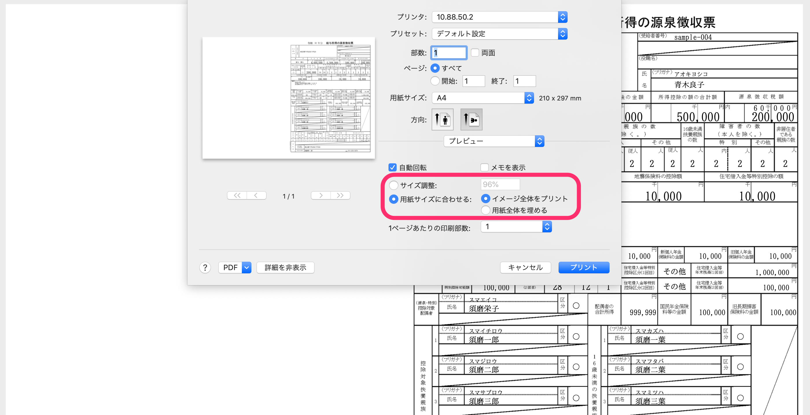
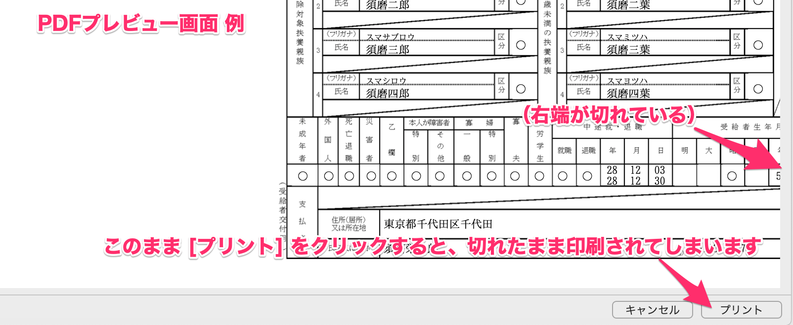

源泉徴収票を印刷した際に、プリンターの印刷範囲をはみ出していることなどが原因で端が切れて出力されてしまうことがあります。
その場合は以下の対処法をお試しください。

# 1\. 印刷の詳細設定を表示する

印刷（プリント）詳細設定が表示されていない場合は設定画面を表示します。

※ご使用のOSやブラウザなど、ご利用環境によって表示のされ方は異なります。
この記事でご案内しているのは、Mac と Google Chrome を使用した場合の表示例となります。

【ブラウザ上で印刷画面を開いた画面例】

【PDFを開いてプリント画面に移動した例】

# 2\. 印刷詳細画面の倍率を設定して印刷する

印刷詳細画面の倍率を **「用紙に合わせる」** に設定、または **「カスタム」** の縮小サイズなど設定しなおし、再度印刷してみてください。

【ブラウザの印刷画面例】

【PDFの印刷画面例】

:::tips
印刷しようとしたPDFやプレビューで表示したPDFが切れていると、印刷するときも切れた状態で出力されてしまいます。

印刷前に取り込んだPDFをご確認、またはプレビュー画面からブラウザに戻って、上記設定をお試しください。
:::
