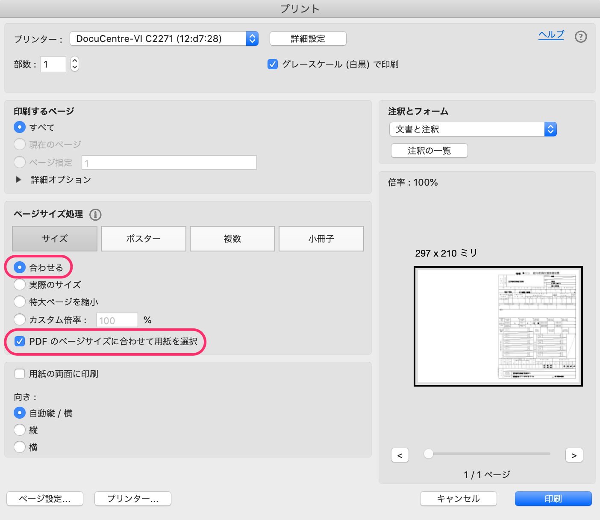

源泉徴収票について、問い合わせの多い質問とその回答内容を紹介します。

# Q1. 退職者に源泉徴収票の発行はできる？

はい、退職者にも源泉徴収票を発行できます。

SmartHRには退職した従業員専用の「退職者権限」があり、「退職者権限」が付与されたアカウントは給与明細や源泉徴収票の閲覧のみを行える状態になります。

退職した従業員に源泉徴収票の発行を行う場合、該当の従業員アカウントに「退職者権限」を付与した後で、源泉徴収票を発行してください。

退職者権限の設定方法について詳しくは、以下の記事をご覧ください。

:::related
[メールアドレスアカウントに退職者権限を適用する](https://knowledge.smarthr.jp/hc/ja/articles/360026106034-%E9%80%80%E8%81%B7%E8%80%85%E3%83%AD%E3%83%BC%E3%83%AB%E3%82%92%E9%81%A9%E7%94%A8%E3%81%99%E3%82%8B)
:::

# Q2. 源泉徴収票の公開日時は指定できる？

いいえ、源泉徴収票機能には公開日時の予約機能がありません。

お手数ですが、源泉徴収票の公開は手動で行うようお願いします。

# Q3. 通知画面でチェックボックスが表示されないのはなぜ？

該当の従業員がSmartHRへの招待を承諾していない場合や、ログイン・通知用メールアドレスを設定していない場合は、源泉徴収票の通知を行う画面で従業員名の横にチェックボックスが表示されません。

従業員にSmartHRの招待を承諾してもらうか、ログイン・通知用メールアドレスを設定してもらった上で、もう一度お試しください。

なお、招待メールに記載されているURLは発行から14日間のみ有効です。有効期限が切れてしまった場合は、招待メールを再送してください。

:::related
[招待メールを再送する](https://knowledge.smarthr.jp/hc/ja/articles/360026103574)
[ログイン・通知用メールアドレスを設定（変更）する](https://knowledge.smarthr.jp/hc/ja/articles/360026263093)
:::

# Q4. SmartHRに登録されている情報からマイナンバーを反映できる？

いいえ、源泉徴収票にマイナンバーを印字できる項目はありません。

ただし、別のシステムで作成したマイナンバー印字ありの源泉徴収票をお持ちの場合、PDFファイル形式で従業員さまへ配布していただけます。

PDFファイルを源泉徴収票に取り込む方法は、以下の記事をご覧ください。

:::related
[源泉徴収票機能とは](https://knowledge.smarthr.jp/hc/ja/articles/360026106554)
:::

# Q5. 印刷したときに端が切れる場合は？

源泉徴収票を印刷したときに端が切れてしまう場合、プリンタ設定を変更いただくと切れずに印刷できます。

プリンタの設定画面を開き、 **［ページサイズ処理］** の項目でサイズを［合わせる］をクリックし、［PDFのページサイズに合わせて用紙を選択］にチェックを入れてください。

以上の操作を行なった上で印刷すると、端が切れることなくプリントできます。

詳しくは以下のページをご覧ください。

:::related
[印刷した源泉徴収票の端が切れてしまう場合は？](https://knowledge.smarthr.jp/hc/ja/articles/360042496594)
:::

# Q6. 源泉徴収票にメッセージを記載するには？

源泉徴収票の配布通知メールの内容を変更すると、従業員は源泉徴収票の受け取り時に管理者が入力したメッセージもあわせて確認できます。

メールの本文内に通知事項を記載して、源泉徴収票を配信してください。

通知メールの編集方法については、以下のページをご覧ください。

:::related
[従業員が受け取るメールの内容をカスタマイズする](https://knowledge.smarthr.jp/hc/ja/articles/360026106674)
:::

# Q7. PDFを従業員と紐づけられない場合の対処法は？

PDFを従業員と紐づけられない場合、ご利用のWebブラウザがSmartHRの動作環境を満たしていない可能性が考えられます。

:::related
[SmartHRの動作環境は？](https://knowledge.smarthr.jp/hc/ja/articles/360035170054)
:::

上記のページをご確認の上、動作環境を満たすWebブラウザ・OSでお試しください。

# Q8. 確定済みの源泉徴収票一覧に源泉徴収票を追加できる？

はい、できます。

確定済みの源泉徴収票を一度「確定解除」したあと、源泉徴収票を追加してください。

:::related
[源泉徴収票を更新する](https://knowledge.smarthr.jp/hc/ja/articles/4408644043033)
:::

# Q9. 「給与所得等明細書の電子交付に関する同意」に同意していない従業員がいる場合は？

「給与所得等明細書の電子交付に関する同意」に未同意の従業員は、源泉徴収票を見られません。

電子交付に同意していない従業員が給与明細や源泉徴収票の確認を行おうとすると、電子交付の同意画面が表示されます。

従業員さまに電子交付に関する同意をしていただきたい場合は、従業員側の画面で **画面右上のアカウント名 >［個人設定］>［給与所得等明細書の電子交付に関する合意］** の順にクリックし、同意のチェックを入れていただくよう従業員さまにお伝えください。

従業員が電子交付の合意を行う手順について詳しくは、以下のページをご覧ください。

:::related
[「電子交付に関する同意」に未同意の従業員がいる場合は？](https://knowledge.smarthr.jp/hc/ja/articles/360035049894)
:::
