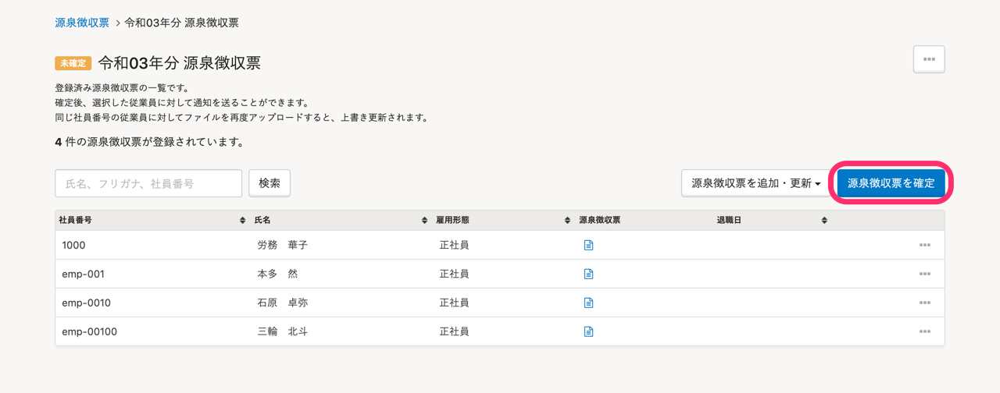
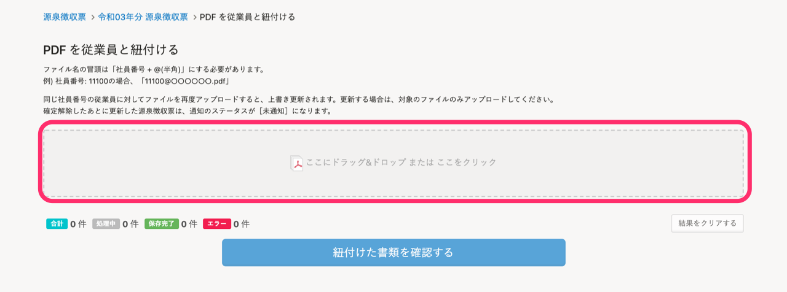

源泉徴収票を発行し、従業員に通知する方法を説明します。

給与計算ソフトから出力した、CSV形式またはPDF形式の源泉徴収票をアップロードしてSmartHRに登録します。

いずれの方法でも、PDF形式の源泉徴収票を配付できます。

# CSVファイルをアップロードし、PDFファイルの源泉徴収票を従業員に配付する

CSV形式の源泉徴収票をアップロードし、PDFファイルに変換された源泉徴収票を従業員に配付します。

## 1\. トップページの ［源泉徴収票］をクリック

トップページ左側にある **［機能］** から **［源泉徴収票］** をクリックします。

## 2\. ［+発行する］をクリック

源泉徴収票一覧画面の右上にある **［+発行する］** をクリックすると、 **［源泉徴収票を発行する］** 画面が表示されます。

## 3.  源泉徴収票の［名前］と［年］を入力し、［発行する］をクリック

源泉徴収票の管理用の名前を入力し、源泉徴収票に印字される年を選択します。

 **［発行する］** をクリックすると、源泉徴収票一覧画面が表示されます。

## 4\. ［源泉徴収票を追加・更新］>［CSVから取り込む］をクリック

源泉徴収票一覧画面の右上にある **［源泉徴収票を追加・更新］>** ［ **CSVから取り込む］** をクリックすると、CSVファイルのアップロードページが表示されます。

## 5\. 取り込むCSVファイルを準備

 **［インポート］** の下にある **［サンプルのCSVファイルをダウンロード］** をクリックすると、サンプルのCSVファイルをダウンロードできます。

CSVファイルは、下図のように1行目を項目名とし、2行目以降に各従業員の源泉徴収票情報を入力します。

項目名は、**必ず**入力してください。

項目名（カラム名）の一覧は、CSVファイルのインポート画面下部を参照してください。

:::tips
項目名（カラム名）一覧表の左端にある項番の列（A, B, Cなど）は、CSVファイルに記入する必要はありません。

:::
:::tips
各項目と源泉徴収票の記載位置の紐付きは、以下のPDFファイルで確認できます。
[源泉徴収票の見本PDF](./__________.pdf)
PDFファイルの内容は、CSVファイルのインポート画面内にある「各項目と源泉徴収票の紐付きはこちらでご確認いただけます」の文字リンクからも確認できます。
:::

## 6\. ［ファイルを選択］をクリックし、CSVファイルを選択後、［インポート］をクリック

 **［ファイルを選択］** をクリックし、アップロードするCSVファイルを選択します。

 **［インポート］** をクリックすると、「源泉徴収票の取り込みを予約しました」のメッセージが表示され、バックグラウンド処理で取り込みが始まります。

## 7\. CSVファイルが取り込まれたことを確認し、確定と通知を行なう

バックグラウンド処理の完了後、源泉徴収票の一覧画面で内容を確認し、 **［源泉徴収票を確定］** をクリックすると、確定されます。

確定すると、従業員はトップページから発行された源泉徴収票を閲覧できるようになります。

通知したい従業員にチェックを入れ、 **［まとめて通知］** をクリックすると従業員に通知されます。

:::tips
従業員に送られるメールの内容は、「メールフォーマット」で設定できます。
[従業員が受け取るメールの内容をカスタマイズする](https://knowledge.smarthr.jp/hc/ja/articles/360026106674)
:::
:::related
[源泉徴収票を更新する](https://knowledge.smarthr.jp/hc/ja/articles/4408644043033)
[源泉徴収票を削除する](https://knowledge.smarthr.jp/hc/ja/articles/360026106274)
:::

# PDFファイルをアップロードし、従業員に配付する

ファイル名に社員番号を含めたPDF形式の源泉徴収票をアップロードし、社員番号が一致する従業員に配付します。

## 1\. トップページの ［源泉徴収票］をクリック

トップページ左側にある **［機能］** から **［源泉徴収票］** をクリックします。

## 2\. ［+発行する］をクリック

源泉徴収票一覧画面の右上にある **［+発行する］** をクリックすると、 **［源泉徴収票を発行する］** 画面が表示されます。

## 3.  源泉徴収票の［名前］と［年］を入力し、［発行する］をクリック

源泉徴収票の管理用の名前を入力し、源泉徴収票に印字される年を選択します。

 **［発行する］** をクリックすると、源泉徴収票一覧画面が表示されます。

## 4\. ［源泉徴収票を追加・更新］>［PDFを従業員と紐付ける］をクリック

源泉徴収票一覧画面の右上にある **［源泉徴収票を追加・更新］>**  ［ **PDFを従業員と紐付ける］** をクリックすると、PDFファイルのアップロードページが表示されます。

## 5\. 取り込むPDFファイルを準備

ファイル名は「**社員番号@**任意の文字列.pdf」のように、社員番号を含めてください。

社員番号が一致する従業員とPDFファイルが紐付けられます。

例えば、社員番号001の従業員の源泉徴収票は、「**001@**令和3年分源泉徴収票.pdf」のようなファイル名にしてください。

ファイル名が上記に沿っていない場合や、ファイル形式がpdfでない場合はエラーになり、アップロードできません。

## 6\. PDFファイルを選択し、［紐付けた書類を確認する］をクリック

画面中央のスペースにPDFファイルをドラッグアンドドロップしてアップロードします。

画面中央のスペースをクリックし、PDFファイルを選択してもアップロードできます。

PDFファイルをアップロードすると、ステータス名と件数の下に詳細が表示されます。

ステータスが **［保存完了］** になっていることを確認し、 **［紐付けた書類を確認する］** をクリックすると、源泉徴収票一覧画面に戻ります。

:::tips
 **［氏名］** 欄にエラーが表示された場合は、内容を確認して、ファイルをアップロードし直してください。

:::

## 7\. PDFファイルを確認し、確定と通知を行なう

源泉徴収票の一覧画面で内容を確認し、 **［源泉徴収票を確定］** をクリックすると、確定されます。

確定すると、従業員はトップページから発行された源泉徴収票を閲覧できるようになります。

通知したい従業員にチェックを入れ、 **［まとめて通知］** をクリックすると従業員に通知されます。

:::tips
従業員に送られるメールの内容は、「メールフォーマット」で設定できます。
[従業員が受け取るメールの内容をカスタマイズする](https://knowledge.smarthr.jp/hc/ja/articles/360026106674)
:::
:::related
[源泉徴収票を更新する](https://knowledge.smarthr.jp/hc/ja/articles/4408644043033)
[源泉徴収票を削除する](https://knowledge.smarthr.jp/hc/ja/articles/360026106274)
:::
