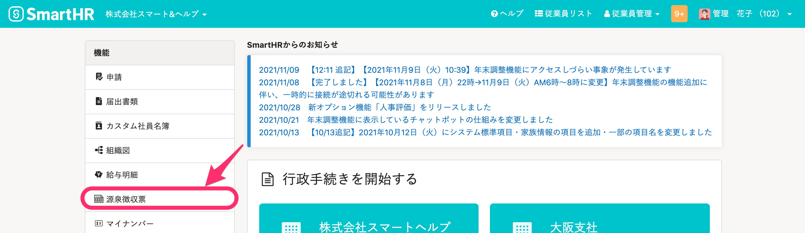
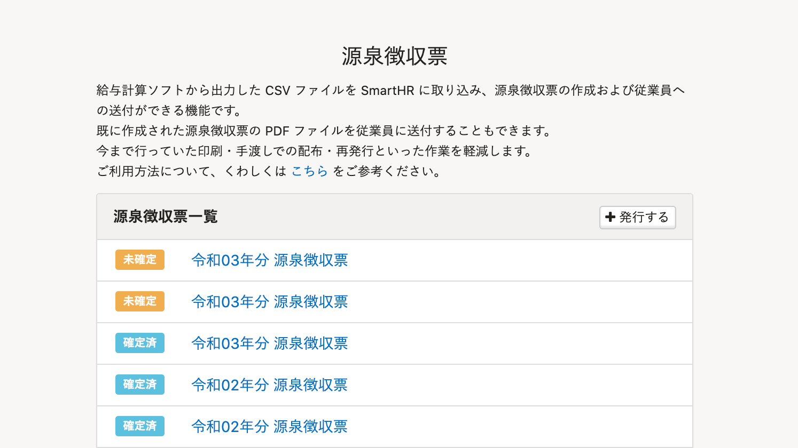
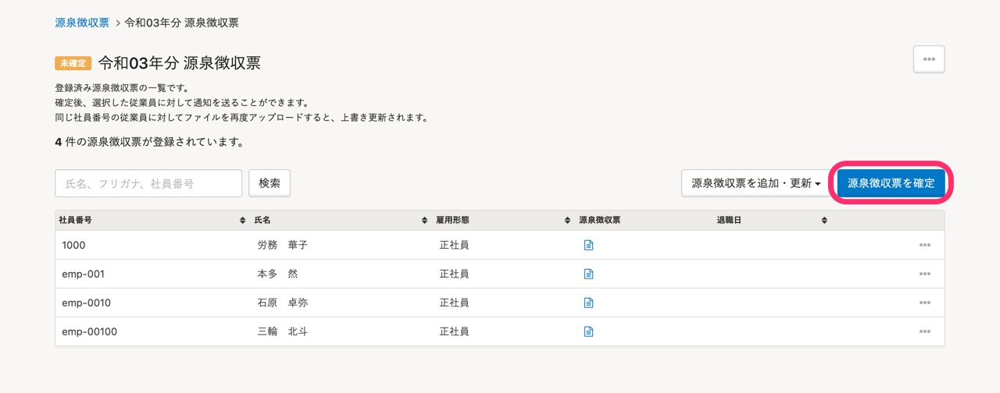
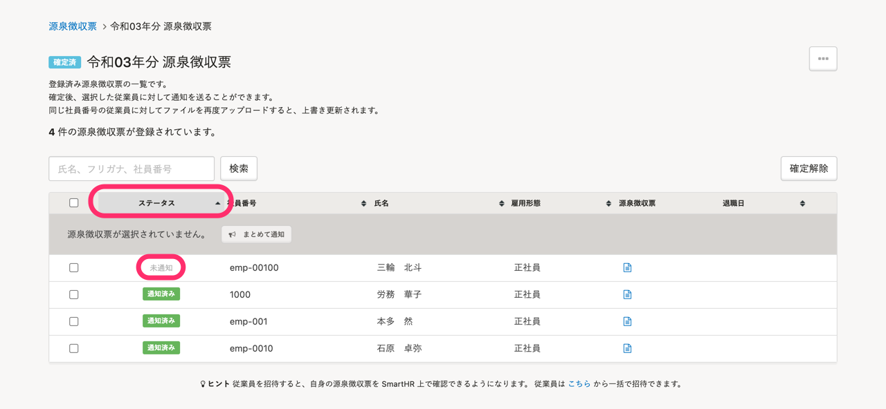

作成済みの源泉徴収票グループに源泉徴収票を追加したり、登録済みの源泉徴収票を上書き更新したりする方法を説明します。

# 1\. トップページの［源泉徴収票］をクリック

トップページ左側にある **\[機能\]** から **\[源泉徴収票\]** をクリックします。

# 2\. 対象の源泉徴収票をクリック

**\[源泉徴収票一覧\]** で、対象の源泉徴収票をクリックします。

## 確定済みの源泉徴収票を更新する場合

確定済みの場合は、「確定解除」すると源泉徴収票を上書き更新できるようになります。

:::alert
「確定解除」すると、源泉徴収票グループに含まれる従業員全員が、源泉徴収票を閲覧できなくなります。
再度「確定」すると、閲覧できるようになります。
:::

# 3\. 追加・修正したい従業員のファイルをアップロードする

同じ社員番号の従業員に対してファイルを再度アップロードすると、上書き更新されます。

アップロード方法は、[源泉徴収票を発行する](https://knowledge.smarthr.jp/hc/ja/articles/4409111670809)をご覧ください。

:::alert
更新対象ではない従業員のファイルはアップロードしないでください。
意図せずファイルを上書きしてしまうおそれがあります。
:::

# 4\. 内容を確認して、［源泉徴収票を確定］をクリック

アップロード内容が反映されていることを確認し、 **［源泉徴収票を確定］** をクリックします。

# 5\. 更新した源泉徴収票のみ、従業員に発行の通知を送る

更新した源泉徴収票は通知のステータスが **［未通知］** になるため、必要に応じて再度通知を送ります。

 **［ステータス］** でソートをかけて、 **［未通知］** の源泉徴収票のみにチェックを入れます。

 **［まとめて通知］** をクリックして、従業員に発行の通知を送信します。

