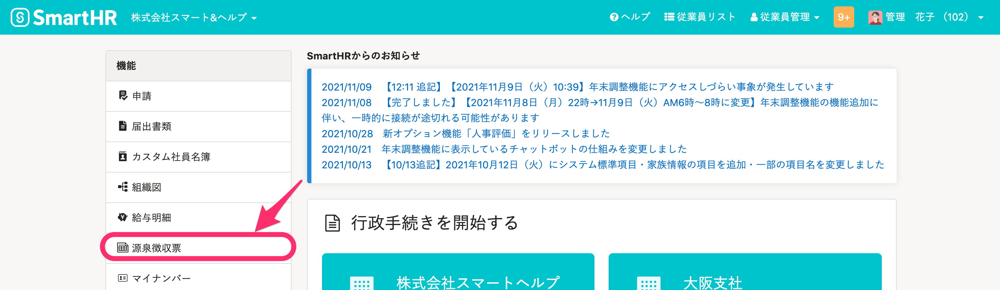
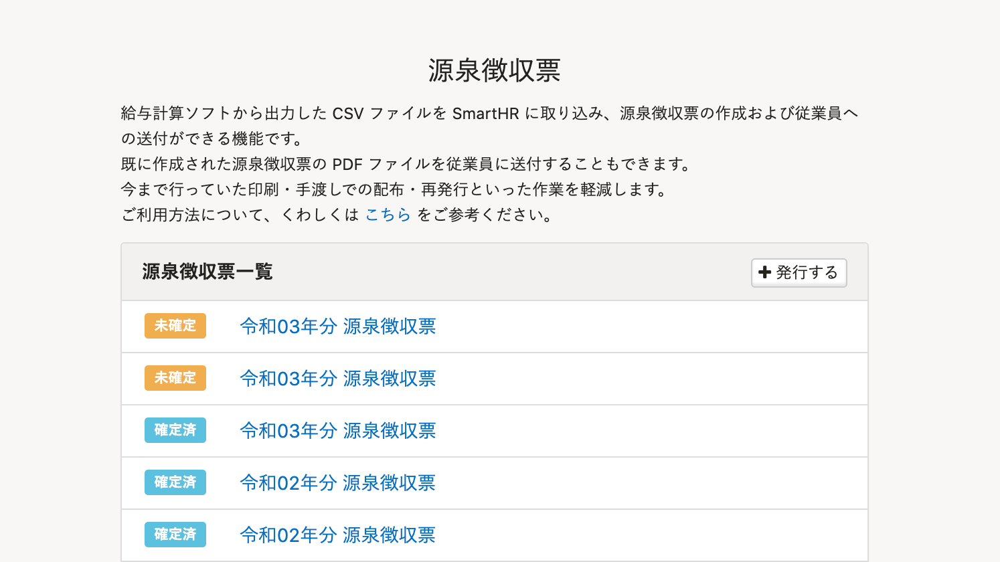
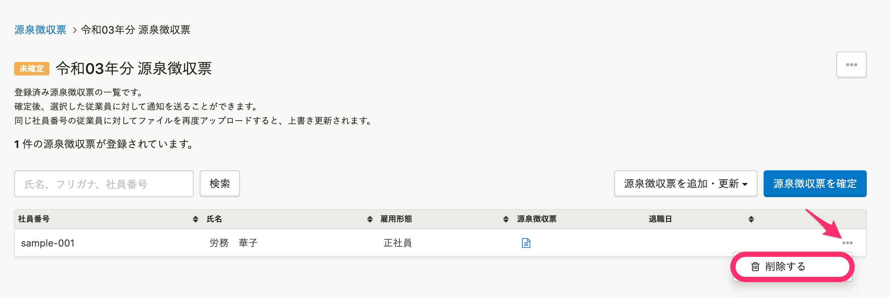
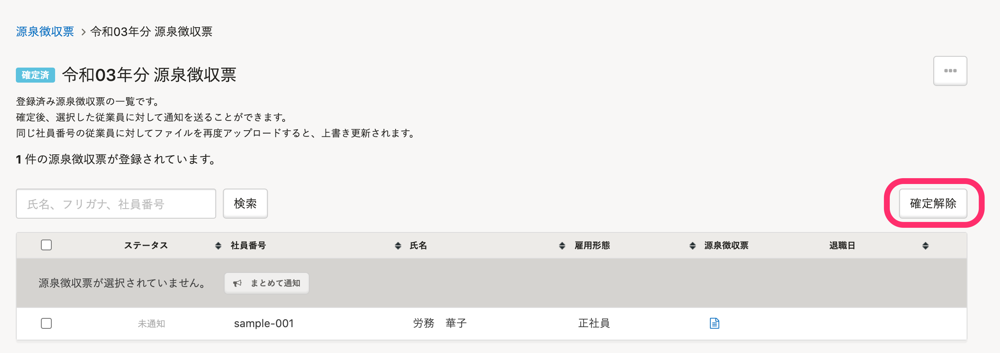
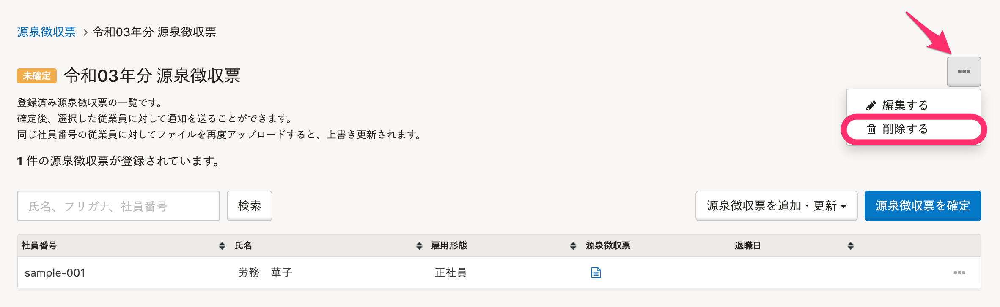

一度登録した源泉徴収票を削除する方法を説明します。

従業員ごとに個別に削除する方法と、グループごと一括削除する方法があります。

# 従業員ごとに削除する

従業員ごとに源泉徴収票を削除します。

:::tips
源泉徴収票を修正したい場合は、削除せず上書きして修正できます。
[源泉徴収票を更新する](https://knowledge.smarthr.jp/hc/ja/articles/4408644043033)
:::

## 1\. トップページの［源泉徴収票］をクリック

トップページ左側にある **［機能］** から **［源泉徴収票］** をクリックします。

## 2\. 対象の源泉徴収票をクリック

 **［源泉徴収票一覧］** で対象の源泉徴収票をクリックします。

## 3\. 削除したい源泉徴収票の［...］メニュー >［削除する］をクリック

削除したい従業員の源泉徴収票の右端にある **［…］メニュー >［削除する］** をクリックします。

:::tips
### 確定済みの源泉徴収票を削除する場合
確定済みの場合は、「確定解除」すると従業員ごとに源泉徴収票を削除できるようになります。

削除後は、源泉徴収票を再度確定してください。
未確定のままにすると、源泉徴収票グループに含まれる従業員全員が源泉徴収票を閲覧できなくなります。
:::

# グループごとに削除する

源泉徴収票グループごとに源泉徴収票を削除します。

## 1\. トップページの［源泉徴収票］をクリック

トップページ左側にある **［機能］** から **［源泉徴収票］** をクリックします。

## 2\. 対象の源泉徴収票をクリック

 **［源泉徴収票一覧］** で、対象の源泉徴収票をクリックします。

## 3\. ［...］メニュー >［削除する］をクリック

右上の **［…］メニュー**  \> **［削除する］** をクリックします。

