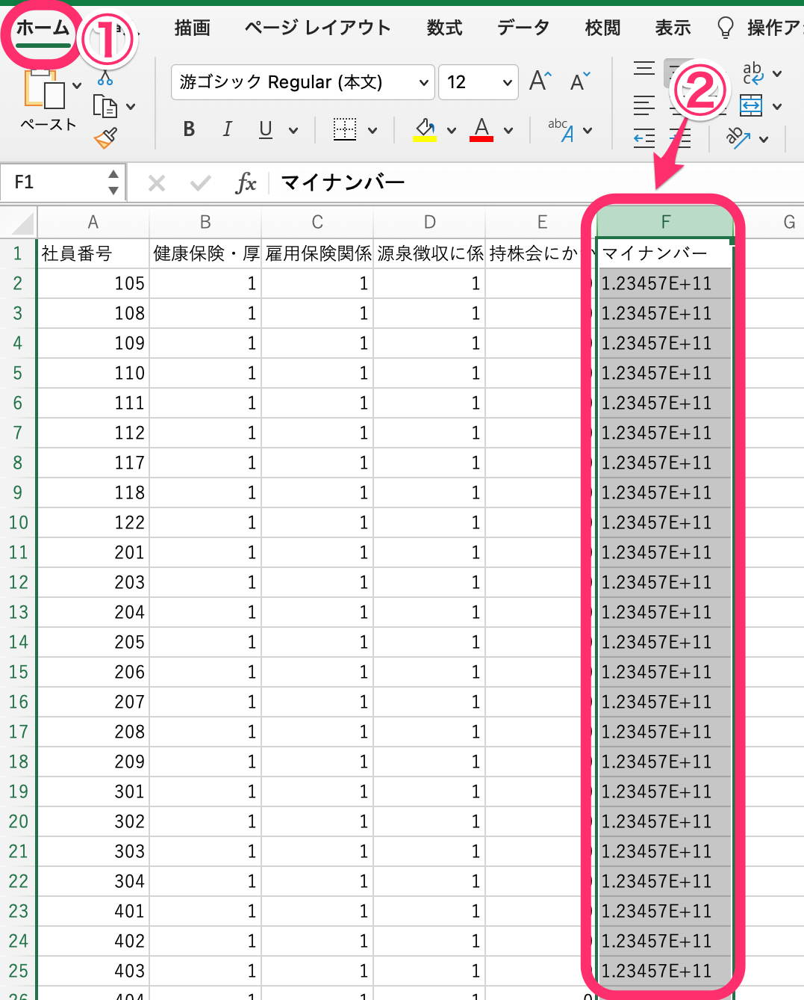
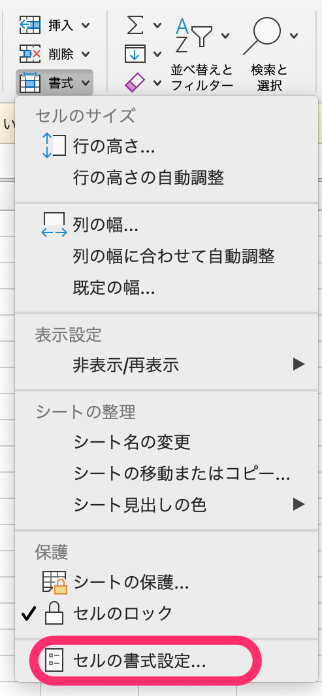
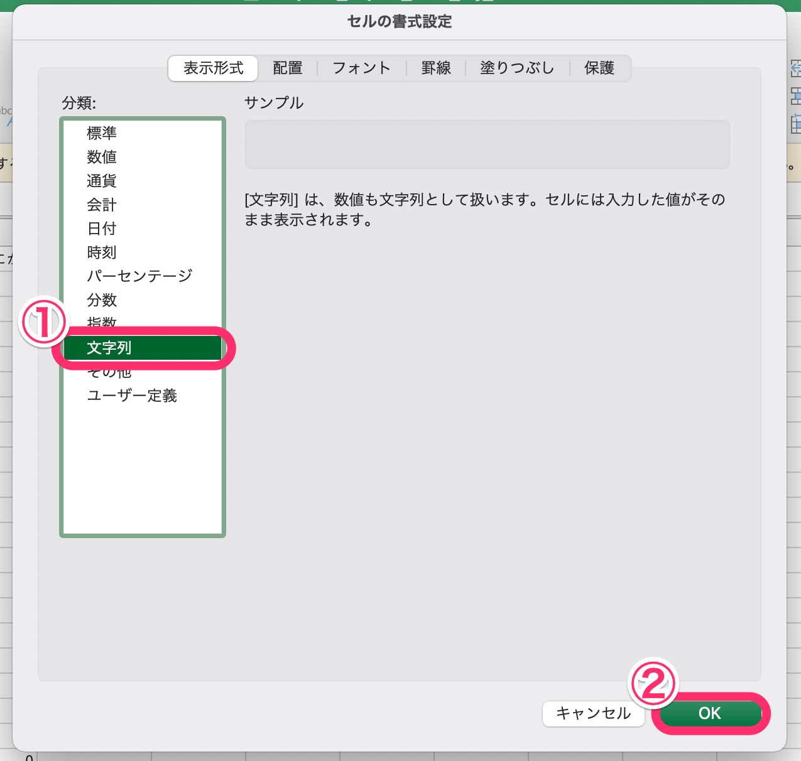
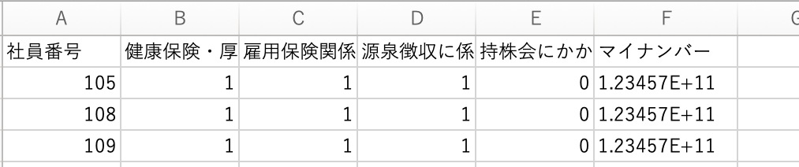
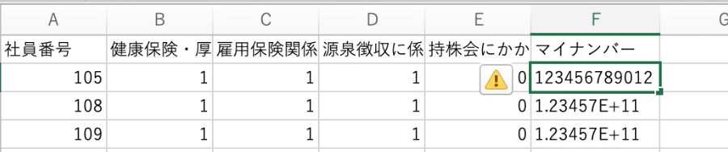

:::alert
このページに記載している内容は、サポート対象外です。
ご不明な点がある場合は、それぞれのサポート元へお問い合わせください。
[SmartHRサポートポリシー](https://knowledge.smarthr.jp/hc/ja/articles/360044805593#toc--4)
:::

# A. セルの書式を「文字列」に設定すると、マイナンバーを正しく表示できます。

ファイルに桁数の大きい数値が入力されている場合、Excelの仕様により、「E+11」などのEを含む数字表記（指数表記）になることがあります。

## 対応方法

### 1\. ［ホーム］を選択した状態で該当の列をクリック

Excelの **［ホーム］** タブを選択した状態で、指数表記になっている列全体をクリックします。

### 2\. ［書式］>［セルの書式設定…］をクリック

 **［書式］>［セルの書式設定…］** をクリックすると、書式設定画面が表示されます。

### 3. **［表示形式］>［文字列］** をクリック

 **［表示形式］** タブにある **［分類］** 欄の **［文字列］** を選択して、 **［OK］** をクリックします。

### 4\. 該当のセルをダブルクリック

該当のセルをダブルクリックすると設定が適用され、マイナンバーが正しく表示されます。

適用前：マイナンバーが正しく表示されていません。

適用後：マイナンバーが正しく表示されます。

