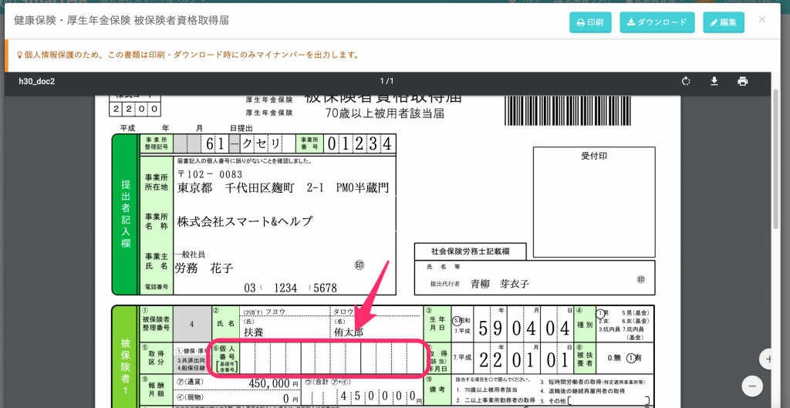
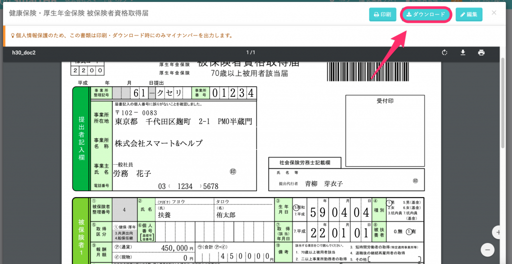
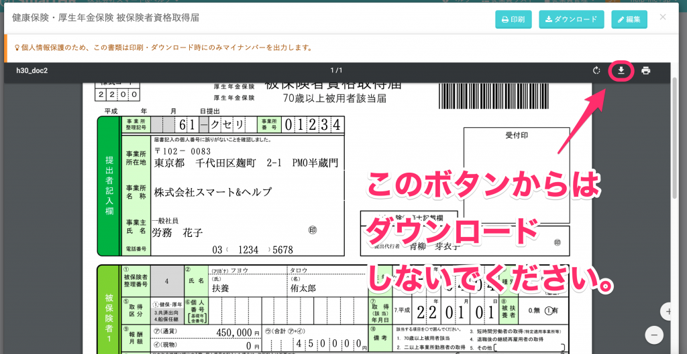
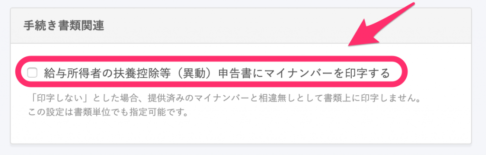
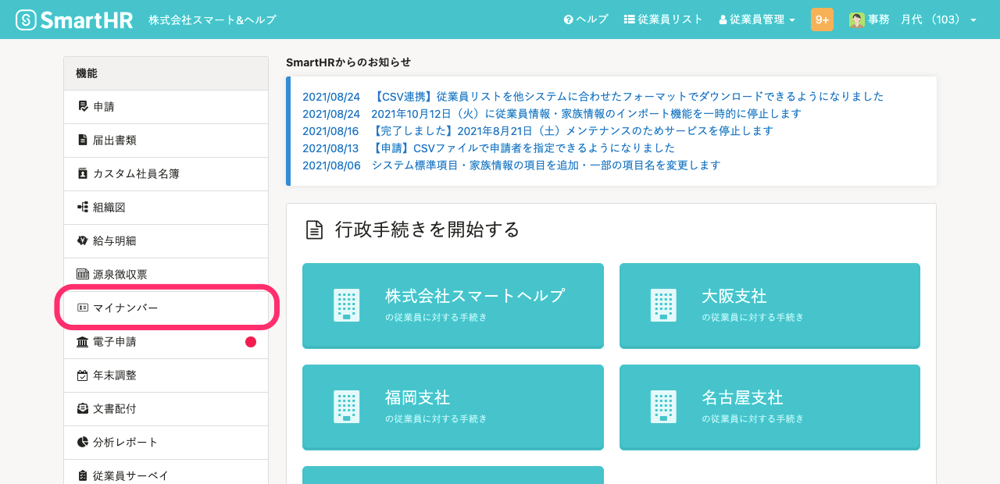

登録済みのマイナンバーが書類に反映されない場合は、いくつかの原因が考えられます。

# SmartHRの画面上で確認している

個人情報保護のため、SmartHRでの書類プレビュー画面では、マイナンバーは表示されない仕組みとなっております。

確認をする際は、プレビュー画面上部にある **\[ダウンロード\]** からPDFのダウンロードをしてください。

# PDFダウンロードを、ブラウザの機能で行っている

プレビュー画面からPDFをダウンロードする際、 上部にある **\[ダウンロード\]** ではなく、**小さなアイコンからダウンロードをすると、PDFにマイナンバーが印字されません。**

必ず上部にある **\[ダウンロード\]** からダウンロードをしてください。

# 給与所得者の扶養控除（等）異動申告書にマイナンバーを印字しない設定をしている

**\[共通設定\] > \[手続き関連設定\]** 内にある「手続き書類関連」の欄で、「給与所得者の扶養控除（等）異動申告書にマイナンバーを印字する」のチェックが外れていると、給与所得者の扶養控除（等）異動申告書にマイナンバーが印字されません。

印字が必要な場合はこちらにチェックを入れてください。

# マイナンバーを登録していない

正しい **\[ダウンロード\]** ボタンからPDFをダウンロードしてもマイナンバーが表示されない場合は、マイナンバーが未登録の可能性があります。

マイナンバーが登録されているかどうかは、トップページ左の **\[機能\]** 欄にある **\[マイナンバー\]** をクリックすると表示される、マイナンバー管理画面で確認できます。

マイナンバー管理画面の一覧で、従業員名の右側にある **\[詳細\]** をクリックすると、本人と被扶養者のマイナンバーの登録状況が確認できます。

**\[詳細\]** が表示されていない場合は、マイナンバーは未取得の状態です。

マイナンバーの取得が必要な場合は、下記のページをご覧ください。

[マイナンバー管理機能とは](https://knowledge.smarthr.jp/hc/ja/articles/360026107514)
