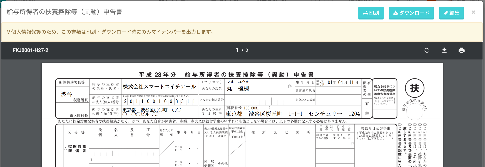
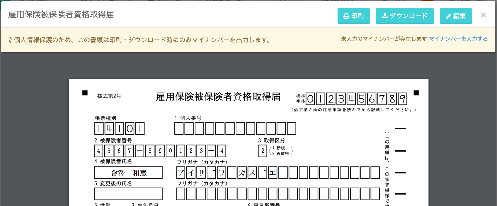

手続き書類上でのマイナンバーの表示は、従業員のマイナンバーが登録されているか否かによって異なります。

# マイナンバーが登録されている場合

従業員のマイナンバーを管理している場合、各種手続きでマイナンバーを使用して出力できます。

SmartHRの画面上では表示せず、実際に印刷・ダウンロードした場合にのみマイナンバーを出力します。

※ **事務担当者** が作成した手続のみ、事務担当者もマイナンバーを閲覧できます。

印刷・ダウンロードした際にマイナンバーが表示されない場合は、下記のページをご確認ください。

[マイナンバーが書類に反映されない原因は？](https://knowledge.smarthr.jp/hc/ja/articles/360026262053)

# マイナンバーが未登録の場合

下記図の通り、入力を促すメッセージが表示されます。

