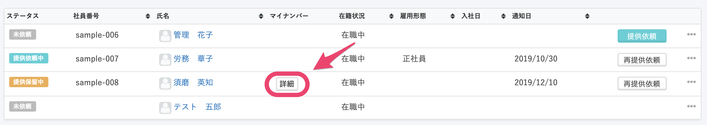
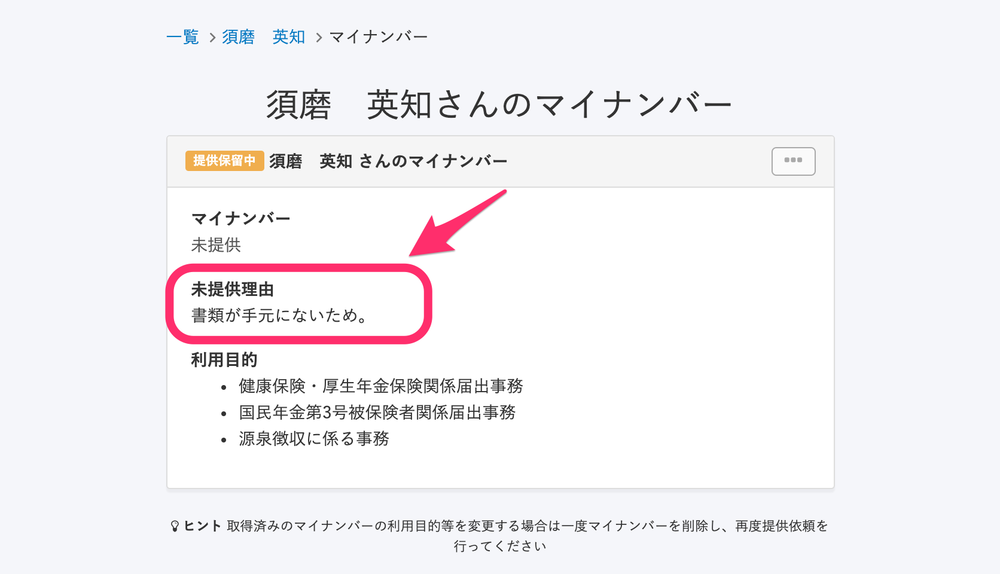
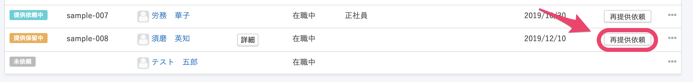
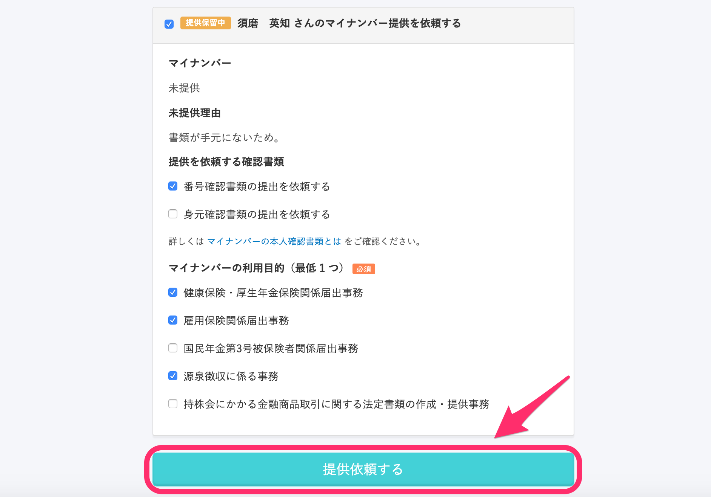
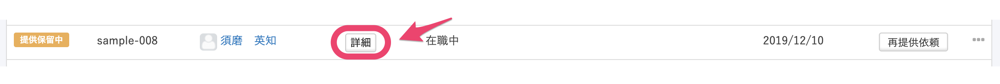
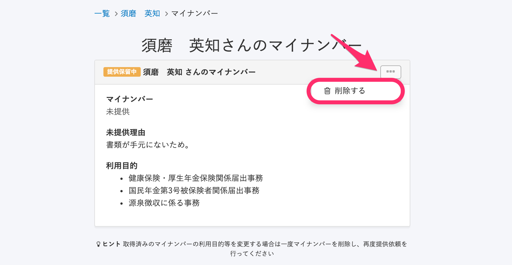
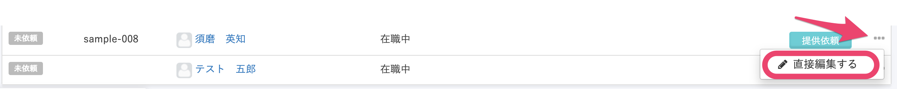

従業員はマイナンバーの提出依頼に対して「提供しない」を選択し、提供を保留できます。

従業員が提供をしなかった場合、マイナンバー管理画面では **\[提供保留中\]** のステータスになります。

:::tips
**\[提供保留中\]** になっている場合、従業員のSmartHRトップページには、常にマイナンバー提供ボタンが表示されます。
詳しくは下記のページをご覧ください。
[マイナンバーの提供依頼が届いたら？](https://knowledge.smarthr.jp/hc/ja/articles/360026266313)
:::

# 提供保留の理由を確認する方法

## 1\. 該当従業員のマイナンバー欄の **\[詳細\]** をクリック

SmartHRトップページ左側の **\[機能\]** にある **\[マイナンバー\]** をクリックすると、マイナンバー管理画面に移動します。

マイナンバー管理画面の従業員一覧の、ステータスが **\[提供保留中\]** になっている従業員のマイナンバー欄にある **\[詳細\]** をクリックしてください。

## 2.未提供理由を確認する

マイナンバー詳細画面で、未提供理由をご確認ください。

# マイナンバーの再提供依頼をする方法

**\[提供保留中\]** になっている従業員に対し、再提供依頼ができます。

## 1\. マイナンバー一覧画面で、該当従業員の **\[再提供依頼\]** をクリック

**\[再提供依頼\]** をクリックすると、マイナンバーの提供依頼画面が開きます。

## 2\. 未提供理由や提供を依頼する書類などを確認し、提供を依頼する

マイナンバーの提供依頼画面で、 **\[未提供理由\]** や **\[提供を依頼する確認書類\]** などを確認のうえ、画面下部にある **\[提供依頼する\]** をクリックして、再提供依頼を送信してください。

再提供依頼が送信されると、従業員にはメールとSmartHRの画面上で通知が届きます。

# マイナンバーを直接登録する方法

**\[提供保留中\]** になっているマイナンバーを、管理者が直接登録することもできます。

## 1\. 該当従業員の **\[詳細\]** をクリック

## 2\. マイナンバーを削除する

マイナンバーの詳細ページにて、従業員もしくは各被扶養者の右上にある **\[…\]メニュー > \[削除\]** をクリックすると、削除の確認ダイアログが表示されます。

※実際にはマイナンバーの登録はされていない状態のため、削除しても手続きに影響はありません。

確認ダイアログで **\[OK\]** をクリックすると、**\[提供保留中\]** の状態が解除されます。

## 3\. マイナンバーの直接編集をする

マイナンバー管理画面の一覧の該当従業員の行の右端にある **\[…\]メニュー > \[直接編集する\]** をクリックし、直接入力してください。

直接編集の詳しい流れは下記のページをご確認ください。

[管理者がマイナンバーを直接入力する](https://knowledge.smarthr.jp/hc/ja/articles/360026105234)
