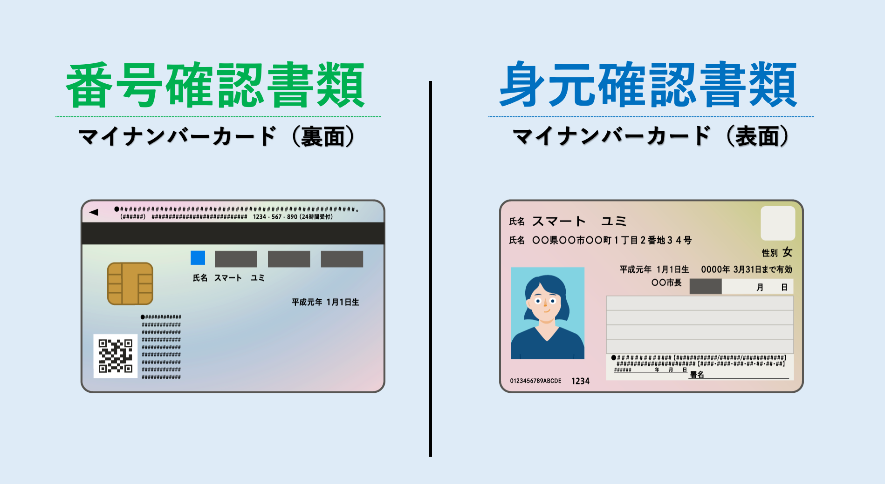
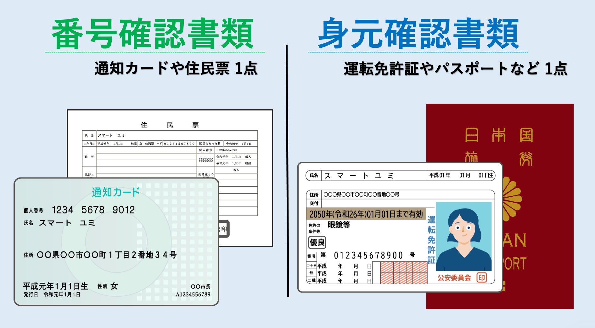

マイナンバーの確認にあたっては、マイナンバーと本人確認書類を突き合わせて、 **正しい番号であること（番号確認）** と **本人が番号の正しい持ち主であること（身元確認）** を確かめる必要があります。

マイナンバーの確認時に使う本人確認書類について説明します。

# マイナンバー確認時に使う本人確認書類

## マイナンバーカードがある場合

マイナンバーカード（個人番号カード）がある場合は、マイナンバーカード1枚で番号確認（裏面）と身元確認（表面）ができます。

:::alert
画像を添付する際に、マイナンバーカードの裏表を間違えないようにご注意ください。
- 番号確認書類：マイナンバーの記載がある **裏面** を添付
- 身元確認書類：顔写真がある **表面** を添付
:::

## マイナンバーカードがない場合

マイナンバーカードがない場合は、住所、氏名などが住民票の記載と一致している **通知カード** か、マイナンバーが記載された **住民票の写し** を番号確認書類に使います。

:::tips
「通知カード」は2020年5月25日に廃止され、マイナンバーの通知は個人番号通知書の送付をもって行なわれることとなりました。
改姓や転居などで通知カードの記載事項に変更が生じた場合、通知カードは番号確認の書類として使えなくなりますのでご注意ください。
また、個人番号通知書は、番号確認書類および身元確認書類としては使えません。
通知カードの廃止について、詳細は [通知カードの廃止について｜総務省](https://www.soumu.go.jp/kojinbango_card/02.html#haishi) をご覧ください。
:::

### 住民票 または 通知カード＋顔写真付き身分証明書1点

運転免許証などの **顔写真付き身分証明書** があれば、**1点** で身元確認できます。

#### 顔写真付き身分証明書の例

- 運転免許証
- 運転経歴証明書
- 旅券（パスポート）
- 身体障害者手帳
- 在留カード
- 特別永住者証明書 など

### 住民票 または 通知カード＋顔写真なしの身分証明書2点

顔写真付きの身分証明書がない場合は、下記のいずれかの身分証明書 **2点** で身元確認します。

#### 顔写真なしの身分証明書の例

- 公的医療保険の被保険者証
- 年金手帳・基礎年金番号通知書
- 学生証（顔写真なし）
- 社員証 （顔写真なし）
- 資格証明書（顔写真なし）
- 国税・地方税・ 社会保険料・公共料金の領収書
- 印鑑登録証明書
- 住民票の写し
- 源泉徴収票 など

:::alert
**公的医療保険の被保険者証** を使用する場合、「保険者番号」と「被保険者記号・番号」を隠してください。

[医療保険の被保険者等記号・番号等の告知要求制限について](https://www.mhlw.go.jp/stf/newpage_13989.html)
:::

なお、SmartHRで従業員に対するアカウント発行時に身元確認が済んでいる場合には、ログインに利用する ID およびパスワードをもって身元確認とすることも可能です。
（番号法施行規則四二ニ）

本人確認書類に関するさらに詳しい情報は、以下のページをご確認ください。

[民間事業者における取扱いに関する質問｜内閣府](https://www.cao.go.jp/bangouseido/faq/faq4.html)

[本人確認の措置について（PDF）｜内閣府](https://www.cao.go.jp/bangouseido/pdf/lawkakunin.pdf)
