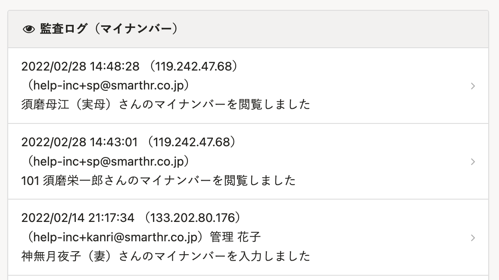

SmartHRのマイナンバー管理機能を利用すると、安全かつ確実にマイナンバーの収集・保管ができます。
登録されたマイナンバーは各種書類へ出力させることも可能です。

# マイナンバーを登録する方法

SmartHRでは、以下の3つの方法でマイナンバーを登録できます。
運用状況に合わせた方法でご活用ください。

## 1\. [従業員にマイナンバーの提供依頼をし、入力してもらう](https://knowledge.smarthr.jp/hc/ja/articles/360026105214)

## 2\. [管理者が直接入力する](https://knowledge.smarthr.jp/hc/ja/articles/360026105234)

## 3\. [招待と合わせて従業員にマイナンバーの入力をしてもらう方法](https://knowledge.smarthr.jp/hc/ja/articles/360026105274)

:::tips
**マイナンバーは暗号化された状態で保存され、万が一データが流出した場合でも、マイナンバー自体が把握されることはありません。**
また、人為的な流出への抑止としてマイナンバーの閲覧履歴は監査ログとして自動的に保存されます。
ログは **\[共通設定\] >\[監査ログ\]** にてご確認いただけます。

:::
