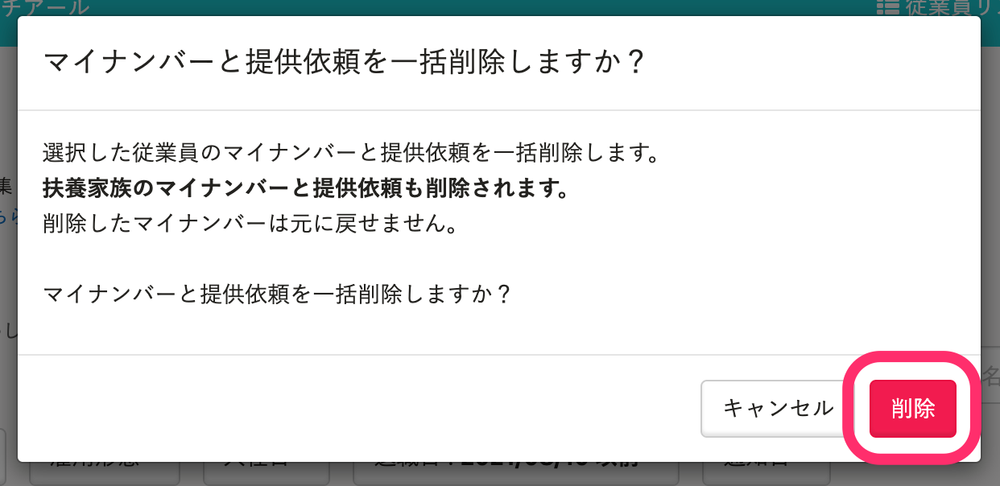

マイナンバーを個別または一括で削除する方法を説明します。

マイナンバーの利用目的を変更する場合、登録済みマイナンバーを削除のうえ、改めて利用目的を明示して提供依頼をする必要があります。

また、マイナンバーの誤入力や紛失で訂正するときにも、まず登録済みマイナンバーを削除してください。

:::related
[マイナンバーの番号確認書類・身元確認書類を削除する](https://knowledge.smarthr.jp/hc/ja/articles/4404156802457)
:::

# 個別に削除する

## 1\. ［機能］>［マイナンバー］をクリック

SmartHRトップページ左側にある **［機能］** の **［マイナンバー］** をクリックすると、 **［マイナンバー管理］** 画面が表示されます。

## 2\. マイナンバーを削除する従業員の［詳細］をクリック

マイナンバーを削除する従業員の **［マイナンバー］** 列にある **［詳細］** をクリックすると、詳細画面が表示されます。

## 3\. ［…］メニュー >［マイナンバーを削除］をクリック

従業員または家族の右上の **［…］メニュー**  から、 **［マイナンバーを削除］** をクリックすると、確認ダイアログが表示されます。

## 4\. 確認ダイアログで［OK］をクリック

メッセージを確認し、 **［OK］** をクリックすると、マイナンバーが削除されます。

# 一括削除する

一括削除の場合は、マインバーの提供依頼も削除されます。

また、家族のマイナンバーと提供依頼も削除されます。

## 1\. ［機能］>［マイナンバー］をクリック

SmartHRトップページ左側にある **［機能］** の **［マイナンバー］** をクリックすると、 **［マイナンバー管理］** 画面が表示されます。

## 2\. 検索やフィルターで従業員を絞り込む

マイナンバーと提供依頼を一括削除する従業員を、検索やフィルターで絞り込みます。

:::tips
 **［退職日］** \> **［日付で絞り込む］** を使用すると、指定した日付以前に退職した従業員を絞り込めます。

:::

## 3\. 削除対象にチェックを入れて、［一括操作］>［マイナンバーと提供依頼を一括削除］をクリック

マイナンバーと提供依頼を削除したい従業員にチェックを入れます。

 **［マイナンバーと提供依頼を一括削除］** をクリックすると、確認のダイアログが表示されます。

## 4\. 確認のダイアログで、［削除］をクリック

 **［削除］** をクリックすると、マイナンバーと提供依頼の一括削除のバックグラウンド処理が始まります。

## 5\. 結果を確認

 **［バックグラウンド処理一覧］** 画面に移動すると、一括削除の結果を確認できます。

 **［状態］** 欄に緑色の **［完了］** が表示されていれば 、問題なく一括削除が完了しています。

