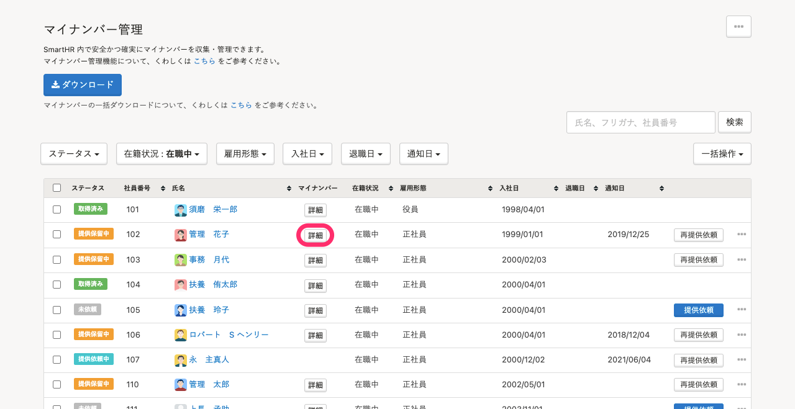
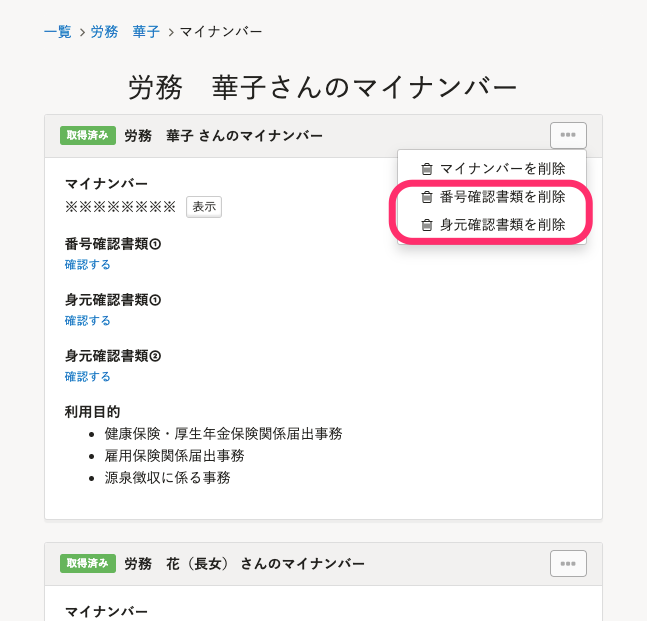
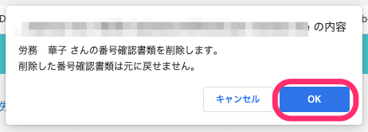

マイナンバーの番号確認書類や身元確認書類を削除する方法を説明します。

マイナンバー収集後に、マイナンバーの確認に使用した書類だけを削除するための機能です。

収集したマイナンバー自体を削除する方法は、下記のヘルプページをご覧ください。

[マイナンバーを削除する](https://knowledge.smarthr.jp/hc/ja/articles/360054037573)

:::tips
番号確認書類や身元確認書類を削除するには、マイナンバーの更新権限が必要です。
:::

# 1\. ［機能］>［マイナンバー］をクリック

SmartHRトップページ左側にある **［機能］** の **［マイナンバー］** をクリックすると、 **［マイナンバー管理］** 画面が表示されます。

# 2\. 確認書類を削除する従業員の［詳細］をクリック

確認書類を削除する従業員の **［マイナンバー］** 列にある **［詳細］** をクリックすると、詳細画面が表示されます。

# 3\. ［…］メニュー >［番号確認書類を削除］または［身元確認書類を削除］をクリック

従業員または家族の右上の **［…］メニュー**  から、 **［番号確認書類を削除］** または **［身元確認書類を削除］** をクリックすると、確認ダイアログが表示されます。

# 4\. 確認ダイアログで［OK］をクリック

メッセージを確認し、 **［OK］** をクリックすると、確認書類が削除されます。

