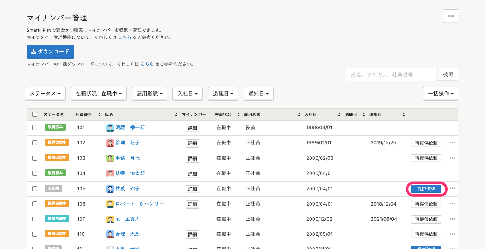
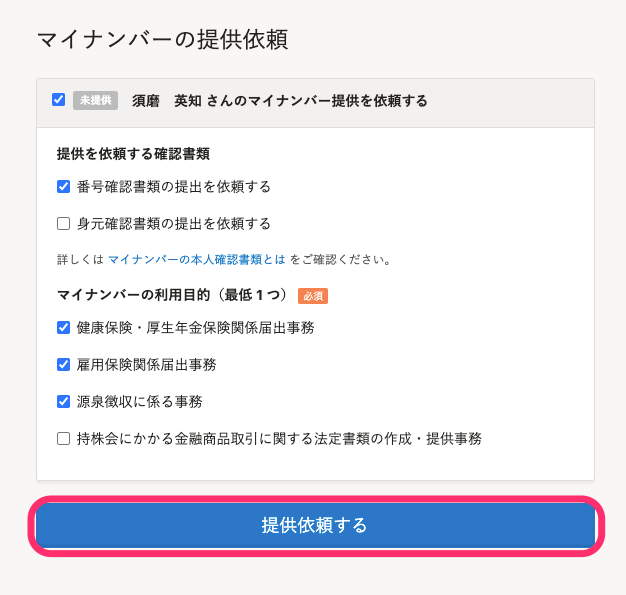
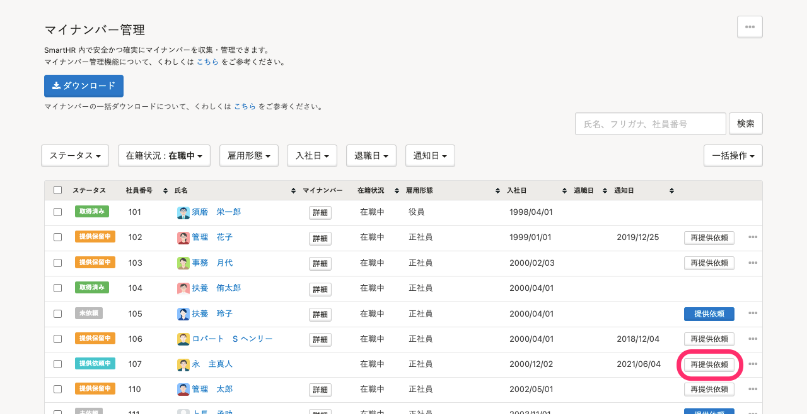
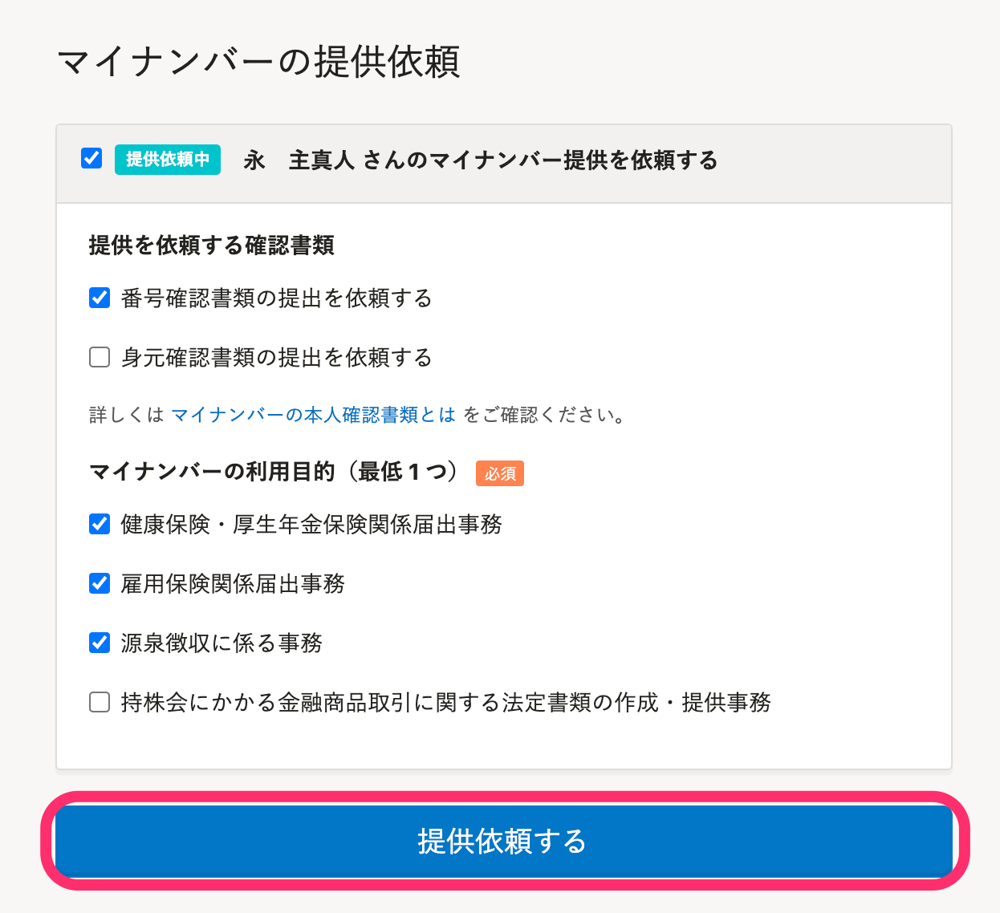

マイナンバー管理機能を使うと、従業員にマイナンバーの提供を依頼できます。

# 従業員にマイナンバーの提供を依頼する

## 1\. ［機能］>［マイナンバー］をクリック

トップページ左側の **［機能］** 欄にある **［マイナンバー］** をクリックすると、マイナンバー管理画面が表示されます。

## 2\. 提供依頼をしたい従業員の［提供依頼］をクリック

マイナンバー管理画面の従業員一覧の **［提供依頼］** をクリックすると、提供依頼の詳細画面が表示されます。

:::tips
 **［提供依頼］** が表示されていない場合は、以下の可能性があります。
- 従業員がまだSmartHRに招待されていない
- すでに招待済みだが、従業員が招待を承認していない
提供依頼の前に、招待・承認を完了させてください。
:::

## 3\. 確認書類と利用目的を指定し、［提供依頼する］をクリック

 **［提供を依頼する確認書類］** と **［マイナンバーの利用目的］** にチェックを入れ、 **［提供依頼する］** をクリックすると従業員に通知が届きます。

:::tips
マイナンバーを収集する際には、利用目的を明示する必要があります。
収集したマイナンバーの利用目的を1つ以上選択し、従業員にマイナンバーの提供を依頼します。
マイナンバー収集における本人確認書類については、下記のヘルプページをご覧ください。
[マイナンバーの本人確認書類とは](https://knowledge.smarthr.jp/hc/ja/articles/360026266453)
:::

## 4\. 従業員がSmartHRにログインし、マイナンバーを入力する

提供依頼を受けた従業員がマイナンバーを入力する詳しい手順は、下記のヘルプページをご覧ください。

[マイナンバーの提供依頼が届いたら？](https://knowledge.smarthr.jp/hc/ja/articles/360026266313)

:::tips
存在しないマイナンバーを入力した場合はエラーになるため、誤入力を防げます。
マイナンバーは、末尾の1桁で入力ミスを確認できるようになっており、その仕組みを利用してエラーを判定しています。
:::

## 5\. 従業員がマイナンバーの入力を完了すると、管理者に通知が届く

通知の有無は、設定により異なります。

詳しくは下記のヘルプページをご覧ください。

[通知の設定を確認・変更する](https://knowledge.smarthr.jp/hc/ja/articles/360033353774)

# 従業員にマイナンバーの提供を再依頼する

ステータスが **［提供保留中］［提供依頼中］** の従業員にマイナンバーの再提供依頼ができます。

マイナンバー管理画面の当該従業員氏名の右にある **［再提供依頼］** をクリックすると、提供依頼の詳細画面が表示されます。

 **［提供依頼］** をクリックすると、従業員に通知が届きます。

