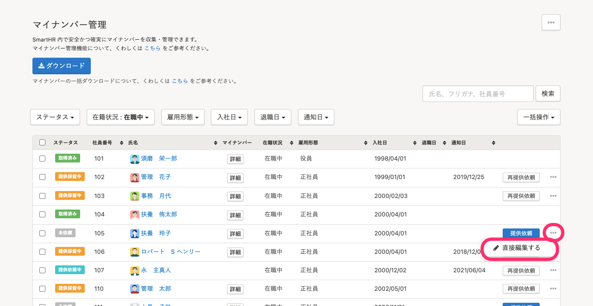
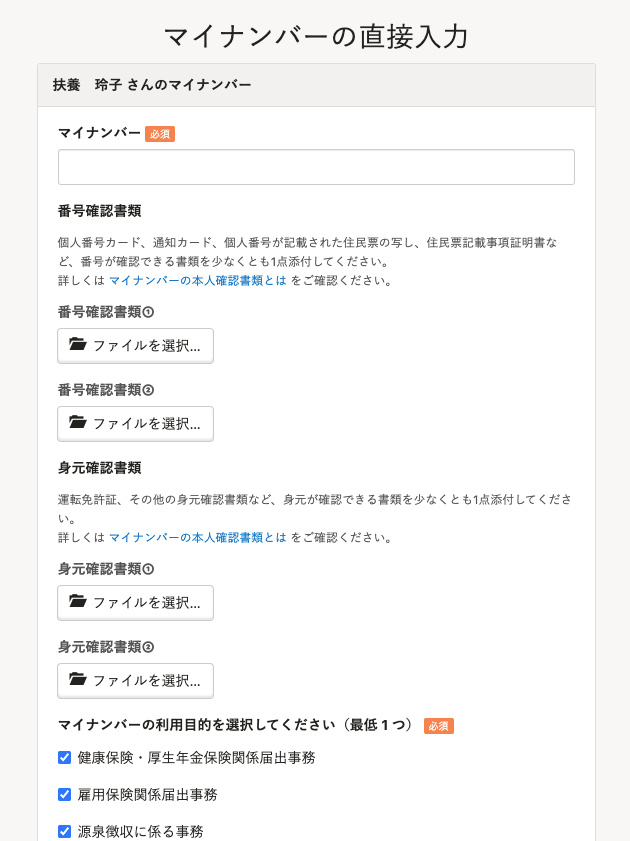
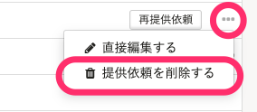

すでにSmartHR外でマイナンバーを収集済みの場合などは、管理者がマイナンバーを直接入力できます。

:::related
[マイナンバーを一括登録する](https://knowledge.smarthr.jp/hc/ja/articles/360026264273)
:::

# 1\. ［機能］>［マイナンバー］をクリック

トップページ左側の **［機能］** にある **［マイナンバー］** をクリックすると、マイナンバー管理画面が表示されます。

# 2\. 対象従業員の［…］メニュー >［直接編集する］をクリック

マイナンバー管理画面の従業員一覧に表示されている従業員の右にある **［…］メニュー** から **［直接編集する］** をクリックすると、マイナンバーの直接入力画面が表示されます。

# 3\. マイナンバーを入力して保存する

マイナンバーや利用目的、確認書類を入力後、画面下部にある **［直接入力する］** をクリックすると、入力が保存されます。

:::tips
### 入力間違いはエラーとなり、登録できません（マイナンバーのチェックデジット）
マイナンバーには、チェックデジットという人手での入力間違いが発生しても機械的にすぐわかるように検査用の数字が付加されています。そのため、実際に採番されている番号以外を入力するとエラーとなり登録できません。
:::

# 提供依頼中の従業員のマイナンバーを直接入力する場合

提供依頼時に **［必須］** に設定した確認書類は、管理者が入力する場合も登録が必要となります。

確認書類なしで直接入力する場合は、 対象従業員の **［…］メニュー >［提供依頼を削除する］** から、提供依頼を取り消し後、直接入力を行なってください。

:::related
[マイナンバーの本人確認書類とは](https://knowledge.smarthr.jp/hc/ja/articles/360026266453)
:::
