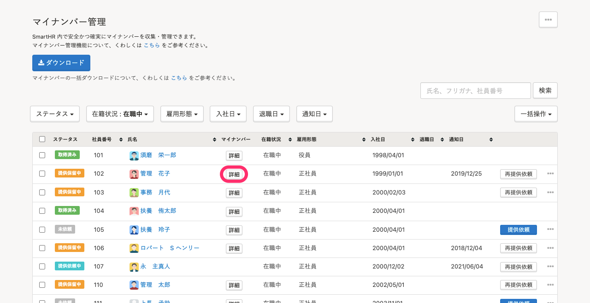
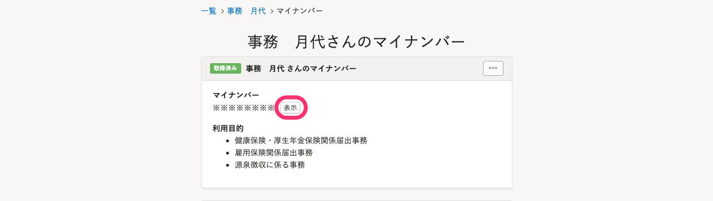
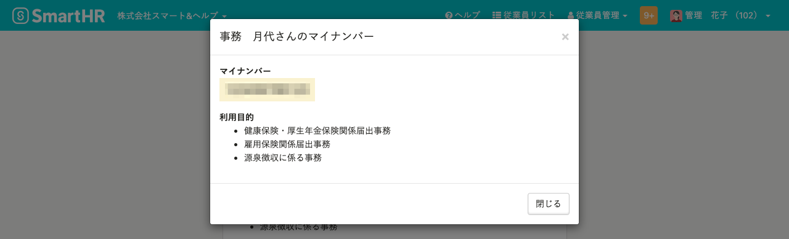

登録済みのマイナンバーは、マイナンバー管理画面から確認できます。

# 1.［機能 **］** \>［マイナンバー **］** をクリック

SmartHRトップページ左の **［機能］** にある **［マイナンバー］** をクリックします。

# 2.対象従業員を選択して、［詳細］をクリック

 **［マイナンバー管理］** の一覧から、マイナンバーを閲覧したい従業員の **［詳細］** をクリックすると、詳細画面が表示されます。

# 3.［表示］をクリック

従業員のマイナンバー詳細画面で**利用目的**を確認のうえ、 **［表示］** をクリックします。

※被扶養者のマイナンバーもこの画面から確認できます。

# 4.マイナンバーが表示される

従業員のマイナンバーが表示されます。

:::tips
マイナンバーを閲覧すると、監査ログに履歴が残ります。
[監査ログとは](https://knowledge.smarthr.jp/hc/ja/articles/360026107494)
:::
