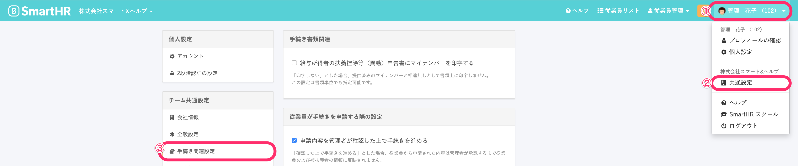
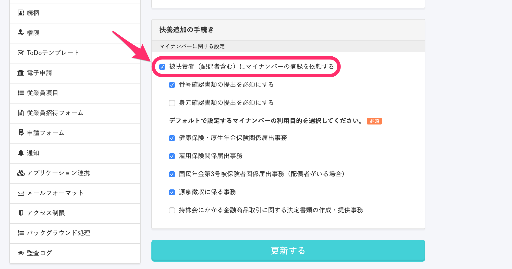
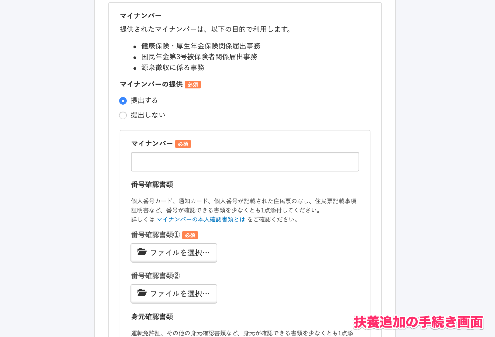
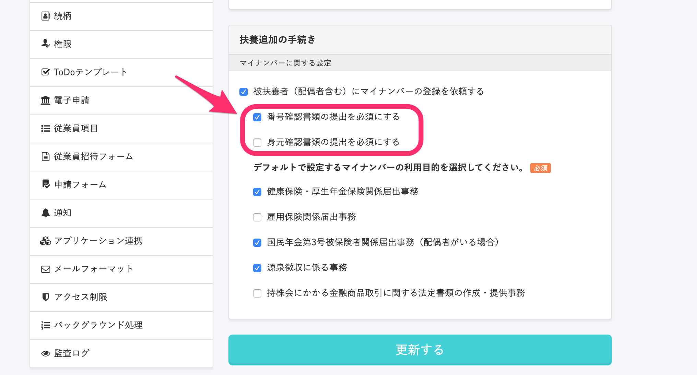
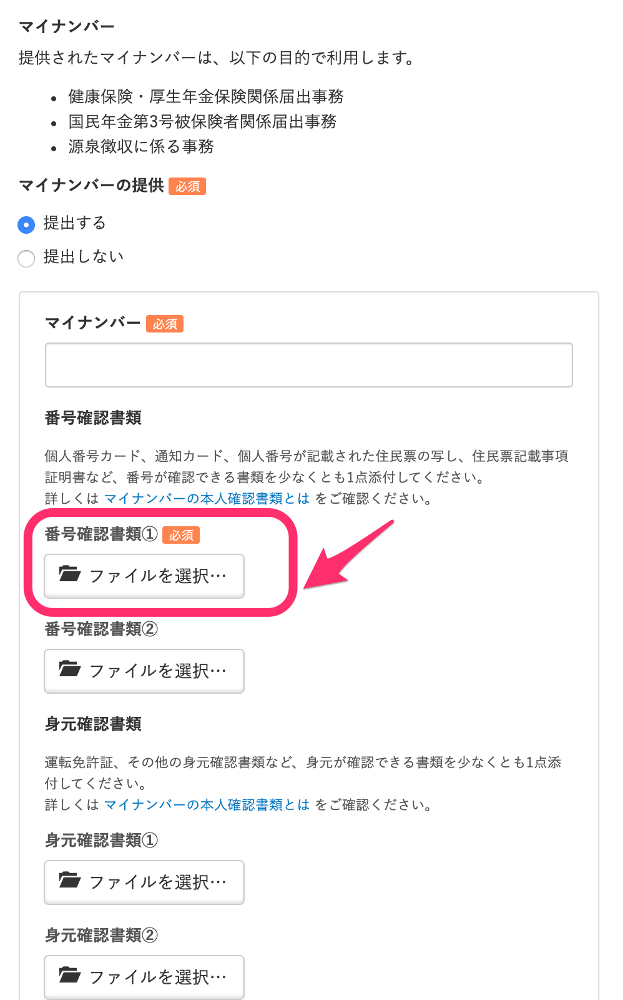
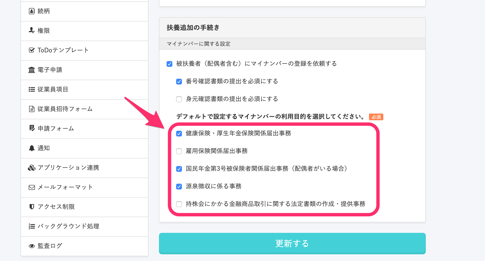
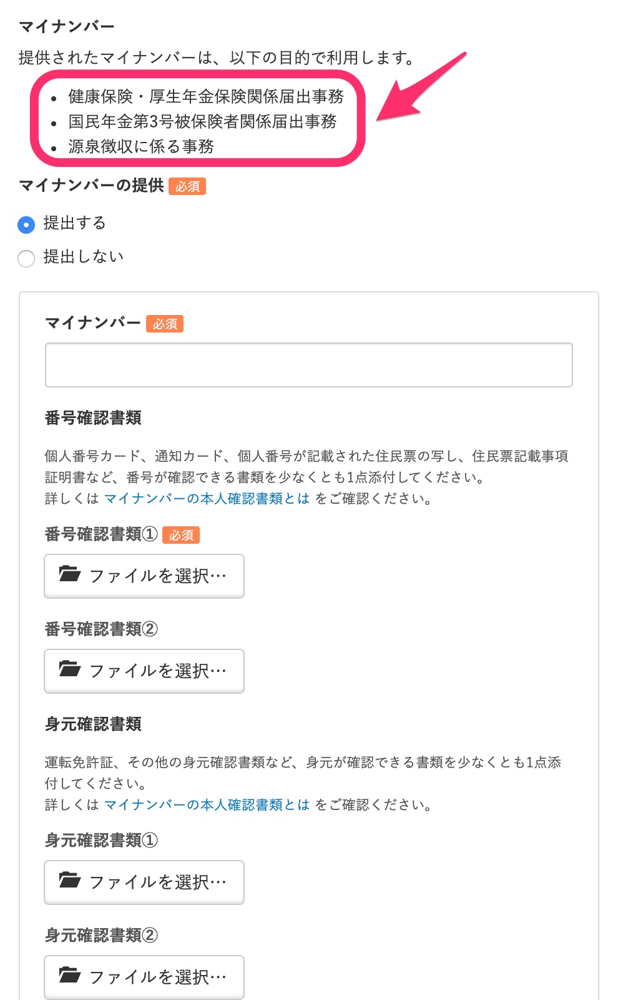
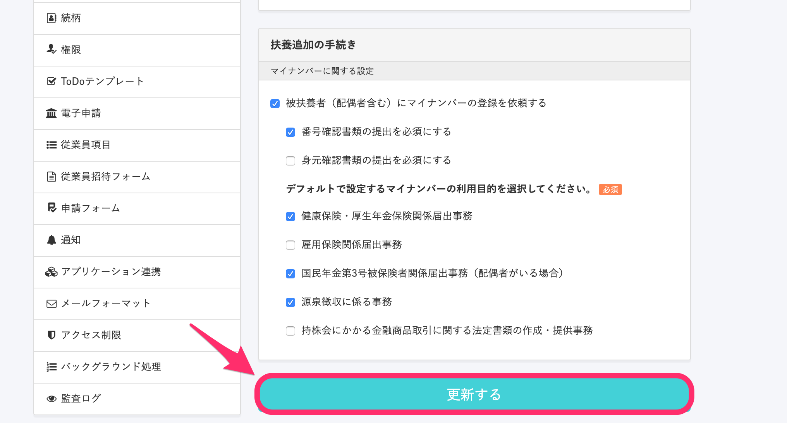

従業員が扶養追加の手続きを申請する際に、マイナンバーの入力欄を表示するかどうかは、管理者が設定で変更できます。

# 設定方法

## 1\. \[画面右上のアカウント名\] > \[共通設定\] > \[手続き関連設定\] をクリック

従業員が扶養追加の手続きを行うときに、被扶養者のマイナンバー登録も依頼するには **\[画面右上のアカウント名\] > \[共通設定\] > \[手続き関連設定\]** をクリックします。

## 2\. \[被扶養者（配偶者含む）にマイナンバーの登録を依頼する\] にチェックを入れる

**\[手続き関連設定\]** をクリックすると表示される画面をスクロールし、**\[扶養追加の手続き\] > \[マイナンバーに関する設定\]** 項目にある **\[被扶養者（配偶者含む）にマイナンバーの登録を依頼する\]** にチェックを入れてください。

この項目にチェックを入れると、従業員が扶養追加の手続きを行う画面で **\[マイナンバー\]** 項目が表示され、扶養追加と同時にマイナンバーの登録を依頼できます。

### 提出書類の設定

**\[被扶養者（配偶者含む）にマイナンバーの登録を依頼する\]** にチェックを入れると、番号確認書類・身元確認書類の提出を必須にするか否かを設定できるようになります。

番号確認書類・身元確認書類の提出を必須にすると、扶養追加の画面で書類名の横に **\[必須\]** マークがつきます。

### 利用目的の設定

従業員やその扶養家族のマイナンバーを収集する場合、利用目的を明示する必要があります。

利用目的は必ず1つ以上、チェックを入れてください。

従業員が扶養家族の追加を行うとき、マイナンバーの利用目的は以下のように表示されます。

## 3\. \[更新する\] をクリック

編集を終えたら、**\[更新する\]** をクリックします。

