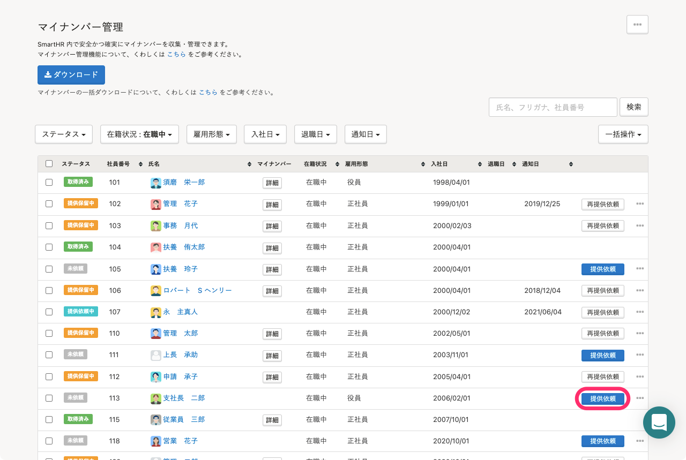
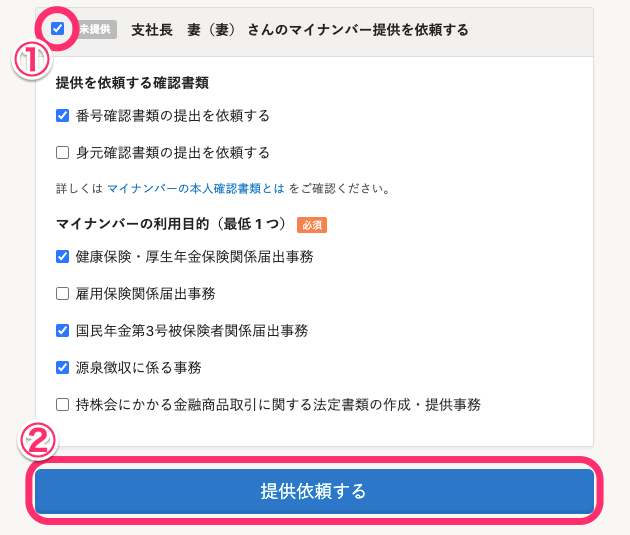
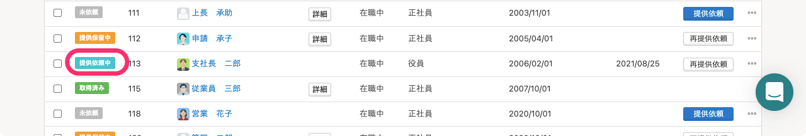

後から追加された被扶養者のマイナンバーも、従業員に提供依頼ができます。

# 1\. ［機能］>［マイナンバー］をクリック

トップページ左側の **［機能］** 欄にある、 **［マイナンバー］** をクリックします。

# 2\. ［提供依頼］をクリック

該当する従業員の **［提供依頼］** をクリックします。

# 3\. 被扶養者にチェックを入れ、［提供依頼する］をクリック

マイナンバーの提供を依頼したい被扶養者にチェックを入れ、収集したい書類（任意）と利用目的（必須）を最低1つ選択し、 **［提供依頼する］** をクリックします。

# 4\. マイナンバー管理画面のステータスを確認する

提供依頼が完了すると、マイナンバー管理画面でのステータスが **［提供依頼中］** となります。

