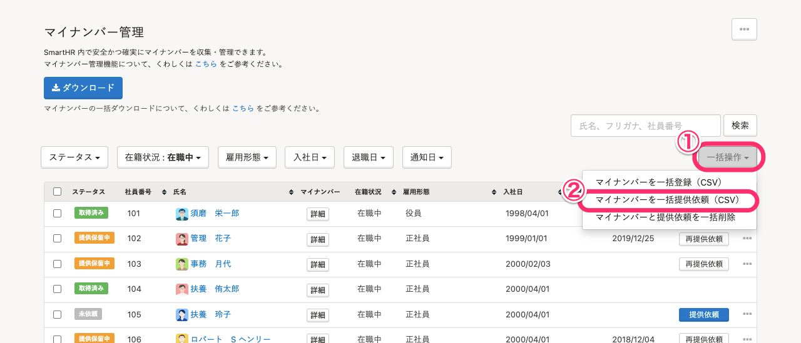
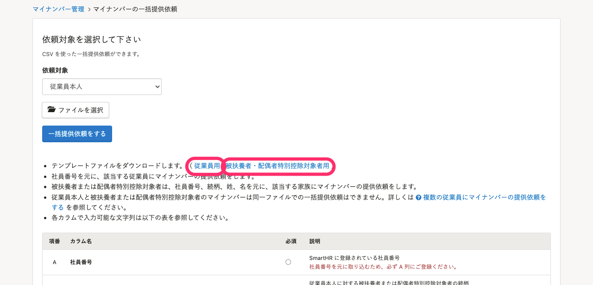
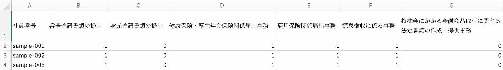
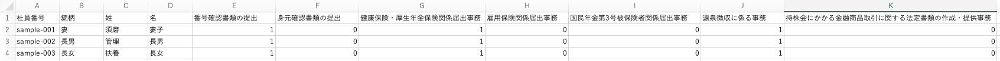
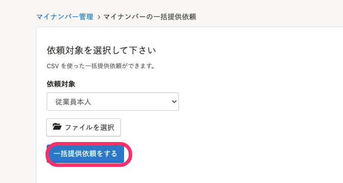
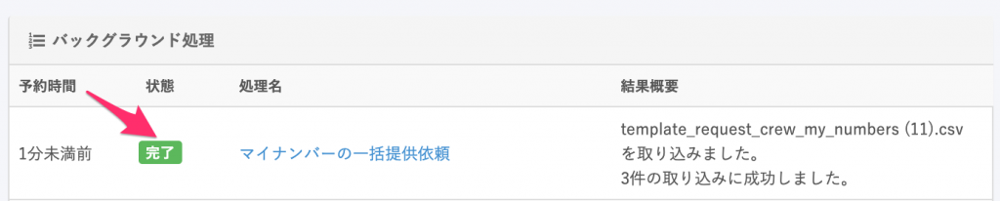
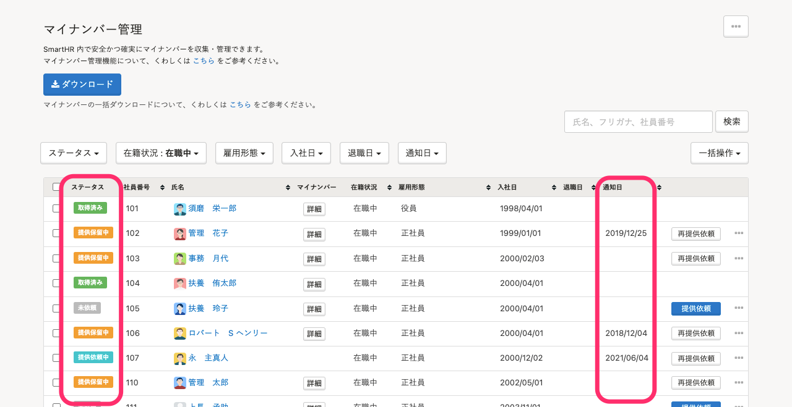
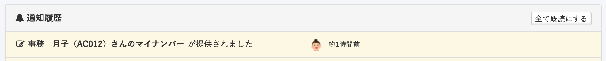

マイナンバーの提供依頼は、CSVファイルを使った一括送信も可能です。

個別の従業員に提供依頼をする場合は、下記のページを参照してください。

[従業員にマイナンバーの提供を依頼する](https://knowledge.smarthr.jp/hc/ja/articles/360026105214)

# 1\. ［機能］>［マイナンバー］をクリック

トップページ左の **［機能］** 欄にある **［マイナンバー］** をクリックすると、マイナンバー管理画面が表示されます。

# 2\. ［一括操作］> ［マイナンバーを一括提供依頼（CSV）］をクリック

 **［一括操作］** から **［マイナンバーを一括提供依頼（CSV）］** をクリックします。

:::tips
提供を依頼できるのは、ステータスが **［未依頼］** で **［提供依頼］** ボタンが表示されている従業員（＋被扶養者）です。
 **［提供依頼］** ボタンが表示されていない場合は、以下の可能性があります。
・従業員がSmartHRに招待されていない。
・SmartHRへの招待は送られているが、従業員が招待の承認を行なっていない。
提供依頼の前に、招待と承認を終えてください。
:::

# 3\. テンプレートファイルをダウンロード

一括登録依頼用のテンプレートファイル（CSV）をダウンロードします。

社員番号が登録されており、マイナンバーが未登録かつ提供依頼されていない従業員（＝ 提供依頼が可能な方）のデータのみがダウンロードされます。

:::tips
従業員本人のマイナンバーと被扶養者分のマイナンバーは同時に一括提供依頼ができないため、どちらも一括提供依頼が必要な場合は、2度にわけて操作してください。
:::

# 4. CSVファイルに利用目的のフラグを入力

ダウンロードしたCSVファイルを開いて、マイナンバーの利用目的フラグ（1=ON、0=OFF）を入力してください。

▼ 従業員用のCSV

▼ 被扶養者用のCSV

被扶養者または配偶者特別控除対象者のマイナンバーは、 **従業員の社員番号、続柄、姓、名** が一致する家族に登録されるため、これらの項目が必須となります。

:::tips
マイナンバーを収集する際には、利用目的を明示する必要があります。
収集したマイナンバーの利用目的を1つ以上選択してください。
マイナンバー収集における本人確認書類については、下記のページをご覧ください。
[マイナンバーの本人確認書類とは](https://knowledge.smarthr.jp/hc/ja/articles/360026266453)
:::

# 5\. 依頼対象とファイルを選択して［一括提供依頼をする］をクリック

 **［依頼対象］** （従業員本人／被扶養者）を指定して該当CSVファイルを選択後、 **［一括提供依頼をする］** をクリックします。

# 6\. 結果を確認する

バックグラウンド処理が終了すると、 **「バックグラウンド処理による マイナンバーの一括提供依頼 の結果が出ました」**  という通知が届きます。通知のリンクをクリックするか、 **［共通設定］>［バックグラウンド処理］** からご確認ください。

エラーが発生している場合の対応方法は、下記のページをご覧ください。

[エラーが出たり、処理に失敗した場合は？](https://knowledge.smarthr.jp/hc/ja/articles/360033711133)

一括提供依頼に成功すると、従業員はSmartHRにログインして、マイナンバーの入力が可能となります。

従業員がマイナンバーの提供依頼を受け取ってから入力するまでの詳しい手順は、下記のページをご覧ください。

[マイナンバーの提供依頼が届いたら？](https://knowledge.smarthr.jp/hc/ja/articles/360026266313)

また、依頼の状況や提供依頼した日は、マイナンバー管理画面で確認できます。

従業員がマイナンバーを入力すると、管理者に  **「〜さんのマイナンバーが提供されました」**  という通知が届きます。

通知の有無は、設定により異なります。詳しくは下記のページをご覧ください。

[通知の設定を確認・変更する](https://knowledge.smarthr.jp/hc/ja/articles/360033353774)
