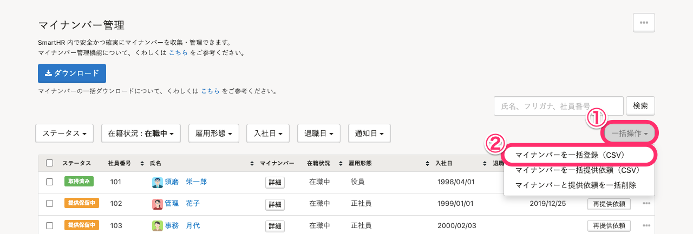
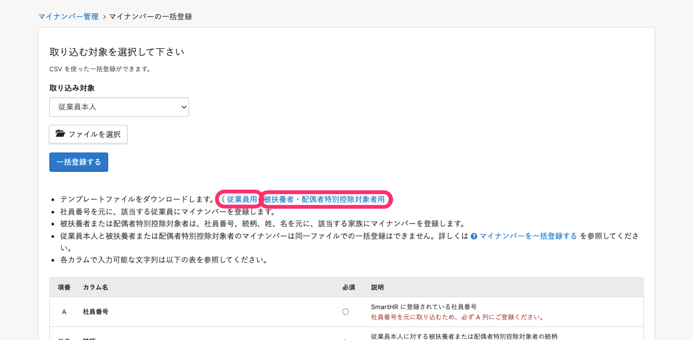
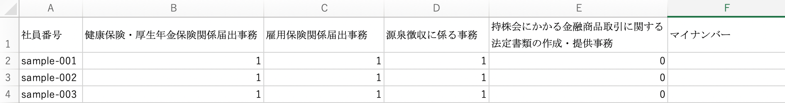
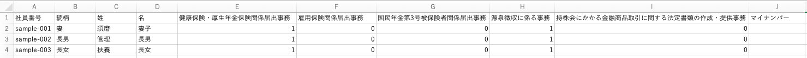
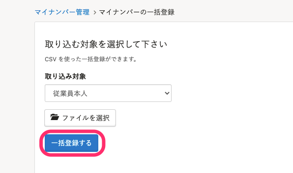

CSVファイルを使い、マイナンバーを一括登録する方法を説明します。

# 1.［機能］>［マイナンバー］をクリック

トップページ左の **［機能］** 欄にある **［マイナンバー］** をクリックすると、マイナンバー管理画面が表示されます。

# 2\. ［一括操作］>［マイナンバーを一括登録（CSV）］をクリック

 **［一括操作］** \> **［マイナンバーを一括登録（CSV）］** をクリックします。

# 3\. テンプレートファイルをダウンロードする

一括登録用のテンプレートファイル（CSV）をダウンロードします。

# 4\. CSVファイルにマイナンバーとフラグを入力する

CSVファイルにマイナンバーや利用目的のフラグ（1=ON、0=OFF）などを入力してください。

**▼ 従業員用のCSV**

**▼ 被扶養者用のCSV**

被扶養者または配偶者特別控除対象者のマイナンバーは、 **従業員の社員番号、続柄、姓、名** が一致する家族に登録されるため、これらの項目が必須となります。

# 5\. 取り込み対象とCSVファイルを選択する

 **［取り込み対象］** （従業員本人／被扶養者）を指定して該当CSVファイルを選択後、 **［一括登録する］** をクリックします。

