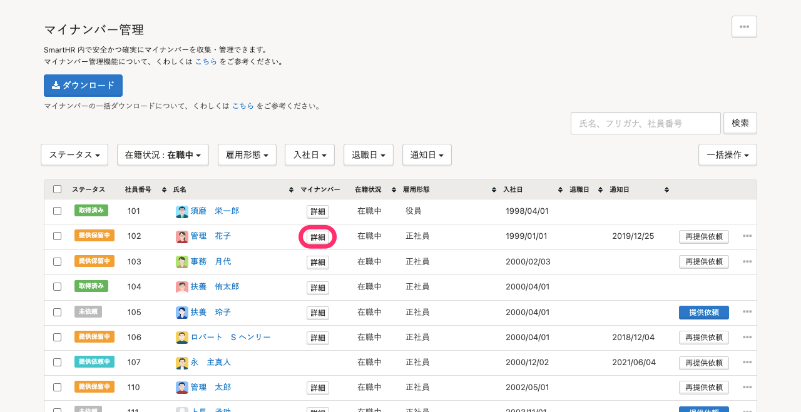

マイナンバーの誤入力をはじめ、以下のような事情で訂正が必要な場合は、登録済みマイナンバーを削除のうえ、改めて登録し直す必要があります。

- マイナンバーの利用目的の変更
- マイナンバーの修正
- マイナンバーの紛失

# 1\. マイナンバーを訂正したい従業員の情報を削除

## 1\. ［機能］>［マイナンバー］をクリック

SmartHRトップページ左側にある **［機能］** の **［マイナンバー］** をクリックすると、マイナンバー管理画面が表示されます。

## 2\. 一覧から、対象従業員を選択

マイナンバー管理画面の一覧で、マイナンバーを削除したい従業員のマイナンバー欄の **［詳細］** をクリックすると、詳細画面が表示されます。

## 3\. マイナンバーを削除する

マイナンバーの詳細画面右上の **［…］メニュー**  をクリックし、 **［マイナンバーを削除］** をクリックすると、確認ダイアログが表示されます。

確認ダイアログで **［OK］** をクリックするとマイナンバーが削除されます。

# 2\. マイナンバーを登録する

削除後、改めてマイナンバーを収集・登録してください。

:::related
[マイナンバー管理機能とは](https://knowledge.smarthr.jp/hc/ja/articles/360026107514)
:::
