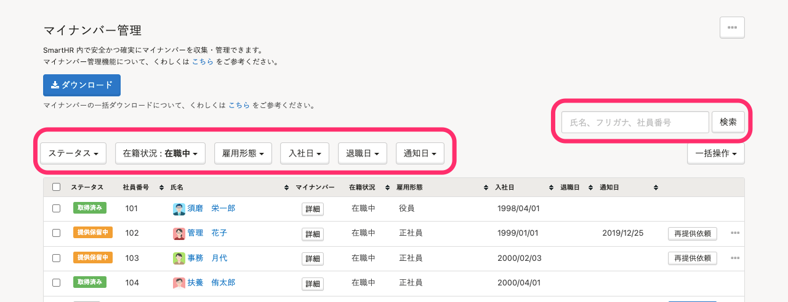
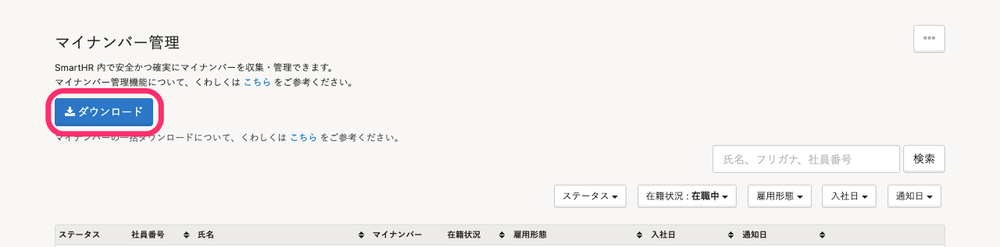
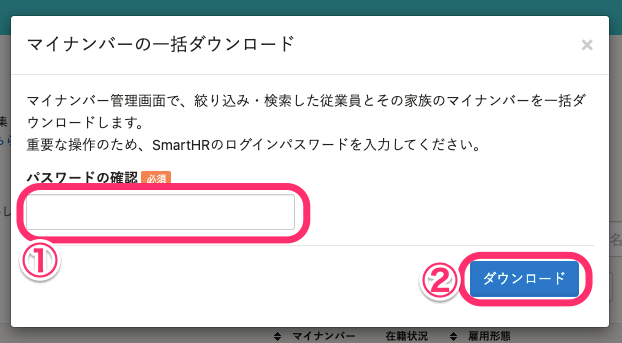
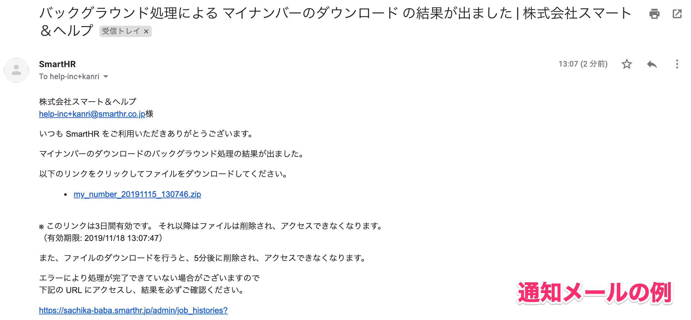
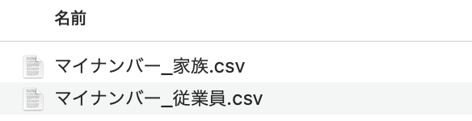

マイナンバー管理ページから、絞り込んだ従業員のマイナンバーを一括ダウンロードできます。

:::alert
マイナンバーを一括ダウンロードするには、 **［権限設定］>［各種機能］>［マイナンバー管理機能］** で **［マイナンバーの一括ダウンロード］** が **［できる］** となっている必要があります。
詳しくは、下記のヘルプページの「マイナンバー管理機能」>「マイナンバーの一括ダウンロード」項目をご覧ください。
[手続きや機能の閲覧・作成・更新・削除の権限を設定する](https://knowledge.smarthr.jp/hc/ja/articles/360041268873)
:::

# ダウンロード方法

## 1\. ［機能］>［マイナンバー］をクリック

SmartHRトップページ左側にある **［機能］** の **［マイナンバー］** をクリックすると、 **［マイナンバー管理］** 画面が表示されます。

## 2\. 検索やフィルターで従業員を絞り込む

マイナンバーをダウンロードする従業員を、検索やフィルターで絞り込みます。

## 3\. ［ダウンロード］をクリック

 **［ダウンロード］** をクリックすると、［マイナンバーの一括ダウンロード］ダイアログが表示されます。

## 4\. ログインパスワードを入力し、［ダウンロード］をクリック

現在ログインしているアカウントのログインパスワードを入力し、 **［ダウンロード］** をクリックすると、ダウンロードの処理を開始します。

## 5\. ［共通設定］>［バックグラウンド処理］で進捗を確認する

進捗は **［共通設定］** \> **［バックグラウンド処理］** で確認できます。

また、処理が完了すると、メールで通知が届きます。

## 6\. データをダウンロードする

処理が完了したら、下記のヘルプページを参考にデータをダウンロードしてください。

:::related
[バックグラウンド処理後にデータをダウンロードする](https://knowledge.smarthr.jp/hc/ja/articles/360026105494)
:::

# 書き出されるCSVファイルについて

被保険者（従業員本人）と、被扶養者（扶養家族）がそれぞれ別のCSVで書き出されます。

## CSVファイルに書き出される項目

下記の項目がCSVファイルに書き出されます。

- 社員番号
- 健康保険被保険者整理番号（年金整理番号）　※
- 雇用形態
- 在籍状況
- 姓 名　※
- 生年月日　※
- 性別　※
- 住所　※
- 個人番号

※ ＝ 関東ITソフトウェア健康保険組合で必要情報とされる項目です。不要な場合は削除してください。

:::tips
### 関東ITソフトウェア健康保険組合に加入している方へ
関東ITソフトウェア健康保険組合が提出を求めている情報（項目）が出力できます。
「雇用形態」「在籍状況」の項目が入っているため、提出対象者のみのデータに加工すれば、CD-Rに焼くだけで提出が可能です。
:::

# よくある質問

## Q1. Zipファイルが開けない場合は？

Macの標準ソフトの場合、Zipファイルを展開できないことがあります。

StuffIt Expanderなどの解凍ソフトをMacにインストールしてご利用ください。

## Q2. 書き出す項目を追加・削除できる？

書き出す項目のカスタマイズはできません。

書き出したCSVファイルを加工してください。
