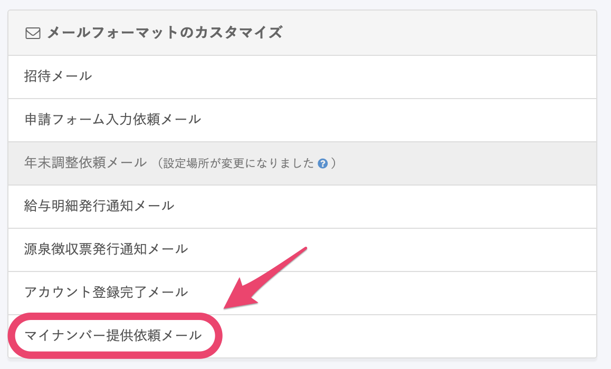
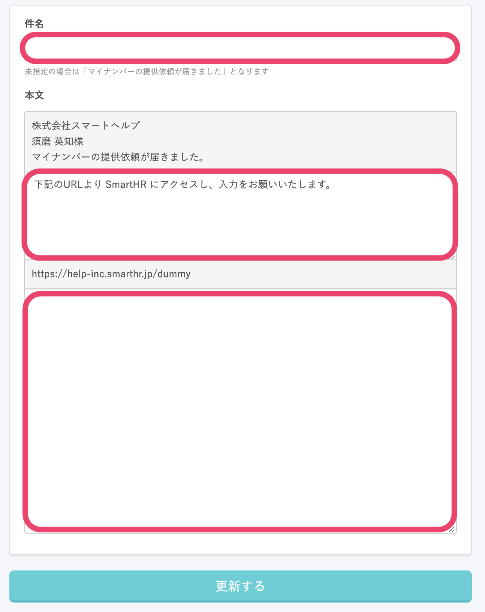

マイナンバーの提供依頼時に従業員に送られるメールの文面は、 **\[共通設定\] > \[メールフォーマット\]** で編集できます。

このページでは、提供依頼メールの編集方法を説明します。

マイナンバーの提供を依頼する方法は、下記のページをご覧ください。

[従業員にマイナンバーの提供を依頼する](https://knowledge.smarthr.jp/hc/ja/articles/360026105214)

# 1\. \[共通設定\] > \[メールフォーマット\] の一覧にある \[マイナンバー提供依頼メール\] をクリック

**\[共通設定\] > \[メールフォーマット\]** の一覧にある **\[マイナンバー提供依頼メール\]** をクリックすると、メールフォーマットの編集画面に移動します。

# 2\. 件名と本文を編集して保存する

マイナンバー提供依頼メールの件名と、本文の一部を編集できます。

件名は、未指定（空欄）の場合は「マイナンバーの提供依頼が届きました」となります。

本文は、上記画像のピンクで囲った部分の編集ができます。

編集が終わったら、画面下部にある **\[更新する\]** をクリックして、変更を反映させてください。
