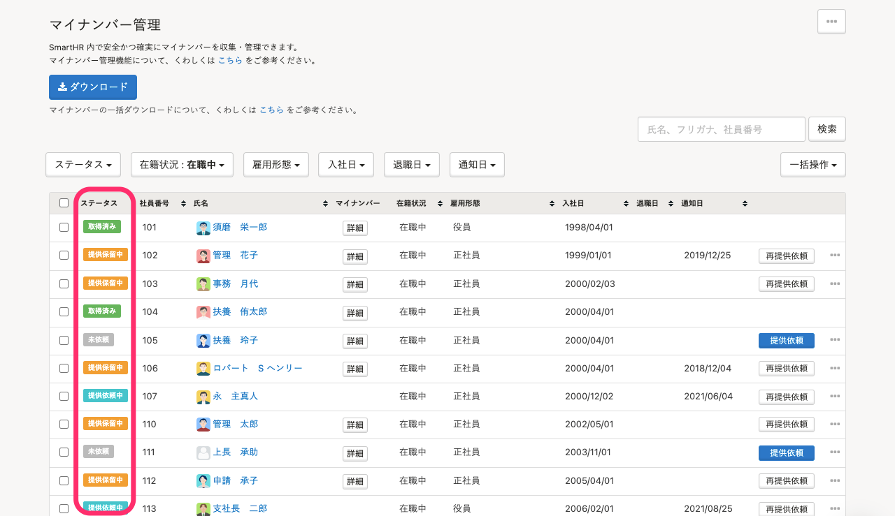

マイナンバー管理画面の左端に表示されている **［ステータス］** の意味を説明します。

# それぞれの意味と対応可否

| ステータス | 内容 | 提供依頼 | 直接編集 |
| --- | --- | --- | --- |
| 未依頼 | マイナンバーの提供依頼を行なっていない状態 または被扶養者のマイナンバーが提供されていない状態 | 可 | 可 |
| 提供依頼中 | 従業員にマイナンバーの提供依頼を行なっている状態 | 可 | 可 |
| 提供保留中 | 依頼済みで、従業員もしくは被扶養者のマイナンバーを「提供しない」としている状態 | 可 | 不可 |
| 取得済み |  従業員および被扶養者のマイナンバー登録がすべて完了している状態 | 不可 | 不可 |

# マイナンバーが提供されているのにステータスが［未依頼］となっている場合

被扶養者のマイナンバーが提供されていないためステータスが **［未依頼］** となっています。

被扶養者のマイナンバーを提供依頼する場合は、下記のページの手順で提供依頼を行なってください。

[追加された被扶養者のマイナンバーを収集する](https://knowledge.smarthr.jp/hc/ja/articles/360026107054)

# マイナンバーが提供されているのにステータスが［提供保留中］となっている場合

従業員がマイナンバーをスキップせず提供した場合でも、被扶養者のマイナンバーについて **［提出しない］** と回答したときは **［提供保留中］** として表示されます。
