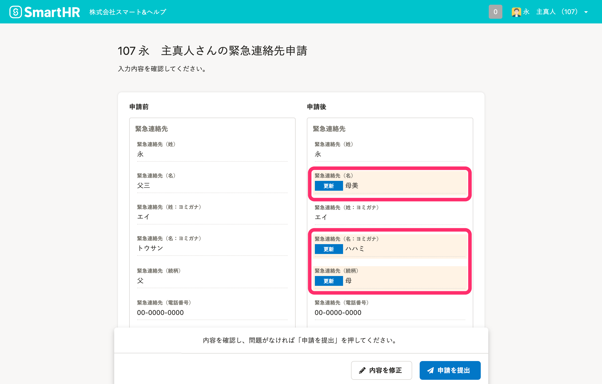
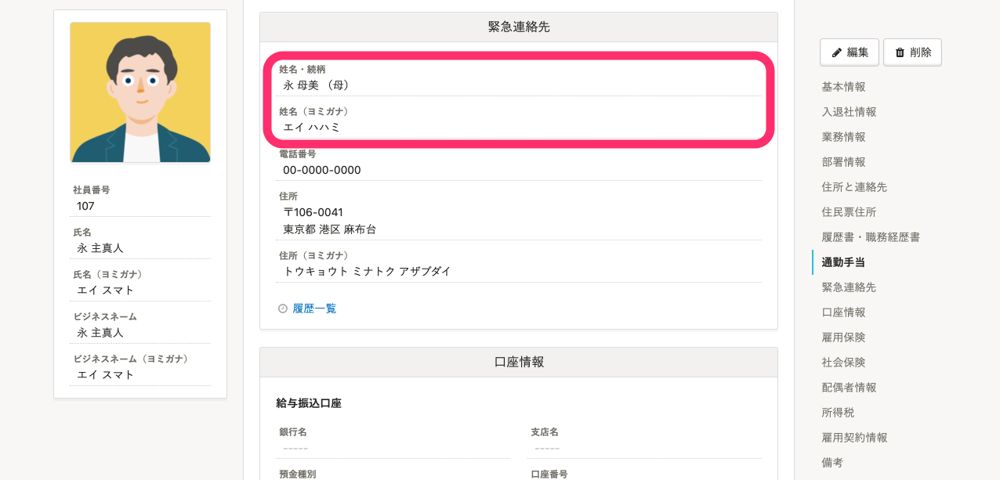
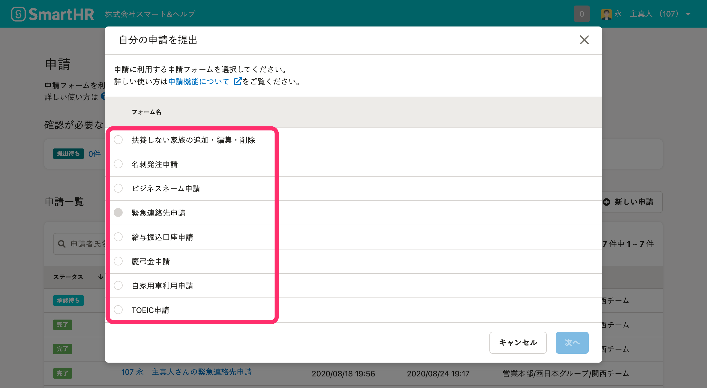
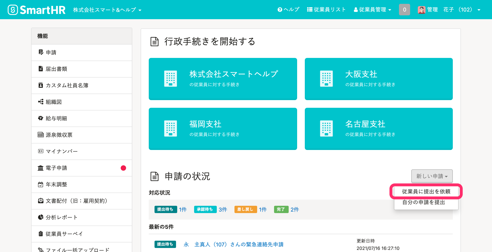
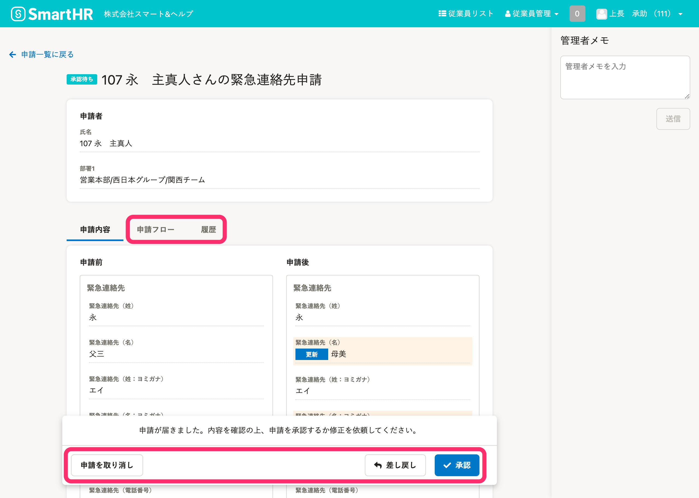
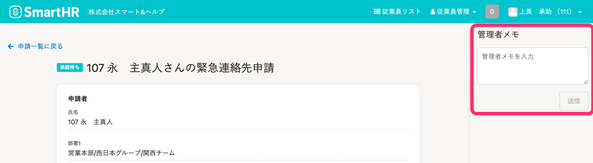
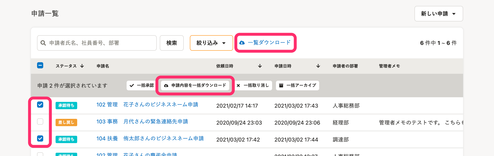

# SmartHRの申請機能

申請機能とは、申請フォームを使って従業員情報を収集できる機能です。

従業員が申請を提出します。

従業員が提出した申請が承認されると、従業員情報が更新されます。（承認の省略もできます）

:::tips
[カスタム従業員項目](https://knowledge.smarthr.jp/hc/ja/articles/360026265513)と組み合わせることで、さまざまな申請フォームとして利用できます。
- 慶弔金申請
- 育休申請
- 自家用車通勤申請
- 資格申請
- 名刺発注申請
:::
:::alert
申請機能では、行政手続きに必要な書類を作成できません。
書類を作成するには、各種手続きを作成します。
詳しくは、[手続き](https://knowledge.smarthr.jp/hc/ja/sections/360005254973)の[住所変更の手続きをする](https://knowledge.smarthr.jp/hc/ja/articles/360026556654)などのページを参照してください。
:::

# 申請機能に関する権限

管理者として申請機能を利用するために、以下の4つの操作内容ごとに権限を設定できます。

- 申請フォームと承認経路の閲覧・編集
- 申請の依頼や承認
- 管理者メモの閲覧・編集
- 申請のダウンロード

:::related
[申請機能を利用するための権限設定](https://knowledge.smarthr.jp/hc/ja/articles/360026262453)
:::

# 申請フォームと承認経路を追加する

 **［共通設定］** の **［申請］** から、申請フォームと承認経路を追加できます。

:::related
[申請フォームを管理する](https://knowledge.smarthr.jp/hc/ja/articles/360026262313)
[承認経路を管理する](https://knowledge.smarthr.jp/hc/ja/articles/360053832734)
:::

申請フォームを追加すると、 **［自分の申請を提出］** 画面に表示されます。

# 従業員に申請の提出を依頼する

従業員に申請の提出を依頼できます。

:::related
[申請機能を使って従業員に情報提供を依頼する](https://knowledge.smarthr.jp/hc/ja/articles/360026103874)
:::

# 申請の内容を確認して、承認する

承認権限のあるアカウントは、従業員から提出された申請を承認できます。

承認者は申請詳細画面で **［申請内容］** を確認し、承認する場合は **［承認］** をクリックします。

必要に応じて、 **［差し戻し］** 、 **［申請を取り消し］** をします。

 **［**  **申請フロー］** 、 **［履歴］** も確認できます。

:::related
[従業員が提出した申請の承認、差し戻し、取り消し](https://knowledge.smarthr.jp/hc/ja/articles/360053919054)
:::
:::tips
管理者メモを使って、次の承認者に申し送り事項を連絡できます。
詳しくは、[申請の管理者メモを活用する](https://knowledge.smarthr.jp/hc/ja/articles/360043330113)をご覧ください。

:::

# 申請に関するデータをダウンロードする

 **［申請一覧］** 画面から、申請に関するデータをCSVファイルで取得できます。

:::related
[申請のCSVダウンロード機能を利用する](https://knowledge.smarthr.jp/hc/ja/articles/360051114994)
:::
