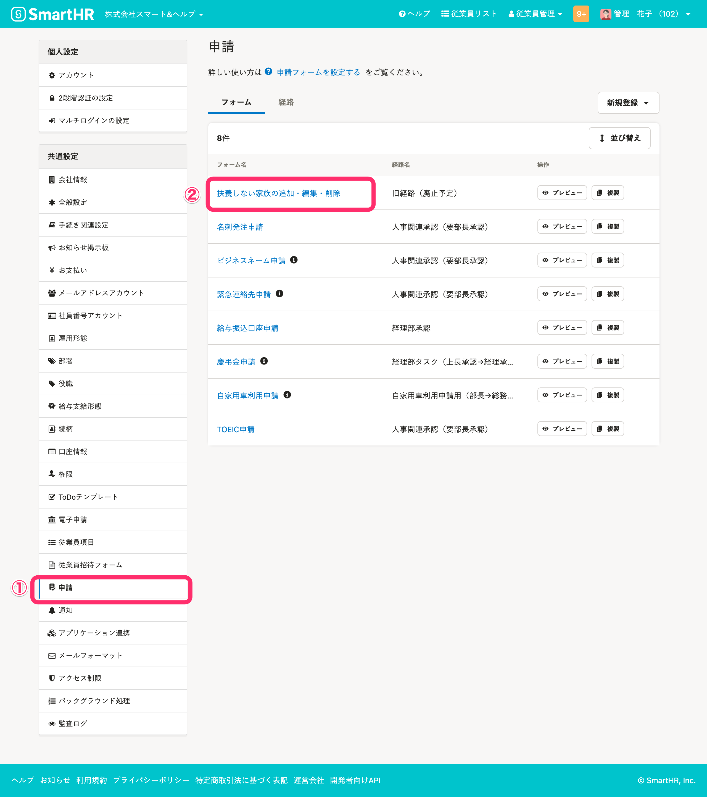
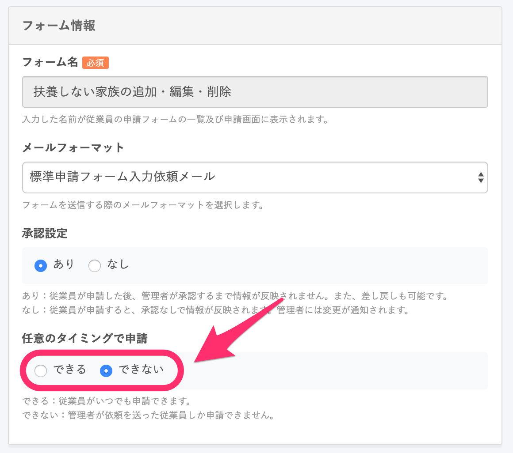
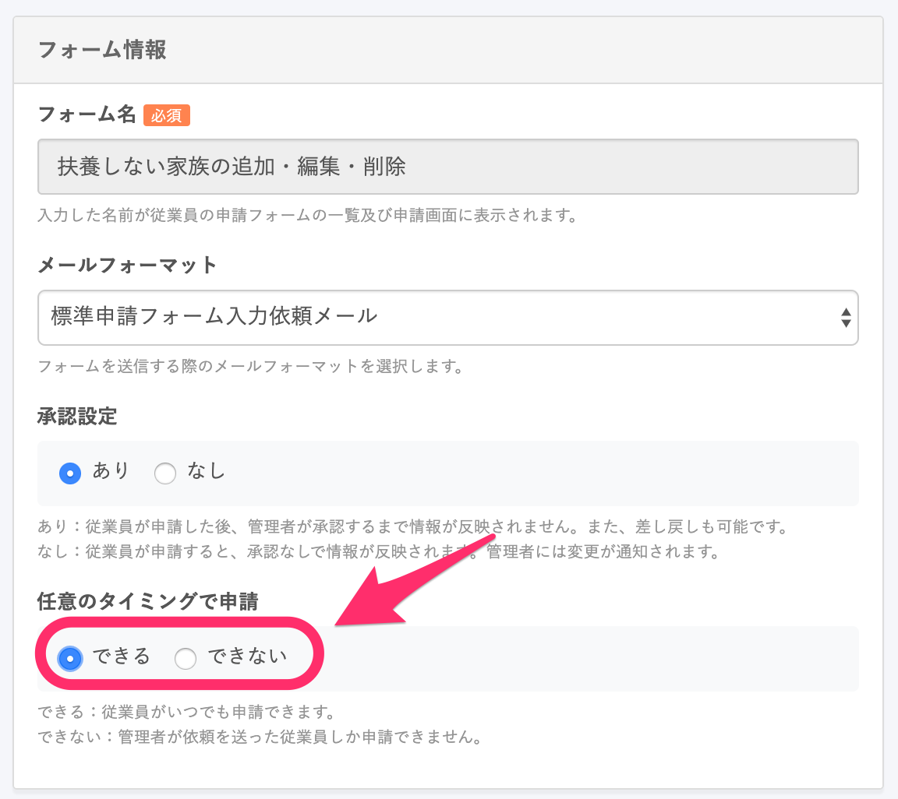

 **［扶養しない家族の追加・編集・削除］** フォームを使って、従業員から扶養しない家族情報の提出を受け付ける方法を説明します。

:::alert
2022年2月7日をもちまして、 **［扶養しない家族の追加・編集・削除］** フォームはシステム標準の申請フォームではなくなりました。 申請フォーム一覧に表示されていない場合は、 **［申請］** の設定画面から [申請フォームの作成・編集](https://knowledge.smarthr.jp/hc/ja/articles/360026262313) をお願いします。
:::

# 従業員が自由に申請を提出できるように変更するには？

初期設定では、従業員からの「扶養しない家族の追加・編集・削除」の申請は、管理者からの依頼をきっかけに作成できるようになっています。

従業員による任意のタイミングでの「扶養しない家族の追加・編集・削除」申請を受け付けるかどうかは、 **［共通設定］>［申請］** のフォーム一覧にある  **［扶養しない家族の追加・編集・削除］** というフォームの編集画面で設定できます。

# 管理者が依頼したときのみ申請を受け付ける

## ［フォーム情報］>［任意のタイミングで申請］の項目で［できない］を選択

 **［フォーム情報］** 欄にある **［任意のタイミングで申請］** の項目で **［できない］** を選択すると、従業員からは「扶養しない家族の追加・編集・削除」申請はできません。

従業員に申請を依頼する手順は、下記のページをご覧ください。

[申請機能を使って従業員に情報提供を依頼をする](https://knowledge.smarthr.jp/hc/ja/articles/360026103874)

# 従業員からの申請を可能にする

## ［フォーム情報］>［任意のタイミングで申請］の項目で［できる］を選択

 **［フォーム情報］** 欄にある **［任意のタイミングで申請］** の項目で **［できる］** を選択すると、従業員から任意のタイミングで「扶養しない家族の追加・編集・削除」の申請ができます。

従業員向けの「扶養しない家族の追加・編集・削除」の申請方法は、下記のページをご覧ください。

[扶養しない家族の追加・編集・削除を申請する](https://knowledge.smarthr.jp/hc/ja/articles/360033900974)
