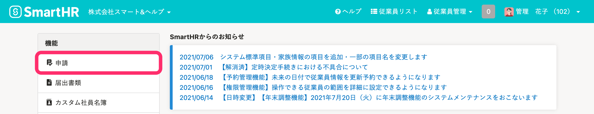
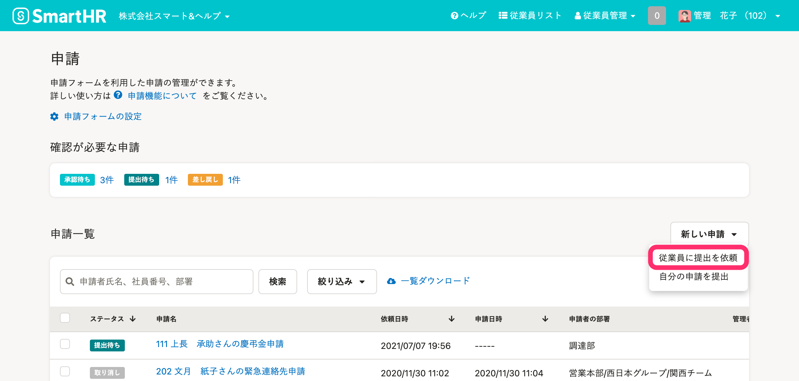
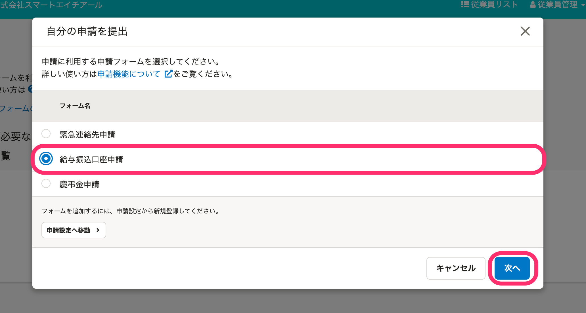
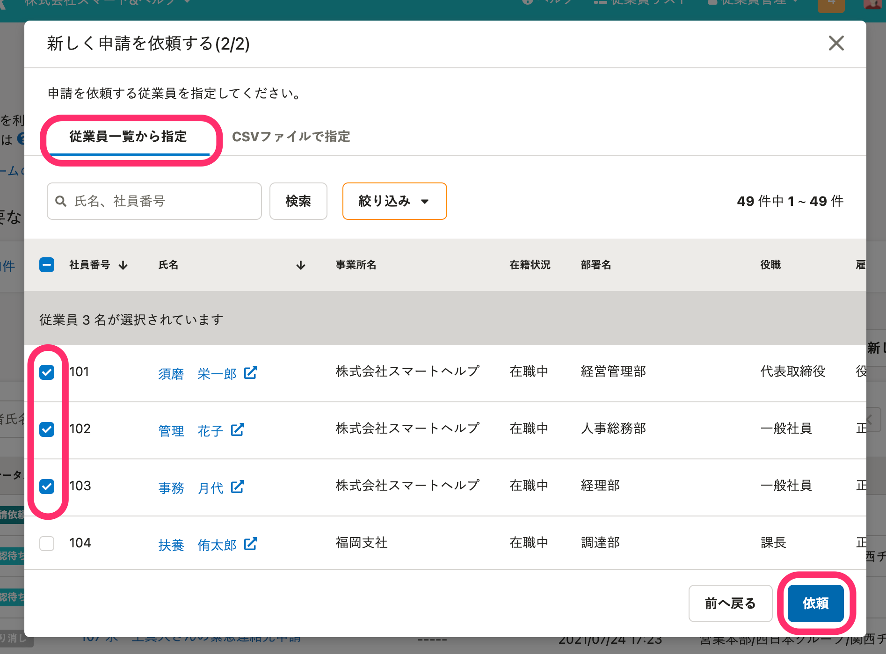
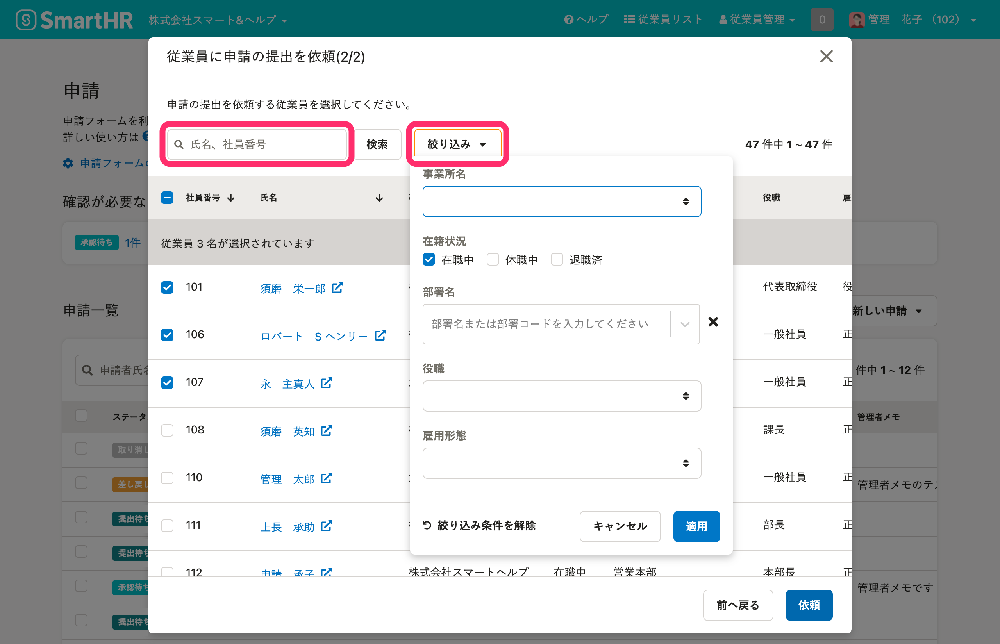
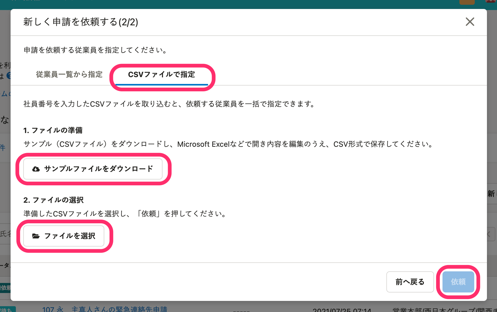
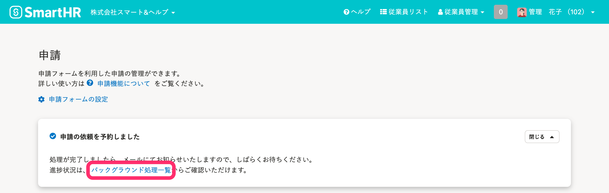
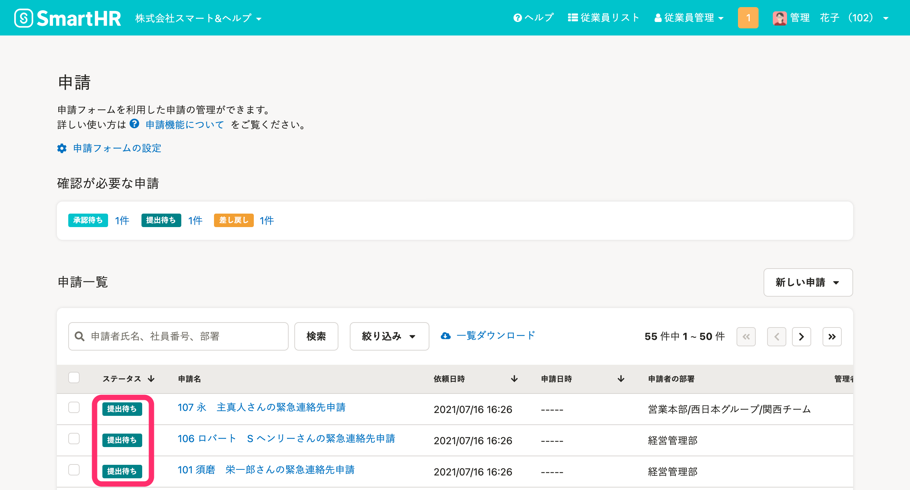
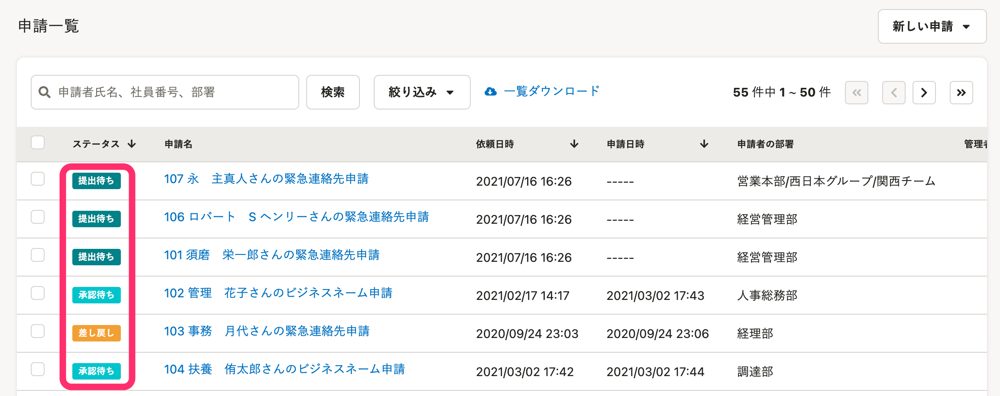

あらかじめ作成した申請フォームを利用して、従業員に情報提供を依頼する方法を説明します。

:::related
[申請フォームを管理する](https://knowledge.smarthr.jp/hc/ja/articles/360026262313)
:::

# 依頼を送信できる従業員の条件

申請の依頼権限を持っているアカウントは、以下の条件を満たす従業員に対して申請の提出依頼ができます。

- 従業員情報の「操作できる範囲」に含まれる
- SmartHRアカウントが作成済みである（＝SmartHRに招待済み）
- アカウントの権限が「退職者」以外である
- 従業員情報ページの必須項目が登録済みである
- 選択した申請フォームを利用した別の申請のステータスが **［提出待ち］［承認待ち］［差し戻し］** ではない

:::related
[権限設定の［従業員関連］>［操作できる範囲］とは](https://knowledge.smarthr.jp/hc/ja/articles/360026264173)
[申請機能を管理者として利用するための権限設定](https://knowledge.smarthr.jp/hc/ja/articles/360026262453)
:::

# 申請フォームを使って、従業員へ申請の提出を依頼する

## 1\. ［機能］>［申請］をクリック

トップページ左の **［機能］** 欄にある **［申請］** をクリックします。

## 2.［従業員に提出を依頼］をクリック

 **［申請一覧］** の右上にある **［新しい申請］** \> **［従業員に提出を依頼］** をクリックすると、申請フォームを選択する画面が表示されます。

## 3\. 申請を依頼したいフォームを選択

依頼したい申請フォームを選択し、 **［次へ］** をクリックします。

## 4\. 依頼する従業員を指定

### 従業員一覧から指定する場合

 **［従業員一覧から指定］** タブを選択し、依頼したい従業員にチェックを入れて **［依頼］** をクリックすると、申請の提出依頼が予約されます。

:::tips
氏名や社員番号での検索と、事業所名、在籍状況、部署名、役職、雇用形態での絞り込みができます。
従業員一覧は、初期状態では**在籍状況が \[在職中\] の従業員のみ**に絞り込まれています。

:::

### CSVファイルで指定する場合

 **［CSVファイルで指定］** タブを選択し、 **［サンプルファイルをダウンロード］** から取得したCSVファイルを編集します。

編集したCSVファイルを **［ファイルを選択］** から取り込み、 **［依頼］** をクリックすると、申請の提出依頼が予約されます。

## 5\. バックグラウンド処理の完了を待つ

 **［依頼］** をクリックするとバックグラウンド処理で申請の依頼が予約されます。

バックグラウンド処理が終了すると、従業員に依頼が送信されます。

バックグラウンド処理の結果は、申請画面のリンク、もしくは **［共通設定］>［バックグラウンド処理］** で確認してください。

バックグラウンド処理が終わると、提出を依頼した申請が **［申請一覧］** に表示されます。

従業員側の対応手順については、以下のページをご覧ください。

:::related
[申請依頼が届いたら](https://knowledge.smarthr.jp/hc/ja/articles/360026103854)
:::

# 進捗状況を確認する

 **［申請一覧］** の **［ステータス］** 列で進捗状況を確認できます。

:::related
[［申請一覧］画面の使い方](https://knowledge.smarthr.jp/hc/ja/articles/360026262433)
:::
