従業員が提出した申請の承認、差し戻し、取り消しの方法を説明します。

# 申請を承認する

以下の手順で、従業員が提出した申請を承認します。

## 1\. 通知のリンクをクリック

申請の承認依頼が届くと、右上のアカウントメニュー横の **［通知］** 欄と **［メール］** でお知らせします。

リンクをクリックすると、 **［申請詳細］** 画面が表示されます。

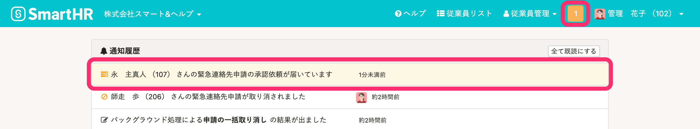

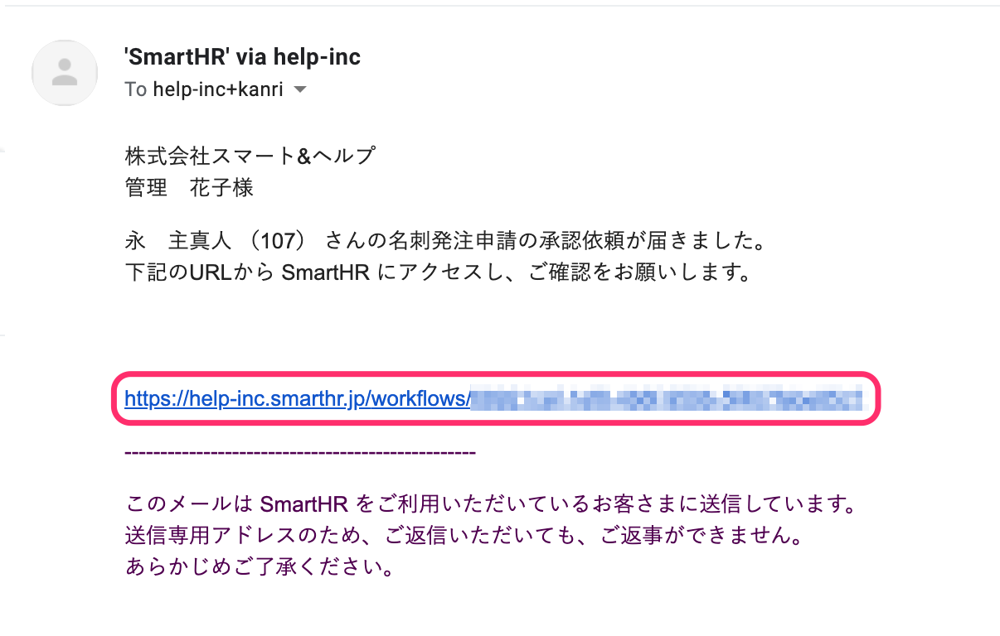

## 2.［申請内容］を確認し、［承認］をクリック

 **［申請内容］** で申請前と申請後の情報を確認して、問題がなければ **［承認］** をクリックします。

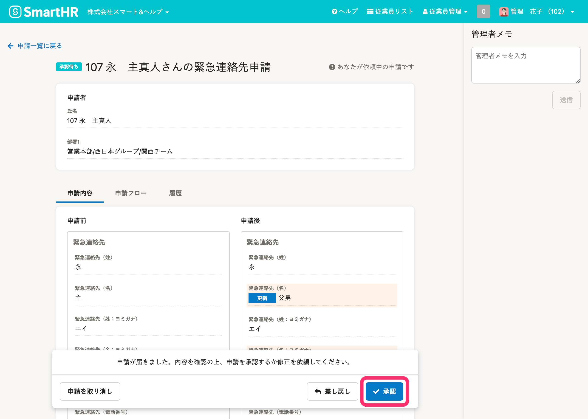

## 3\. メッセージを確認し、［承認］をクリック

メッセージを確認し、 **［承認］** をクリックします。

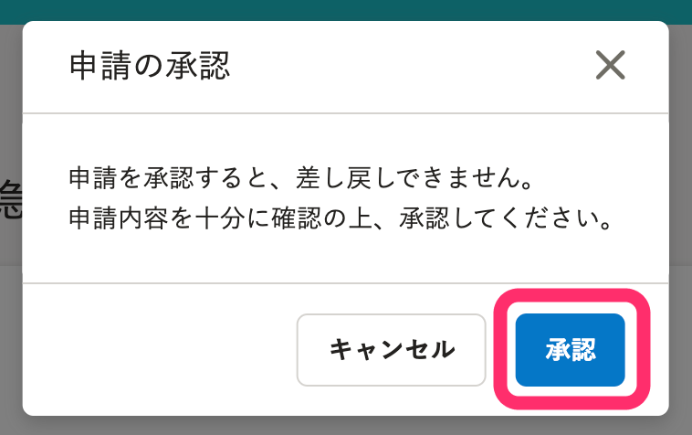

:::tips
最終承認ステップの場合、「承認されると、申請内容が従業員情報に反映されます。」と表示されます。
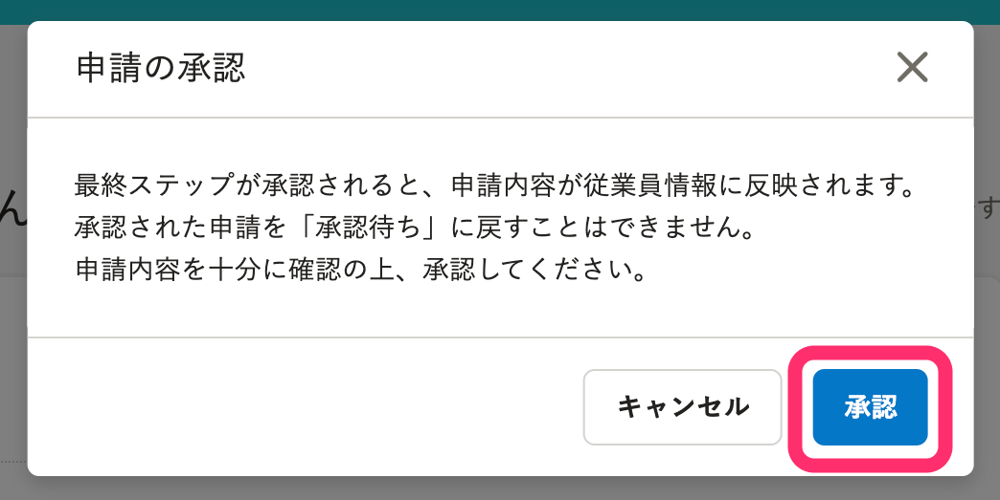
:::
:::tips
 **［申請フロー］** では、申請の依頼者や、承認ステップの承認条件と承認者を確認できます。
-  **［承認済］** には、**承認したアカウント**が表示さます。
-  **［未承認］** には、**承認経路に含まれているが承認をしていないアカウント**が表示されます。
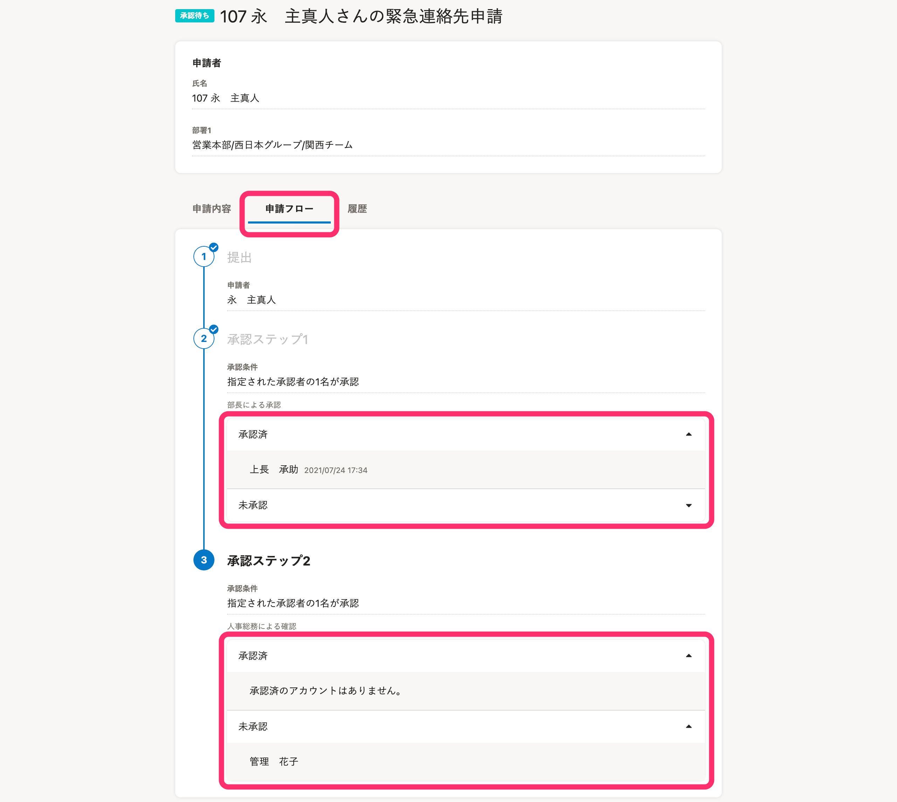
:::
:::tips
 **［申請履歴］** では、申請の依頼、提出、差し戻し、承認の履歴を確認できます。
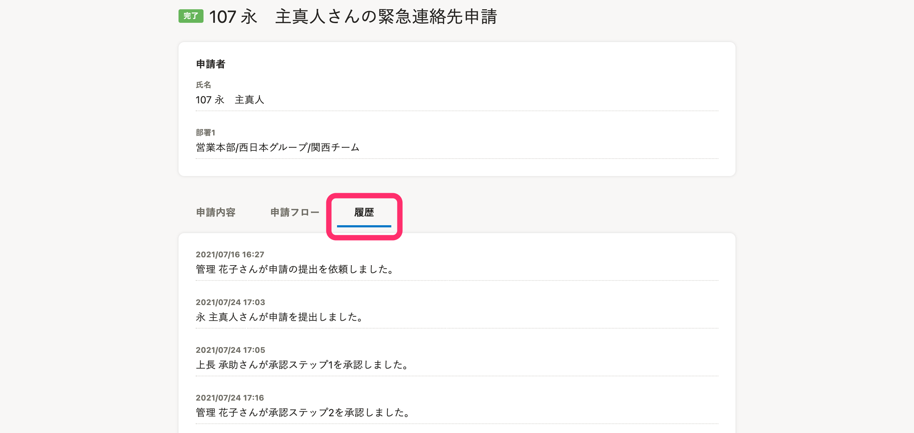
:::

# 申請を一括承認する

 **［申請一覧］** 画面で、複数の申請をまとめて承認できます。

## 1\. 承認したい申請にチェックを入れて、［選択した申請を承認］をクリック

承認したい申請のチェックボックスにチェックを入れて、 **［選択した申請を承認］** をクリックすると、確認メッセージが表示されます。

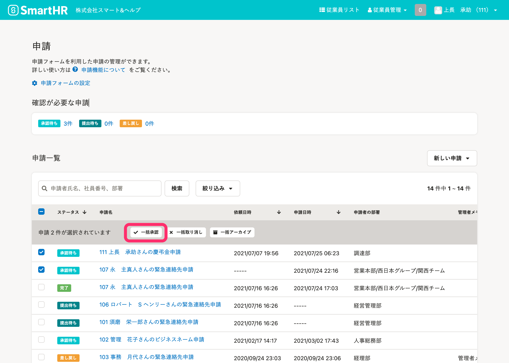

:::tips
**承認が求められている申請のみを表示**するには、 **［申請一覧］** の上に表示される **［承認待ち］** の**件数**をクリックします。
絞り込みを解除する場合は、 **［絞り込み▼］** をクリックして、画面左下の［ **絞り込み条件を解除］>［適用］** をクリックしてください。
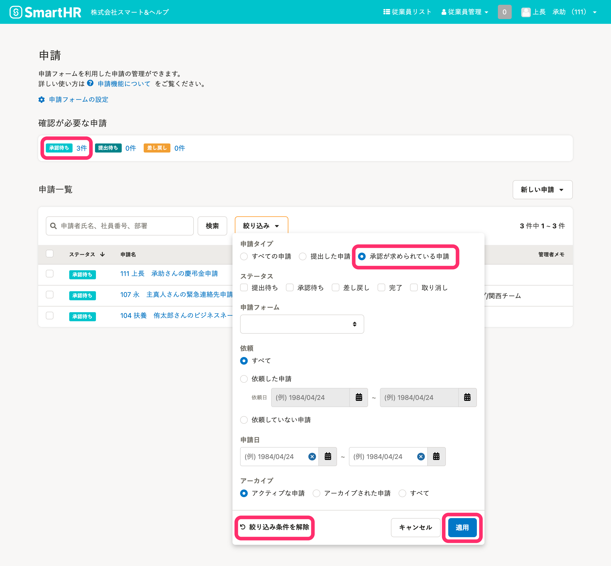
:::

## 2\. メッセージを確認し、［承認］をクリック

選択した申請のうち承認できる件数が、表示されます。

件数を確認し、 **［承認］** をクリックすると、申請の承認が予約されバックグラウンド処理が始まります。

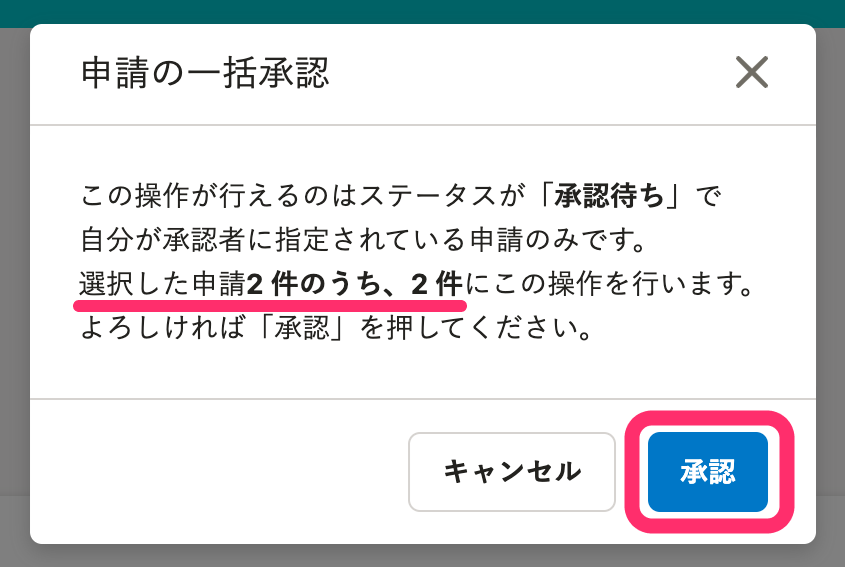

申請の承認処理の進捗状況は、 **［バックグラウンド処理一覧］** から確認します。

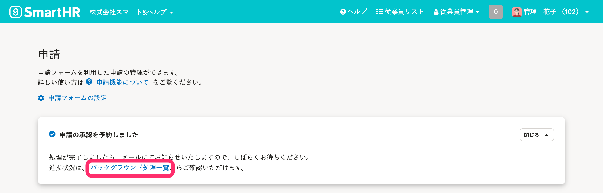

:::tips
この画面で承認できる申請は、申請ステータスが **［承認待ち］** で、自分の承認ステップの申請のみです。
:::

# 申請を差し戻す

 **［申請詳細］** 画面で申請内容に不備を見つけた場合は、申請者、もしくは前のステップの承認者に申請を差し戻します。

## 1.［申請内容］を確認し、［差し戻し］をクリック

 **［申請詳細］** 画面で **［差し戻し］** をクリックすると、 **［申請の差し戻し］** 確認画面が表示されます。

差し戻す前に、管理者メモを残しておくと便利です。

:::related
[申請の管理者メモを活用する](https://knowledge.smarthr.jp/hc/ja/articles/360043330113)
:::

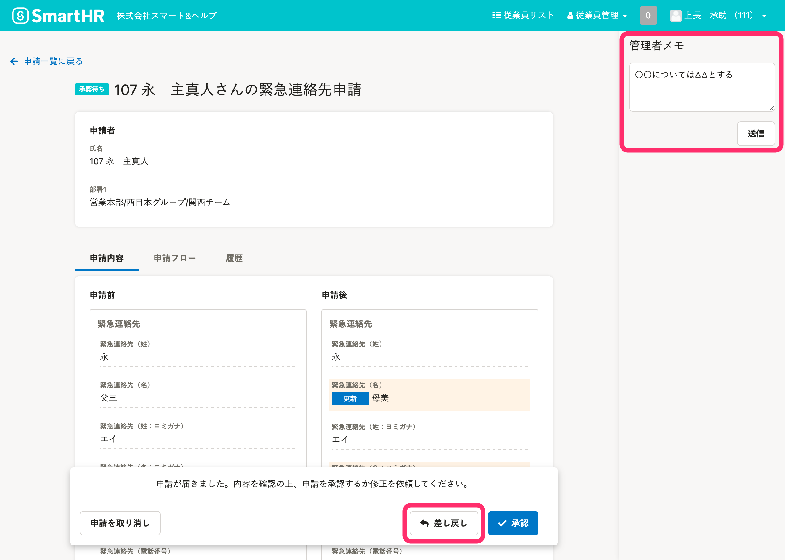

## 2.［差し戻し先］と［差し戻し理由］を記入して、［差し戻し］をクリック

 **［申請の差し戻し］** 確認画面で、 **［差し戻し先］** と **［差し戻し理由］** を記入し、 **［差し戻し］** をクリックします。

 **［差し戻し先］** は、自分の承認ステップよりも前のステップのみ選択できます。

:::tips
- 申請者に対する **［差し戻し理由］** は、**申請者・承認者ともに閲覧**できます。
- 承認者に対する **［差し戻し理由］** は、**申請経路にいる承認者のみ閲覧**できます。
:::

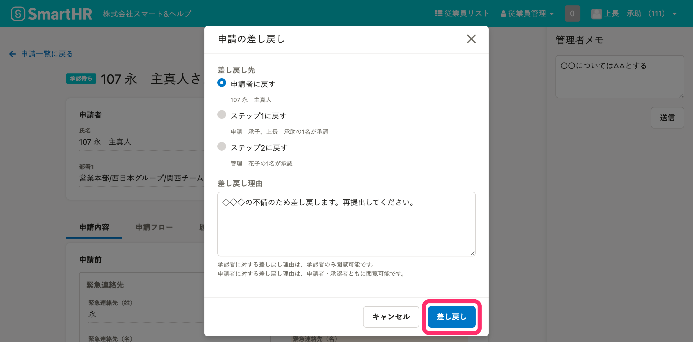

:::tips
再提出された申請を承認する際に、 **［差し戻し理由］** を確認できます。
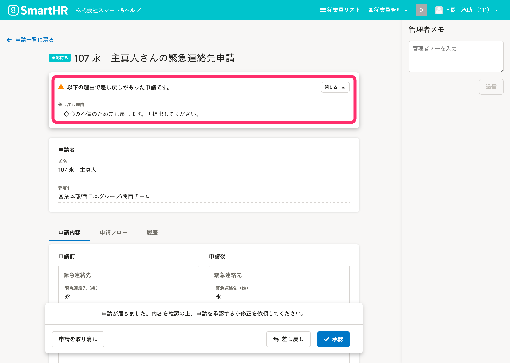
:::

# 申請を取り消す

申請の取り消しとは、**申請をキャンセルする操作**です。

:::alert
取り消された申請は、再提出できません。
申請スタータスが **［完了］** の申請は、取り消しできません。
:::

## 1.［申請内容］を確認し、［申請を取り消し］をクリック

 **［申請詳細］** 画面で **［申請を取り消し］** をクリックすると、 **［申請の取り消し］** 確認画面が表示されます。

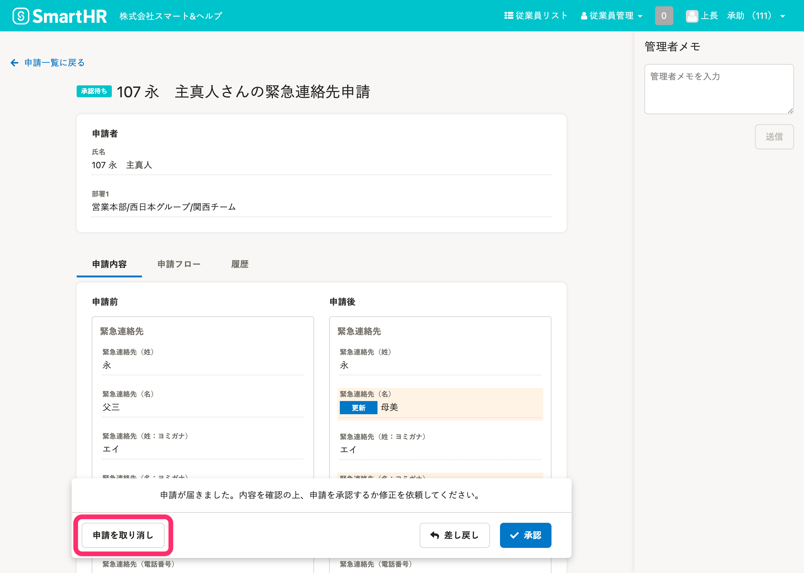

## 2\. メッセージを確認し、［取り消し］をクリック

メッセージを確認し、 **［取り消し］** をクリックします。

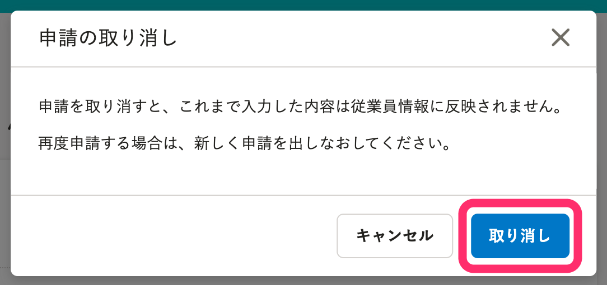

:::tips
 **［申請を取り消し］** ボタンは、承認ステップに該当しないタイミングでも表示されます。
 **「**  **取り消し・アーカイブ」** の操作権限を持つアカウントが、承認経路に含まれている **［申請詳細］** 画面を表示すると、 **［申請を取り消し］** ボタンが表示されます。
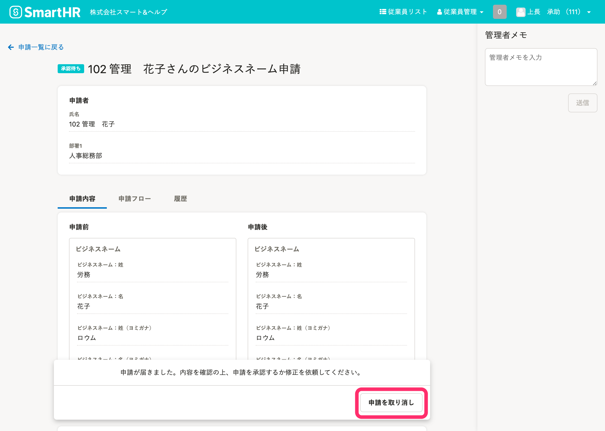
:::

# 申請を一括で取り消す

以下のページをご覧ください。

:::related
[申請の提出依頼を一括で取り消す](https://knowledge.smarthr.jp/hc/ja/articles/360026262393)
:::
