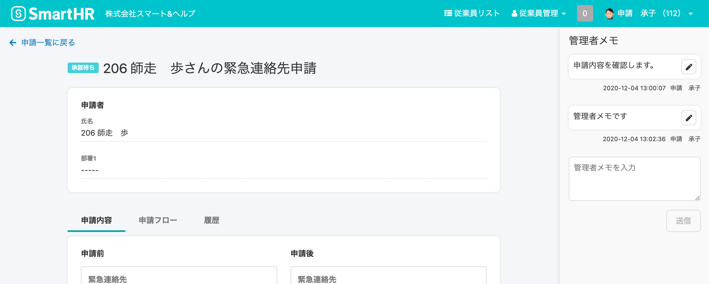

申請詳細画面にメモを残せます。

 **［管理者メモ］** は操作権限を持つ従業員にだけ表示されます。

:::alert
管理者メモ機能は、スマートフォンでの利用に対応しておりません。
管理者メモ機能を使う場合は、PCからSmartHRにアクセスしてください。
:::

# ［管理者メモ］を使うための権限

 **［管理者メモ］** を閲覧、作成、編集、削除するための権限は、権限編集から行ないます。

:::related
[申請機能を利用するための権限設定](https://knowledge.smarthr.jp/hc/ja/articles/360026262453)
:::

# ［管理者メモ］を閲覧する

## 1.メモを確認したい申請の名前をクリック

申請一覧に表示されている申請名をクリックすると、申請の詳細画面に移動します。

:::tips
### ［管理者メモ］をダウンロードする
 **［一覧ダウンロード］** から、 **［管理者メモ］** を含む **［申請一覧］** に表示されている内容をCSVファイルでダウンロードできます。
複数のメモがある場合は、最新のメモのみがCSVファイルに出力されます。
詳しくは、[申請のCSVダウンロード機能を利用する](https://knowledge.smarthr.jp/hc/ja/articles/360051114994)を参照してください。
:::

## 2\. ［管理者メモ］を確認する

PCからの閲覧に限って、申請の詳細画面右側に、 **［管理者メモ］** が表示されます。

# ［管理者メモ］を作成する

## 1.フォームにメモを入力

申請詳細画面右側に表示されている **［管理者メモ］** の入力欄に、メモを入力してください。

メモ欄では改行も可能です。

## 2\. ［送信］をクリック

フォーム下の **［送信］** をクリックすると、メモを残すことができます。

メモは、上から古い→新しいの順（昇順）に、時系列で表示されます。

# ［管理者メモ］を編集する

## 1\. 編集したいメモの鉛筆アイコンをクリック

内容を変更したいメモのフォーム右側の **［鉛筆アイコン］** をクリックすると、編集画面が表示されます。

## 2\. メモを変更したら、［保存］をクリック

編集画面で内容を修正し、右下の **［保存］** をクリックすると、変更内容が反映されます。

編集したものは一番上に表示されます。

# ［管理者メモ］を削除する

## 1\. 削除したい［管理者メモ］の鉛筆アイコンをクリック

削除したいメモのフォーム右側の **［鉛筆アイコン］** をクリックすると、編集画面が表示されます。

## 2\. ［管理者メモを削除］をクリック

編集画面左下の **［管理者メモを削除］** をクリックすると、確認ダイアログが表示されます。

## 3\. ［削除］をクリック

確認ダイアログの **［削除］** をクリックすると、管理者メモが削除されます。

