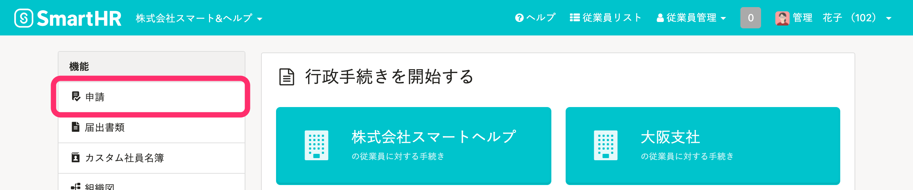
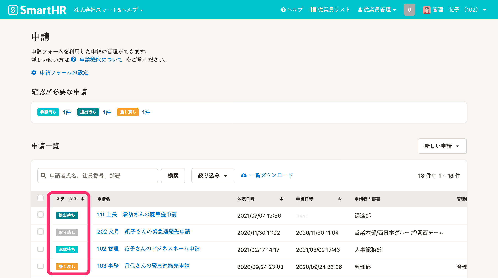
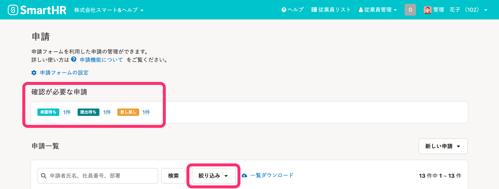
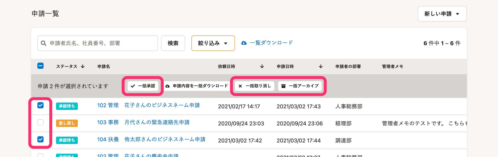
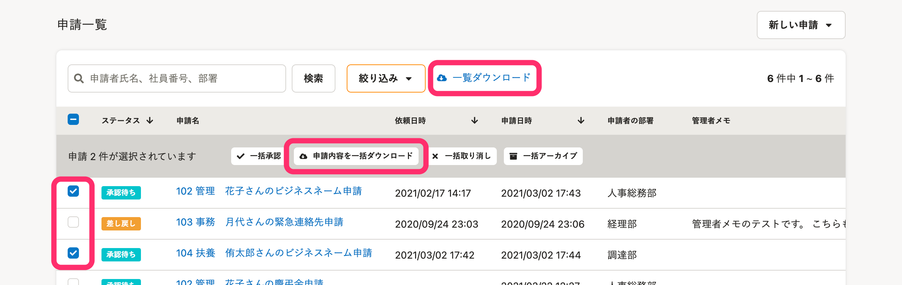

申請一覧画面の使い方を説明します。

申請機能の概要説明は、以下のページをご覧ください。

:::related
[申請機能でできること](https://knowledge.smarthr.jp/hc/ja/articles/360026103894)
:::

# 申請一覧画面とは

申請一覧画面は、トップページ左側の **［機能］** メニューの **［申請］** をクリックすると表示されます。

申請フォームを利用した申請を管理する画面です。

具体的には、申請の検索、絞り込み表示、申請の一括処理、申請データのダウンロードができます。

# 申請一覧画面の見方

## 申請のステータス一覧

 **［申請一覧］** の左端に表示されている **［申請ステータス］** で、申請の進捗状況が確認できます。

| ステータス名 | 説明 |
| :-- | :-- |
| 提出待ち | 従業員に対して申請の提出を依頼している状態 |
| 承認待ち | 申請者が申請を提出し、最終承認ステップの承認者の承認が終わっていない状態 |
| 差し戻し | 申請者に対して申請を差し戻した状態 |
| 完了 | すべての承認ステップでが承認が下りた状態 |
| 取り消し | 申請を取り消した状態 |

## 確認が必要な申請

［申請一覧］の上部に［確認が必要な申請］の件数が表示されます。

表示される件数は、以下の3種類です。

-  **［承認待ち］** ：**自分に届いた**申請の承認依頼の件数
-  **［提出待ち］** ：**自分に届いた**申請の提出依頼の件数
-  **［差し戻し］** ：**自分の提出した**申請が差し戻された件数

:::tips
 **［確認が必要な申請］** の**件数**をクリックすると、クリックしたステータスの申請だけが絞り込み表示されます。
絞り込みを解除するには、 **［絞り込み▼］** をクリックして、 **［絞り込み条件を解除］>［適用］** をクリックしてください。

:::

# 申請一覧画面の操作

## 従業員に申請の提出を依頼する

依頼権限のあるアカウントは、従業員に申請の提出を依頼できます。

詳しい操作方法は、以下のページをご覧ください。

:::related
[申請機能を使って従業員に情報提供を依頼する](https://knowledge.smarthr.jp/hc/ja/articles/360026103874)
:::

## 申請を探す・絞り込む

フリーワード入力と絞り込み機能を使って、 **［申請一覧］** の表示を絞り込みできます。

:::related
[［申請一覧］の表示を絞り込む](https://knowledge.smarthr.jp/hc/ja/articles/360051953213)
:::

## 申請をまとめて処理する

 **［申請一覧］** の左端のチェックボックスにチェックを入れて申請を選択し、一括承認や一括取り消しができます。

また、完了した申請を **［一括アーカイブ］** すると、申請が非表示になります。

:::related
[申請の提出依頼を一括で取り消す](https://knowledge.smarthr.jp/hc/ja/articles/360026262393)
:::

## 申請に関するデータをダウンロードする

2種類の申請に関するデータをダウンロードできます。

 **［一覧ダウンロード］** をクリックすると、申請一覧画面に表示されているステータス、申請名などの情報をダウンロードできます。

 **［申請内容を一括ダウンロード］** をクリックすると、申請内容をダウンロードできます。

:::related
[申請のCSVダウンロード機能を利用する](https://knowledge.smarthr.jp/hc/ja/articles/360051114994)
:::

