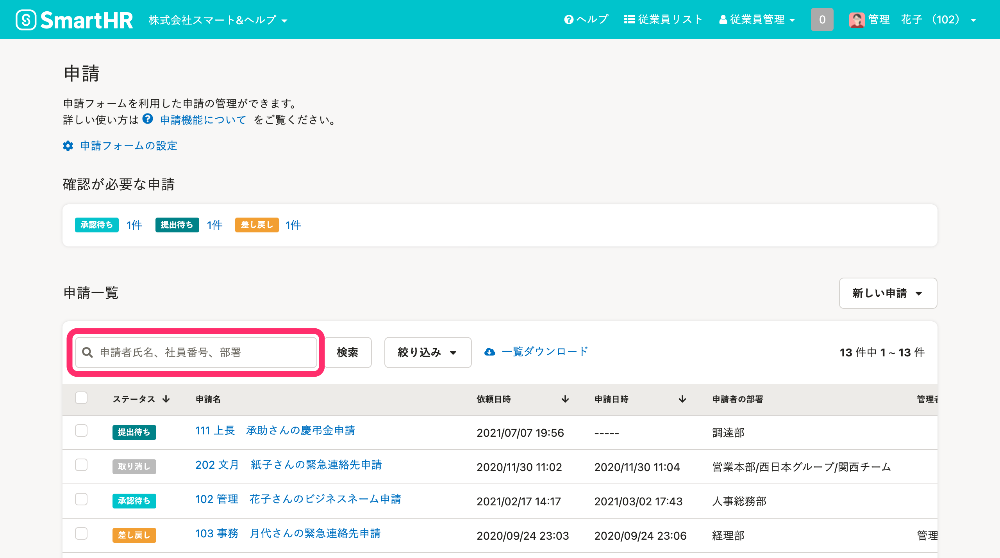
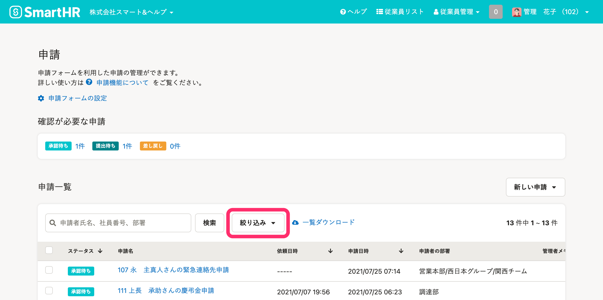
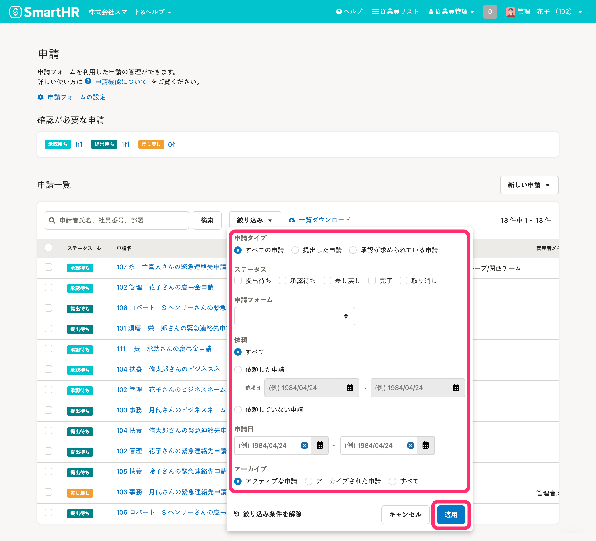
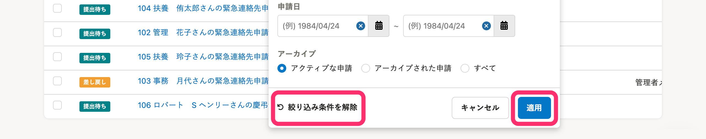

 **［申請一覧］** 画面では、申請者氏名、社員番号、部署による **［検索］** と、申請ステータスや申請日などを指定する **［絞り込み］** ができます。

# 申請者氏名、社員番号、部署で検索する

## 1\. 申請者氏名、社員番号、部署名を入力

検索フォームに申請者氏名、社員番号、部署名を入力します。

## 2\. ［検索］をクリック

 **［検索］** をクリックすると、入力した内容を含む申請が表示されます。

# 申請ステータスや申請日などで絞り込む

## 1\. ［絞り込み］をクリック

 **［絞り込み］** をクリックして、パネルを開きます。

## 2\. 条件を指定し［適用］をクリック

絞り込み表示したい条件を指定し **［適用］** をクリックすると、条件に合致した申請のみが表示されます。

| **申請タイプ** |  **［すべての申請］** 、 **［提出した申請］** 、 **［承認が求められている申請］** のいずれかを指定します。 |
| --- | --- |
| **ステータス** | 各ステータスを指定します。複数指定も可能です。 |
| **申請フォーム** | プルダウンから、申請フォームのいずれかを指定します。 |
| **依頼** |  **［すべて］** 、 **［依頼した申請］** 、 **［依頼していない申請］** のいずれかを指定します。 **［依頼した申請］** を指定すると、従業員に申請を依頼した日付や期間を指定できます。 |
| **提出日** |   申請が提出された日付や期間を指定します。   |
| **アーカイブ** |    **［アクティブな申請］** 、 **［アーカイブされた申請］** 、 **［すべて］** のいずれかを指定します。   |

:::tips
 **［絞り込み条件を解除］> ［適用］** をクリックすると、設定した条件をすべて解除できます。

:::
