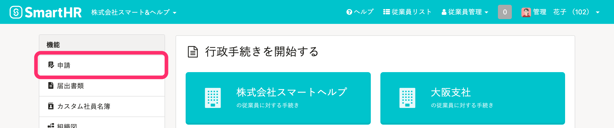
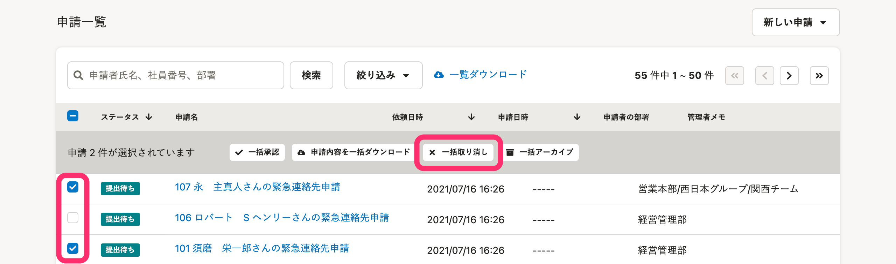
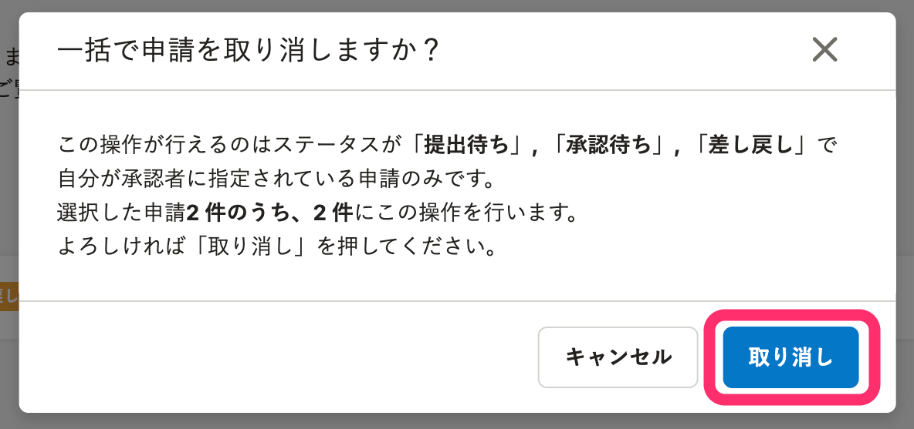
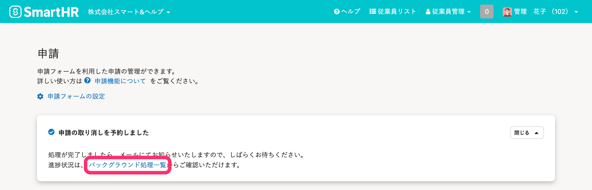

申請の「取り消し・アーカイブ」権限があるアカウントは、申請をまとめて取り消せます。

:::related
[申請機能の権限](https://knowledge.smarthr.jp/hc/ja/articles/360026262453)
:::

# 1.［機能］>［申請］をクリック

トップページ左の **［機能］** 欄にある **［申請］** をクリックすると、申請画面が表示されます。

# 2\. 取り消したい申請にチェックを入れ、［一括取り消し］をクリック

取り消したい申請の横にあるボックスにチェックを入れると、選択した件数と **［一括取り消し］** ボタンが表示されます。

 **［一括取り消し］** をクリックすると、確認メッセージが表示されます。

# 3\. メッセージを確認し、［取り消し］をクリック

選択した申請のうち取り消しできる件数が、表示されます。

件数を確認し、 **［取り消し］** をクリックすると、申請の取り消しが予約されバックグラウンド処理が始まります。

申請の取り消し処理の進捗状況は、 **［バックグラウンド処理一覧］** から確認します。

# 4.［申請一覧］でステータスを確認

バックグラウンド処理が完了すると、申請が取り消されます。

 **［申請一覧］** のステータスには **［取り消し］** と表示されます。
