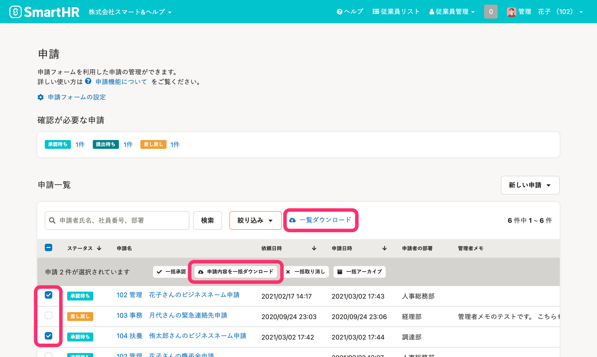
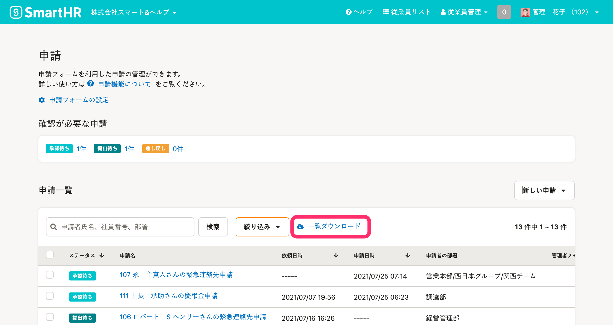
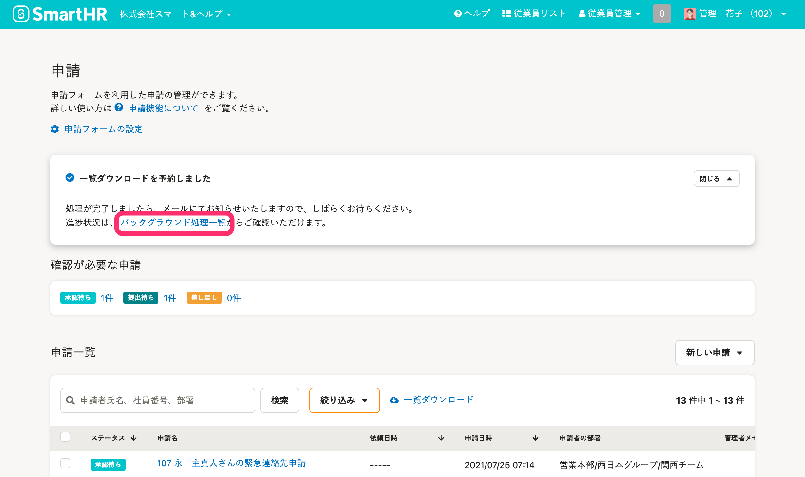
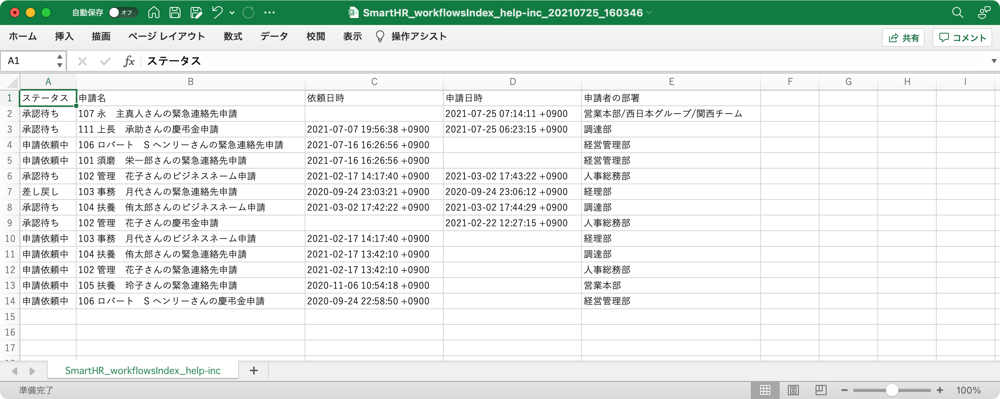
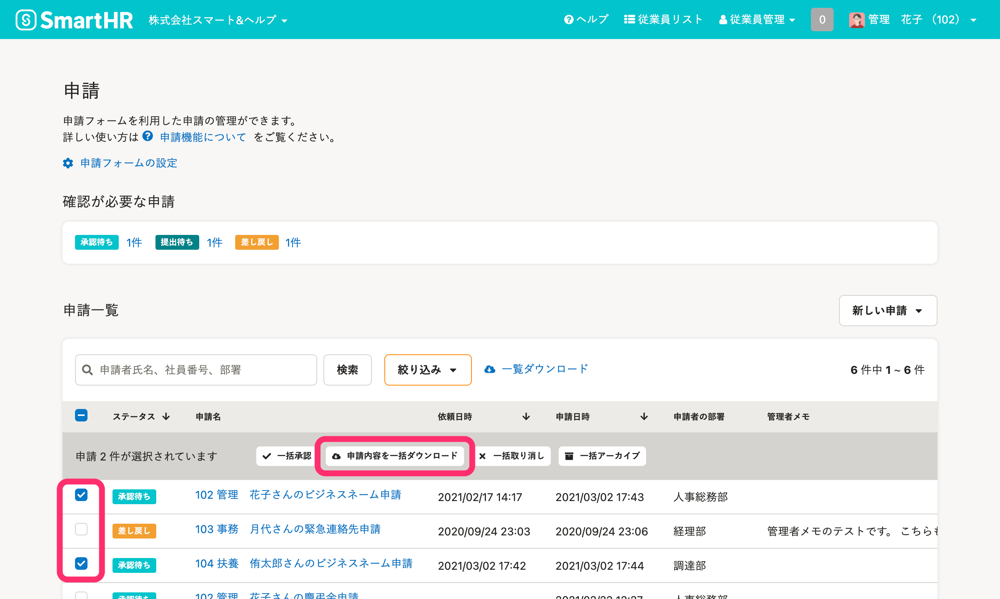
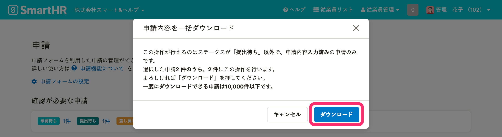
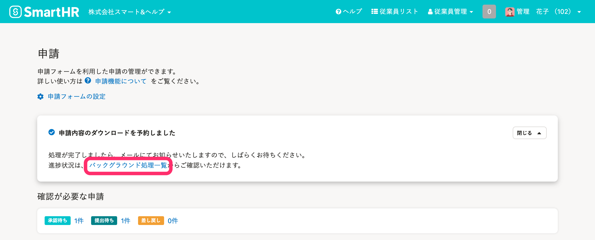
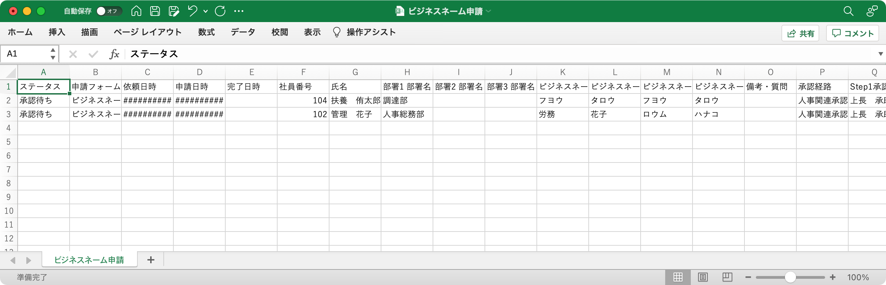

 **［申請一覧］** 画面でCSVダウンロードできる項目と、ダウンロードの手順を説明します。

# CSVでダウンロードできる項目

 **［一覧ダウンロード］** をクリックすると、 **［申請一覧］に表示されている情報** をダウンロードできます。

任意の申請を選択し **［申請内容を一括ダウンロード］** をクリックすると、**申請内容**をダウンロードできます。

具体的には、それぞれ以下の項目をダウンロードできます。

|   | ステータス | 申請名 | フォーム名 | 依頼日時 | 申請日時 | 完了日時 | 社員番号 | 氏名 | 申請者の部署 | 提出項目 | 承認経路 | 承認条件 | 承認者 | 管理者メモ |
| --- | --- | --- | --- | --- | --- | --- | --- | --- | --- | --- | --- | --- | --- | --- |
|  **［一覧ダウンロード］**  | ◯ | ◯ | ― | ◯ | ◯ | ― |   ―   | ― | ◯ | ― | ― | ― | ― | ◯ |
|  **［申請内容の一括ダウンロード］**  | ◯ | ― | ◯ | ◯ | ◯ | ◯ | ◯ | ◯ | ― | ◯ | ◯ | ◯ | ◯ | ― |

# ［申請一覧］に表示されている情報をダウンロードする

## 1\. ダウンロードしたい項目を、［申請一覧］に表示

 **［申請一覧］** の表示を絞り込んで、ダウンロードしたい項目のみを表示させます。

:::related
[［申請一覧］の表示を絞り込む](https://knowledge.smarthr.jp/hc/ja/articles/360051953213)
:::

## 2.［一覧ダウンロード］をクリック

 **［**  **申請一覧］** 画面中央にある **［一覧ダウンロード］** をクリックすると、 **「一覧ダウンロードを予約しました」**  とメッセージが表示され、バックグラウンド処理が始まります。

## 3.［バックグラウンド処理一覧］からデータをダウンロードする

メッセージ内のリンクをクリックし、 **［バックグラウンド処理一覧］** に移動します。

バックグラウンド処理完了後、CSVファイルをダウンロードします。

## 例：［一覧ダウンロード］のCSVファイル

:::related
[バックグラウンド処理後にデータをダウンロードする](https://knowledge.smarthr.jp/hc/ja/articles/360026105494)
:::

# 申請内容をダウンロードする

## 1\. 任意の申請にチェックを入れ、［申請内容を一括ダウンロード］をクリック

ダウンロードしたい申請のチェックボックスにチェックを入れ、 **［申請内容を一括ダウンロード］** をクリックします。

## 2\. メッセージを確認し［ダウンロード］をクリック

ダウンロードできる申請件数を確認します。

 **［ダウンロード］** をクリックし、 **「申請内容のダウンロードを予約しました」** とメッセージが表示され、バックグラウンド処理が開始されます。

:::alert
一括ダウンロードできるのは、 **「ステータスが［提出待ち］以外で、申請内容入力済み」** の申請のみです。
:::

## 3.［バックグラウンド処理一覧］からデータをダウンロードする

メッセージ内のリンクをクリックし、 **［バックグラウンド処理一覧］** に移動します。

バックグラウンド処理完了後、CSVファイルをダウンロードします。

## 例：［申請内容の一括ダウンロード］のCSVファイル

:::related
[バックグラウンド処理後にデータをダウンロードする](https://knowledge.smarthr.jp/hc/ja/articles/360026105494)
:::
