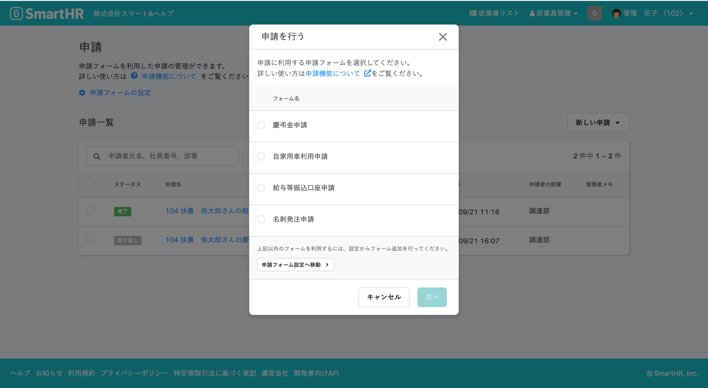
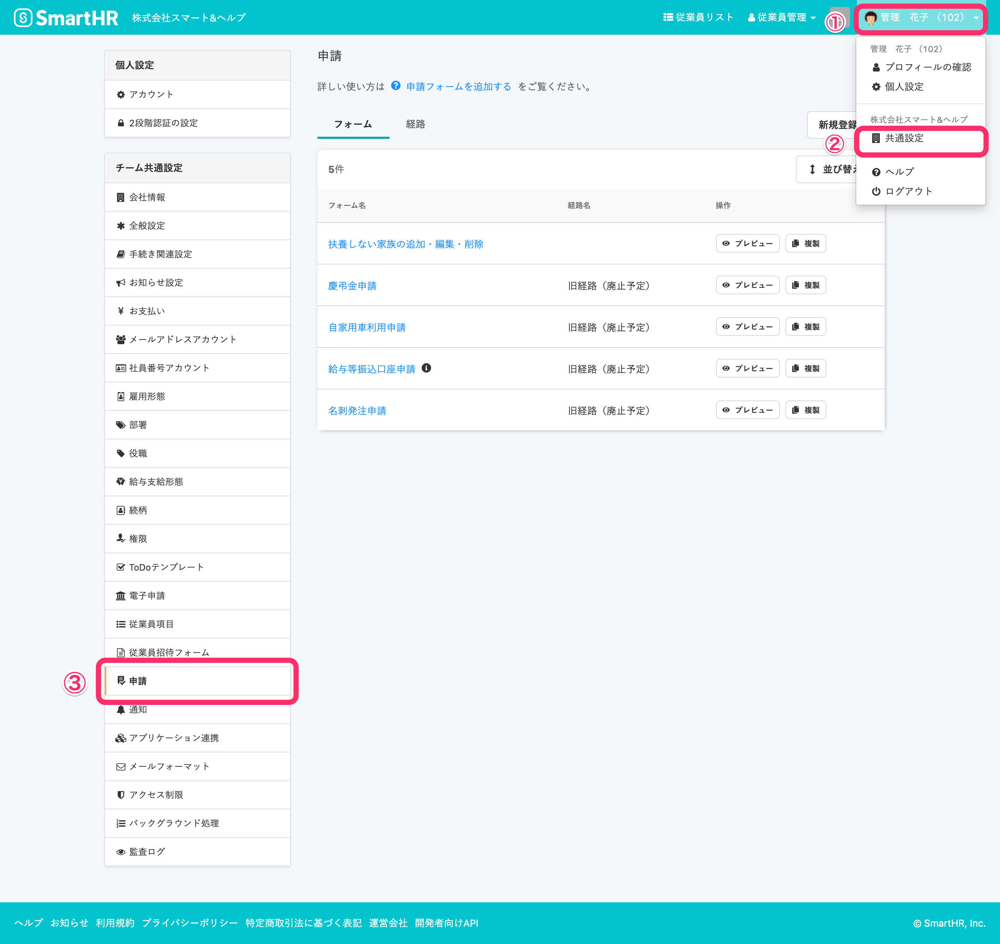
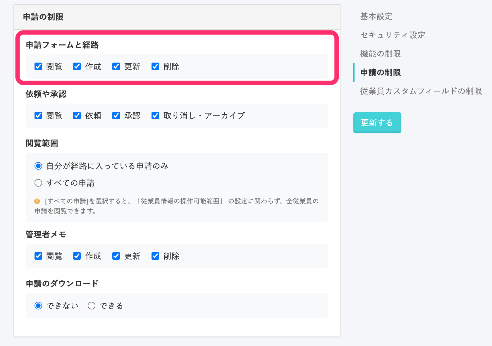
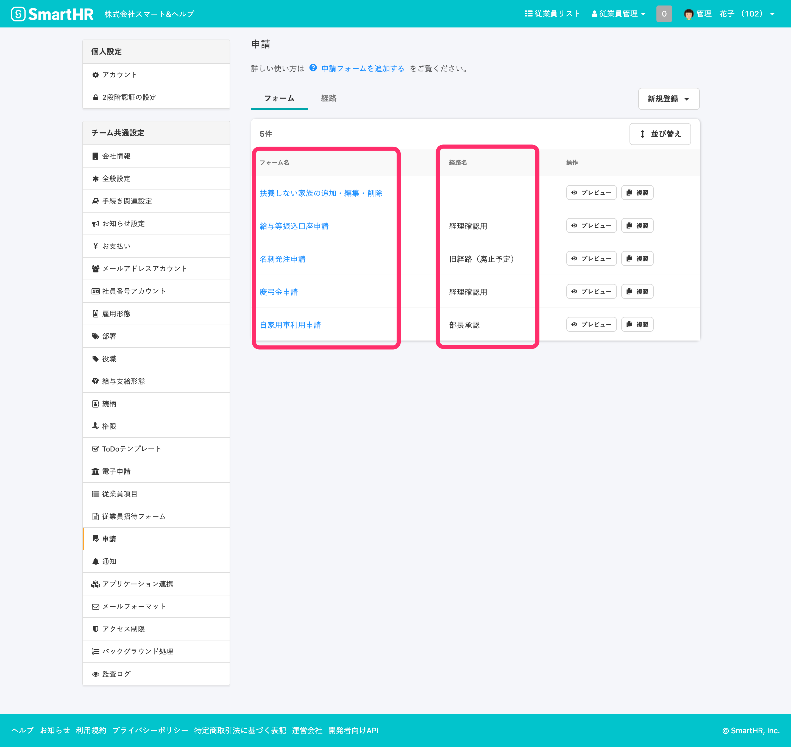
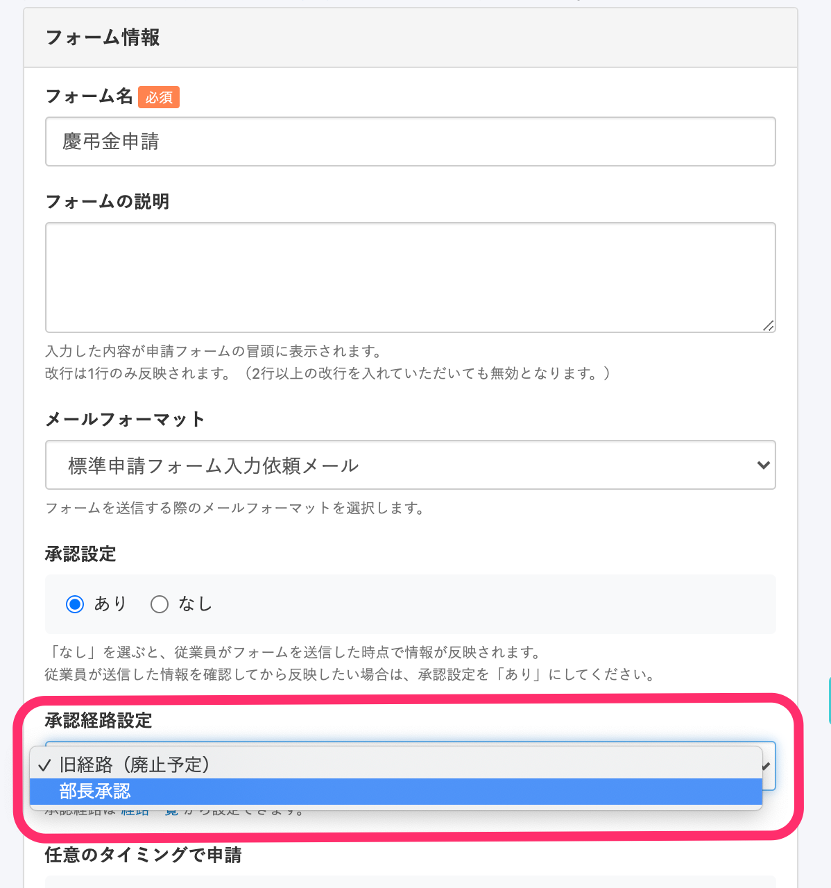
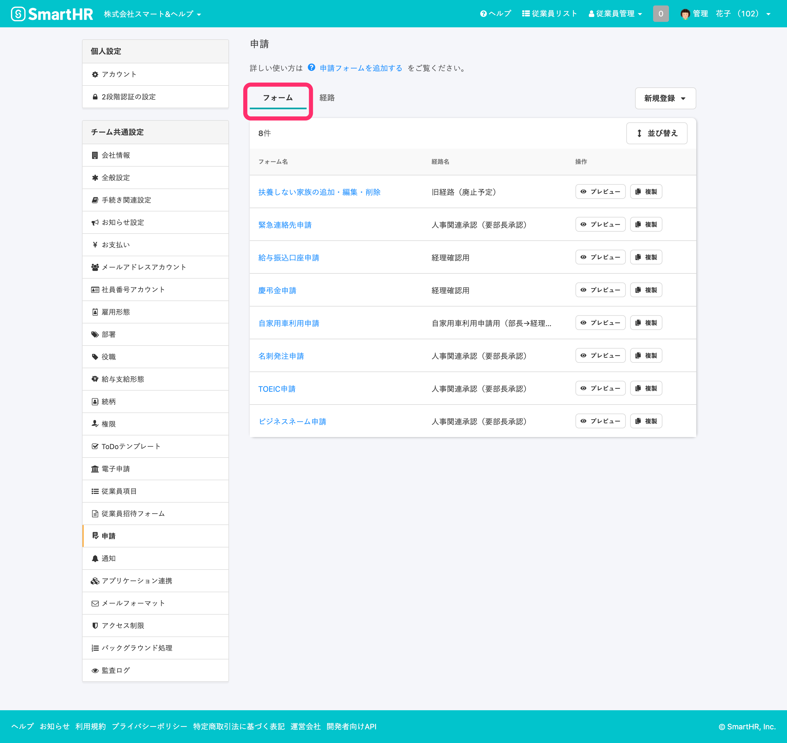
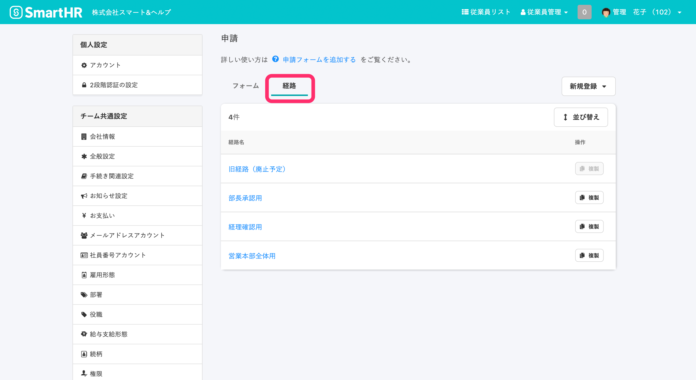

機能メニュー **［申請］** で利用する申請フォームを設定します。

申請フォームを利用するには、 **［申請］** の設定画面で、 [申請フォームの作成・編集](https://knowledge.smarthr.jp/hc/ja/articles/360026262313) と [承認経路の作成・編集](https://knowledge.smarthr.jp/hc/ja/articles/360053832734) が必要です。

# ［申請］の設定

## 画面右上のアカウント名>［共通設定］>［申請］をクリック

画面右上の **［アカウント名▼］** をクリックして開くメニューから **［共通設定］** を選び、画面左のリストにある **［申請］** をクリックして、 **［申請］** 設定画面へ移動します。

## 申請を設定できる権限

### 申請フォームと経路の操作権限を持つカスタム権限も申請設定を操作できます

「管理者」「事務担当者」以外に、 **［申請の制限：申請フォームと経路］** の **［作成］、［更新］、［削除］** が有効になっているカスタム権限のアカウントも、申請の設定画面を操作できます。

カスタム権限の場合、画面右上の **［アカウント名▼］** をクリックして開くメニューから **［個人設定］** をクリックすると、画面左のリストにある **［申請］** が表示されます。

「管理者」、「事務担当者」以外のカスタム権限の場合は、画面右上の **［アカウント名▼］** をクリックして開くメニューから **［個人設定］** をクリックすると、画面左のリストにある **［申請］** が表示されます。

# ［申請］設定画面

申請フォームを利用するにあたって、フォームと経路の紐付けが必要です。

 **［申請］** 設定画面で、フォームと経路をそれぞれ作成し、フォーム編集画面で経路との紐付けを行ないます。

:::tips
### 経路は、［フォーム情報］の中の［承認経路設定］で紐付けします
フォーム名をクリックして表示する、 **［フォーム情報］** の作成・編集画面で、経路との紐付けができます。

:::
:::alert
複数ステップでの承認機能公開以前に、**作成済み**、かつ  **承認設定が「あり」** と設定されていた申請フォームには、 **「旧経路（廃止予定）」** が自動的に紐付けられています。
 **「旧経路（廃止予定）」** については、下記をご確認ください。
[旧経路（廃止予定）はどんな経路ですか？](https://knowledge.smarthr.jp/hc/ja/articles/360055621113)
:::

# ［フォーム］タブで設定・管理する内容

 **［フォーム］** では、申請の入力フォームの作成や編集をします。

 **［フォーム情報］** の設定と、入力フォームに使用する従業員項目を選択して、 **［申請フォーム］** を作成・編集します。

:::related
[申請フォームを管理する](https://knowledge.smarthr.jp/hc/ja/articles/360026262313)
:::

# ［経路］タブで設定・管理する内容

 **［経路］** では、承認経路の作成や編集ができます。

 **［承認ステップ］** ごとに **承認者** と **必要な承認数** を設定して、申請に必要な **承認条件** を作成・管理します。

 **［承認ステップ］** は最大10ステップまで設定できます。

:::related
[申請経路を管理する](https://knowledge.smarthr.jp/hc/ja/articles/360053832734)
:::
