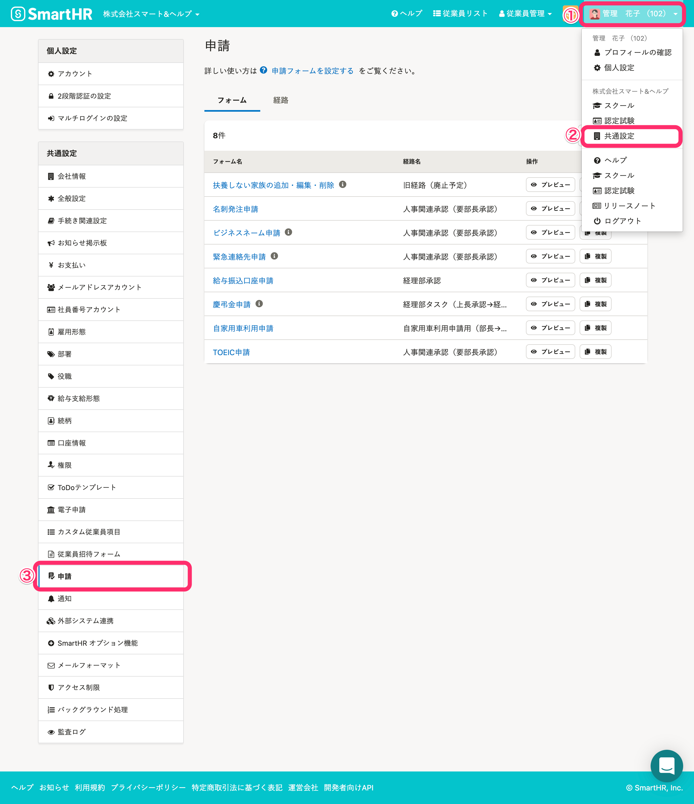
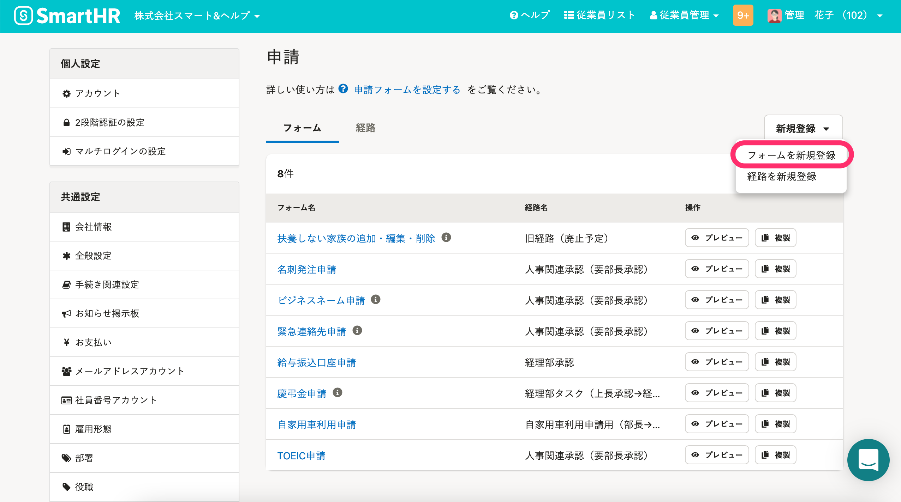
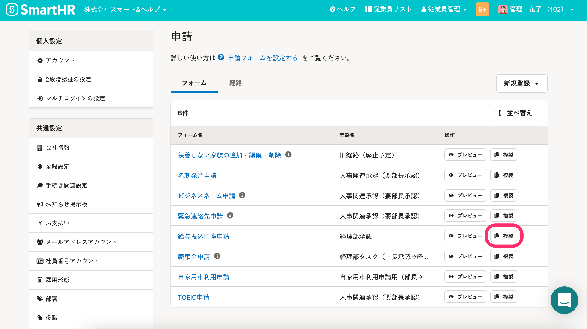
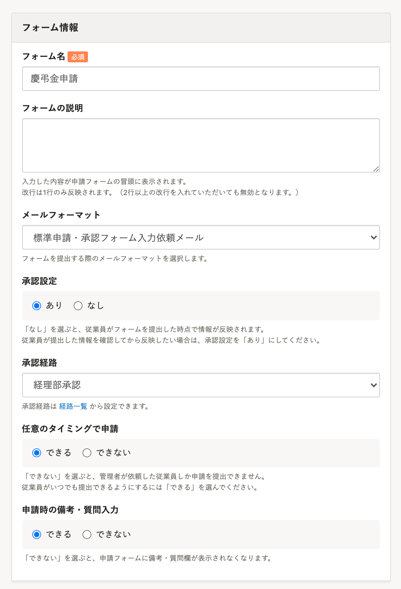
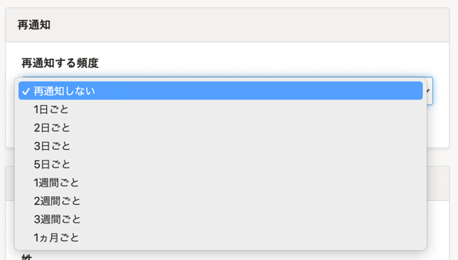
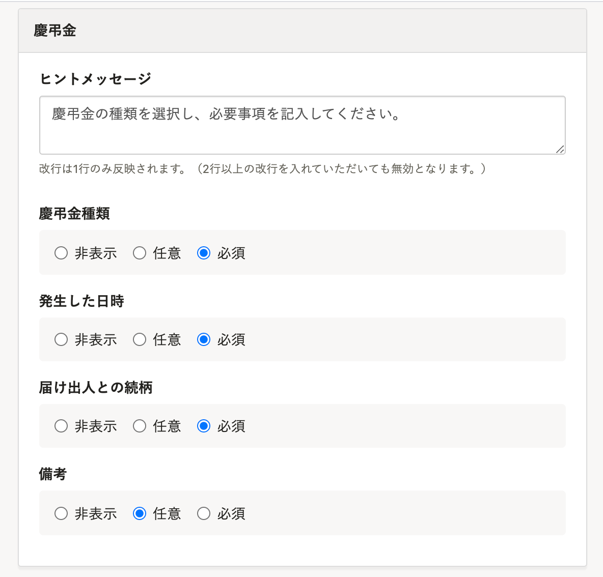
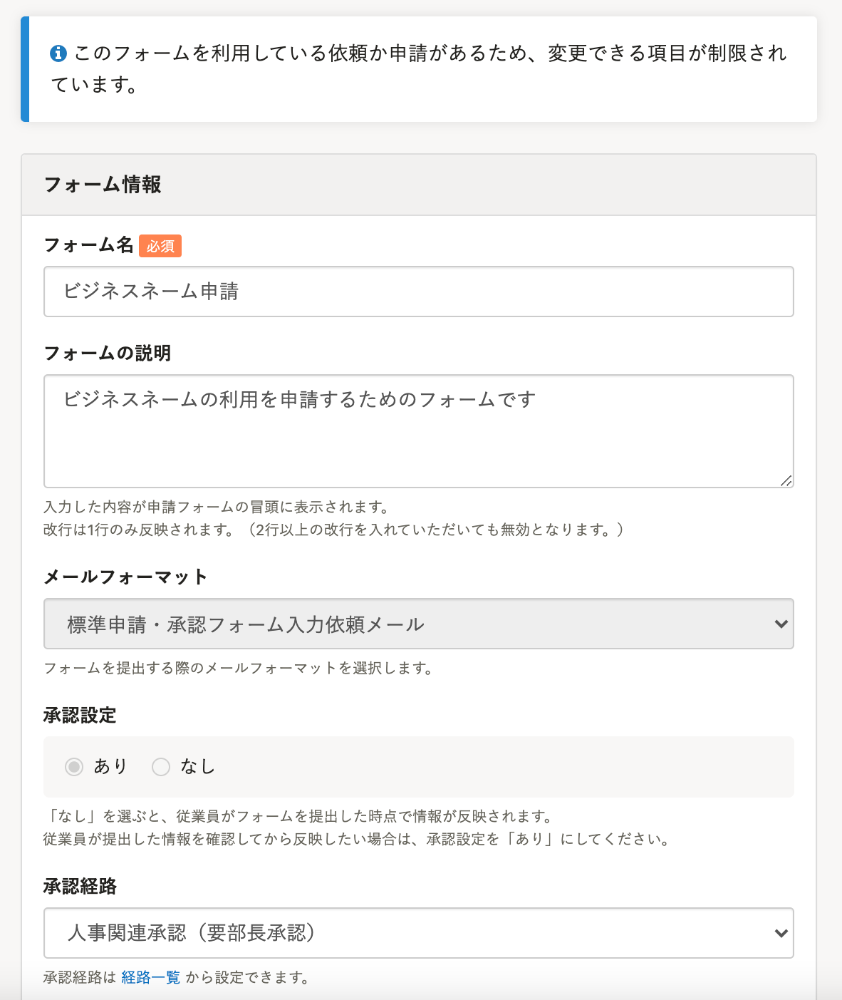
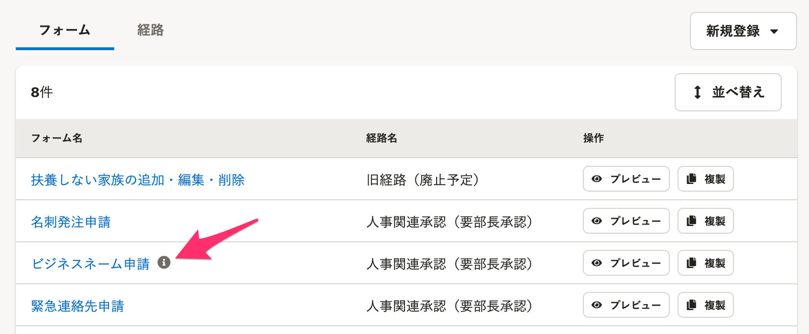
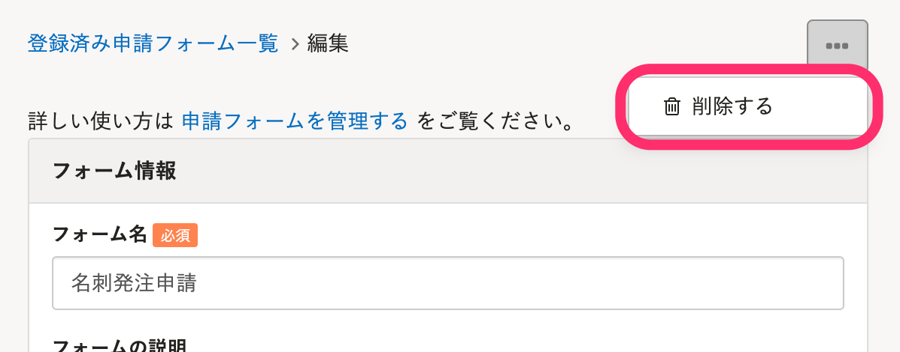

申請に利用する入力フォームの新規作成、編集及び削除方法を説明します。

# ［申請］の設定

## 画面右上の［アカウント名▼］>［共通設定］>［申請］をクリック

画面右上の **［アカウント名▼］** をクリックして開くメニューから **［共通設定］** を選び、画面左のリストにある **［申請］** をクリックすると、 **［申請］** 設定画面へ移動します。

## 申請フォームを管理できる権限

### フォームと経路の操作権限を持つカスタム権限も申請設定を操作できます

「管理者」「事務担当者」以外に、 **［申請フォームと経路の作成や削除］** の **［作成］、［更新］、［削除］** が有効になっているカスタム権限のアカウントも、申請の設定画面を操作できます。

カスタム権限の場合、画面右上の **［アカウント名▼］** をクリックして開くメニューから **［個人設定］** をクリックすると、画面左のリストにある **［申請］** が表示されます。

:::related
[申請機能を管理者として利用するための権限設定](https://knowledge.smarthr.jp/hc/ja/articles/360026262453)
:::

# 申請フォームを新規作成する

## 1.［新規登録］>［フォームを新規登録］をクリック

画面右上にある **［新規登録］>［フォームを新規登録］** をクリックすると、申請フォームの **［新規登録］** 画面が表示されます。

:::tips
### フォームの複製から、新規作成する
申請設定画面の **［フォーム］** 一覧から複製したいフォームをコピーし、新たなフォームの作成も可能です。

:::

## 2.［フォーム情報］に必要事項を記入する

 **［フォーム名］** を入力し、 **［フォームの説明］** 、 **［メールフォーマット］** 、 **［承認設定］** 、 **［承認経路］** 、  **［任意のタイミングで申請］** 、 **［申請時の備考・質問入力］** の設定します。

| 項目名 | 説明 |
| --- | --- |
| フォーム名 | フォームの一覧及び申請画面に表示されます。 （従業員側にも表示されます） |
| フォームの説明（任意） | 入力した内容が申請フォームの冒頭に表示されます。 |
| メールフォーマット | 申請依頼時に従業員に送信するメールのフォーマットを指定します。 メールフォーマットの作成手順は下記をご確認ください。 [従業員が受け取るメールの内容をカスタマイズする](https://knowledge.smarthr.jp/hc/ja/articles/360026106674) |
| 承認設定 | 承認ステップの有無を指定します。  **［あり］** ：承認されるまで従業員情報は更新されません。  **［なし］** ：申請の提出と同時に従業員情報が更新されます。 |
| 承認経路 | 承認経路を指定します。 承認経路は **［経路の一覧］** にあるものが、プルダウンリストに表示されます。 |
| 任意のタイミングで申請 |   申請フォームを常に従業員側のダッシュボードに表示するかどうかを指定します。   **［できる］** ：従業員はいつでも申請を提出できます。  **［できない］** ：従業員は提出依頼があった場合のみ申請できます。   |
| 申請時の備考・質問入力 | 申請フォームに **「備考・質問」** 入力欄が表示されるかどうかを指定できます。 |

## 3.［再通知］を設定する

申請フォームが提出されるまで、 **［メールフォーマット］** で指定したメールを申請者にくり返し送信できます。

ステータスが **［提出待ち］［差し戻し］** の申請が再通知の対象です。

プルダウンメニューから「再通知メールを送るかどうか」と「送る頻度」を指定します。

:::tips
再通知メールは、件名の頭に 【再通知】 がつき、本文は、再通知のタイミングでメールフォーマットに設定されている内容が送られます。
メールフォーマットは、依頼時と差し戻し時でそれぞれ設定できます。
[従業員が受け取るメールの内容をカスタマイズする](https://knowledge.smarthr.jp/hc/ja/articles/360026106674)
:::

## 4\. 申請時に利用する従業員項目を選択して、［登録する］をクリック

申請フォームの入力項目として利用する従業員項目（カスタム項目含む）を選択します。

入力必須項目は **［必須］** 、任意項目は **［任意］** とします。

項目グループごとにヒントメッセージの設定も可能です。

## 5\. 必要に応じて、申請フォームをプレビュー

申請者からの申請フォームの見えかたを確認したい場合は、申請設定画面の **［フォーム］** 一覧で **［プレビュー］** をクリックします。

:::tips
### カスタム従業員項目を使った申請フォームの作成
事前に登録した[カスタム従業員項目](https://knowledge.smarthr.jp/hc/ja/articles/360026265513)と組み合わせることで、さまざまな申請フォームとして利用できます。
- 慶弔金申請
- 育休申請
- 自家用車通勤申請
- 資格申請
- 名刺発注申請
:::

# 申請フォームを編集する

## 1\. 編集したいフォーム名をクリック

申請設定画面の **［フォーム］** タブをクリックすると、登録済みの申請フォーム一覧が表示されます。

編集したいフォーム名をクリックして、フォームの **［編集］** 画面に移動します。

## 2\. 内容を編集し、［更新する］をクリック

内容を編集し、 **［更新する］** をクリックします。

## 3\. 必要に応じて、申請フォームをプレビュー

申請者からの申請フォームの見えかたを確認したい場合は、申請設定画面の **［フォーム］** 一覧で **［プレビュー］** をクリックします。

:::alert
編集したいフォームが利用中（依頼中・申請中・差戻し中）の場合、申請に使用する従業員項目の変更など、一部更新ができません。

一覧画面ではフォーム名の横に **［ i ］** が表示されます。

:::

# 申請フォームを削除する

## 1\. 削除するフォーム名をクリック

申請設定画面の **［フォーム］** タブをクリックすると、登録済みの申請フォーム一覧が表示されます。

削除したいフォーム名をクリックして、フォームの編集画面に移動します。

## 2\. 右上の［...］メニュー >［削除する］をクリック

画面右上にある **［…］メニュー**  の **［削除する］** をクリックしてください。

:::alert
すでに申請依頼をしている場合は、申請フォーム削除後も、申請・承認・差戻しが可能です。
:::
