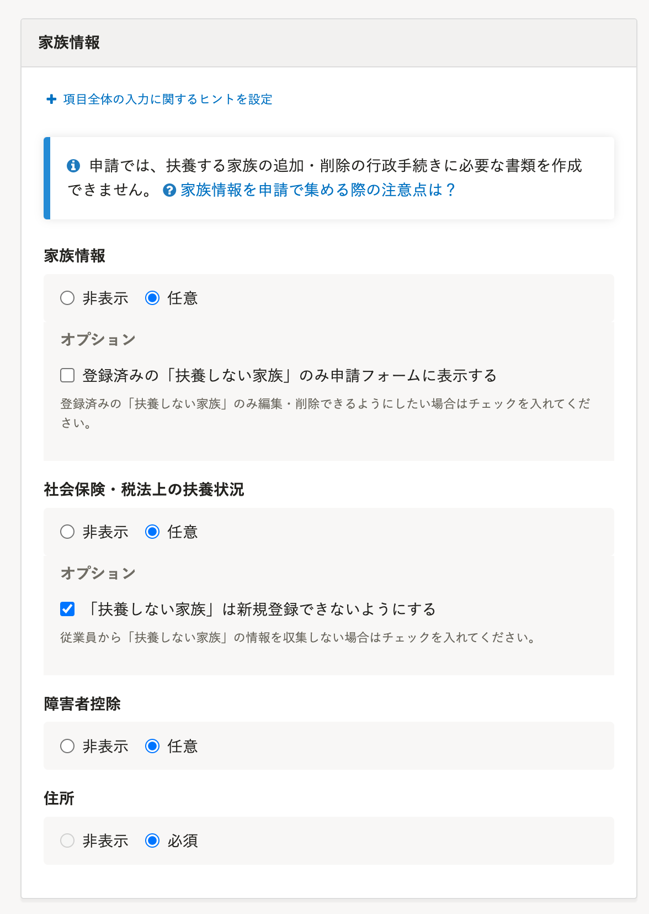
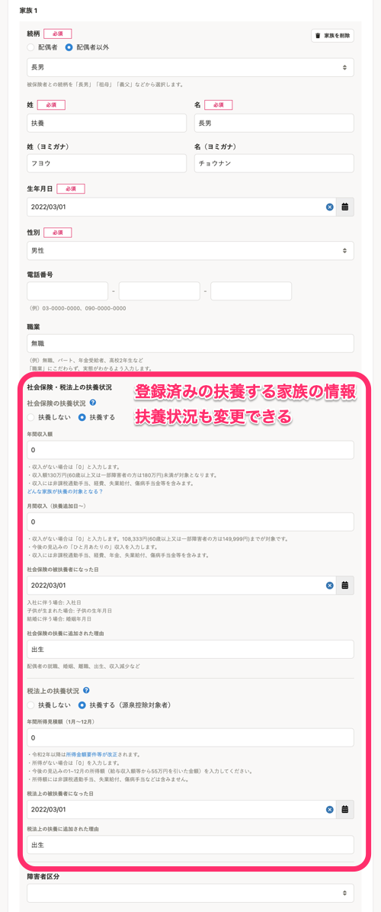
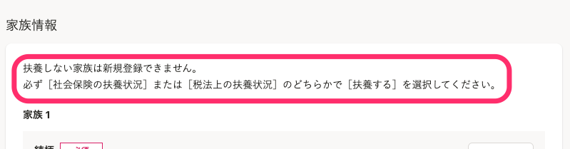
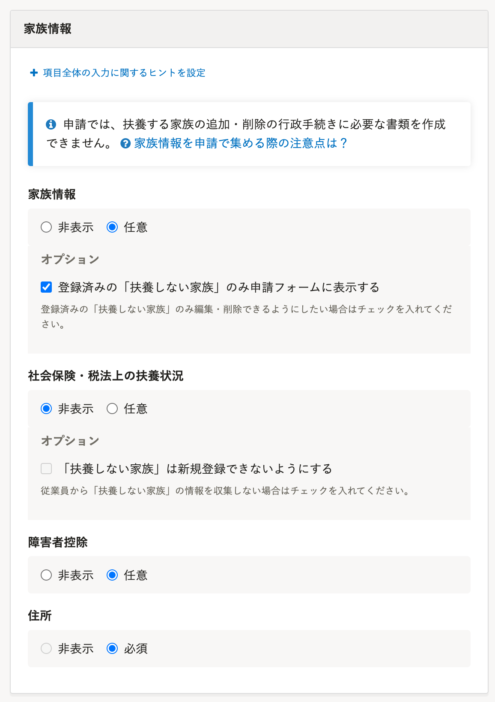
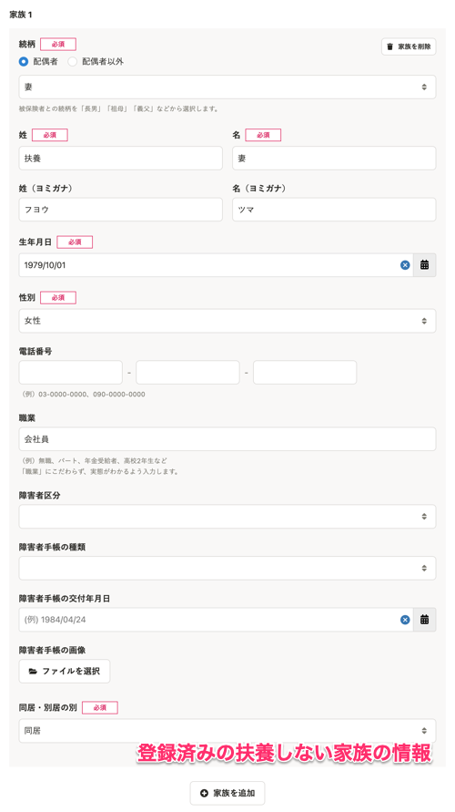
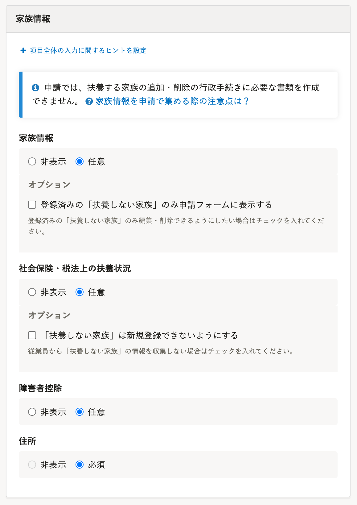

従業員から家族情報を収集する申請フォームの設定例と、各項目の説明を紹介します。

扶養する家族の情報だけ収集したい、扶養状況は収集しないなど、運用によって柔軟に設定できます。

ここでは、下記の3つの例を紹介します。

- 扶養する家族の情報のみ収集する例
- 扶養しない家族の情報のみ収集する例
- 扶養状況に関わらず、すべての家族情報を収集する例

:::tips
税法上の扶養状況が「不明」「配偶者特別控除」の場合は、「扶養しない」家族として扱われます。
[税法上の扶養家族とは](https://knowledge.smarthr.jp/hc/ja/articles/360026107134)
:::

# 扶養する家族の情報のみ収集する例

下記のような場合の設定です。

- SmartHRの手続き機能以外で行政に提出する書類を作成したり、電子申請をしたりしている
- 扶養しない家族の情報は個人情報のため、むやみに収集したくない

:::alert
申請機能には、行政に提出する書類を作成する機能はありません。
書類を作成したり、電子申請したりする場合は、手続き機能を利用してください。
[Q. 家族情報を申請で集める際の注意点は？](https://knowledge.smarthr.jp/hc/ja/articles/5141240383001)
:::

- 家族情報：［任意］
    - オプション：チェックを外す
- 社会保険・税法上の扶養状況：［任意］
    - オプション：チェックを入れる
- 障害者控除：［任意］
- 住所：［必須］

## 申請者ができること

登録済みのすべての家族が表示され、扶養状況を含むすべての情報を編集できます。

また、家族を削除できます。

ただし、扶養しない家族は新規登録できません。

:::tips
この設定の場合は、扶養しない家族の情報は新規登録できない旨が、申請フォームに表示されます。

:::

# 扶養しない家族の情報のみ収集する例

扶養しない家族の情報のみを集めたい場合の設定です。

扶養する家族の情報は、扶養追加・扶養削除の手続きを利用しているが、扶養しない家族の情報も従業員から収集したい場合に利用できます。

- 家族情報：［任意］
    - オプション：チェックを入れる
- 社会保険・税法上の扶養状況：［非表示］
    - オプション：チェックを外す
- 障害者控除：［任意］
- 住所：［必須］

:::tips
扶養状況の欄を非表示にすることで、扶養する家族の情報を収集しないようにするフォームです。
従業員が誤って扶養する家族を追加しないように、ヒントに「扶養しない家族専用のフォームです。扶養する家族はこのフォームでは追加しないでください。」のように注意を促すメッセージを入れることをお勧めします。
:::

## 申請者ができること

登録済みの扶養しない家族の情報が表示され、扶養状況以外の項目を編集できます。

また、家族を削除できます。

扶養する家族の情報は表示されず、新規登録もできません。

# 扶養状況に関わらず、すべての家族情報を収集する例

扶養状況に関わらず、すべての家族情報を収集する場合の設定です。

- 家族情報：［任意］
    - オプション：チェックを外す
- 社会保険・税法上の扶養状況：［任意］
    - オプション：チェックを外す
- 障害者控除：［任意］
- 住所：［必須］

:::tips
登録済みの扶養する家族の扶養状況を変更されたくない場合は、 **［登録済みの「扶養しない家族」のみ申請フォームに表示する］** にチェックを入れます。
:::

## 申請者ができること

登録済みのすべての家族が表示され、扶養状況を含むすべての情報を編集できます。

また、家族を削除できます。

# ［家族情報］の設定項目ごとの説明

家族情報に関する設定項目は、下記のとおりです。

申請者に入力させたくない項目は **［非表示］** に設定します。

-  **［家族情報］** 
    - 申請フォームに家族情報の入力欄を表示するかどうかを選択します。
    -  **［オプション］** にチェックを入れると、社会保険・税法上共に「扶養しない」になっている家族情報のみ、申請フォームに表示されます。
        登録済みの扶養する家族の扶養状況を変更されたくない場合にチェックを入れます。
-  **［社会保険・税法上の扶養状況］** 
    - 申請フォームに扶養状況の入力欄を表示するかどうかを選択します。
    -  **［オプション］** にチェックを入れると、社会保険・税法上共に「扶養しない」になっている家族情報は新規登録できないようになります。
-  **［障害者控除］** 
    - 申請フォームに障害者控除の入力欄を表示するかどうかを選択します。
-  **［住所］** 
    - 申請フォームに住所の入力欄を表示するかどうかを選択します。
    -  **［家族情報］** を **［任意］** にした場合は、自動的に **［必須］** になります。

# 扶養する家族からマイナンバーを収集する

申請機能ではマイナンバーを収集できません。

扶養する家族の追加の申請を承認したあとに、マイナンバー機能で提供依頼をしてください。

なお、扶養しない家族のマイナンバーは収集できません。

:::related
[従業員にマイナンバーの提供を依頼する](https://knowledge.smarthr.jp/hc/ja/articles/360026105214)
:::
