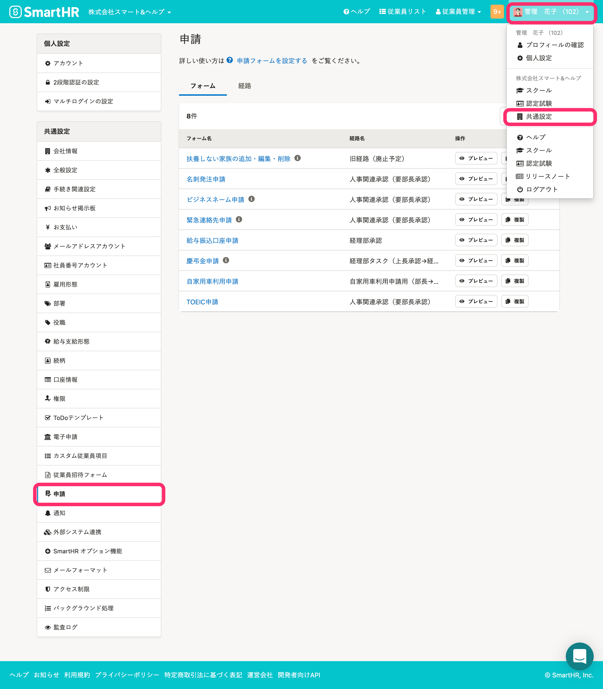
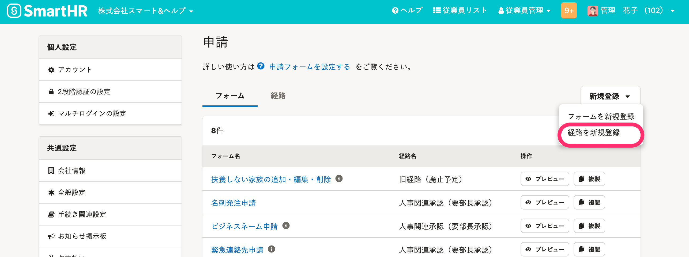
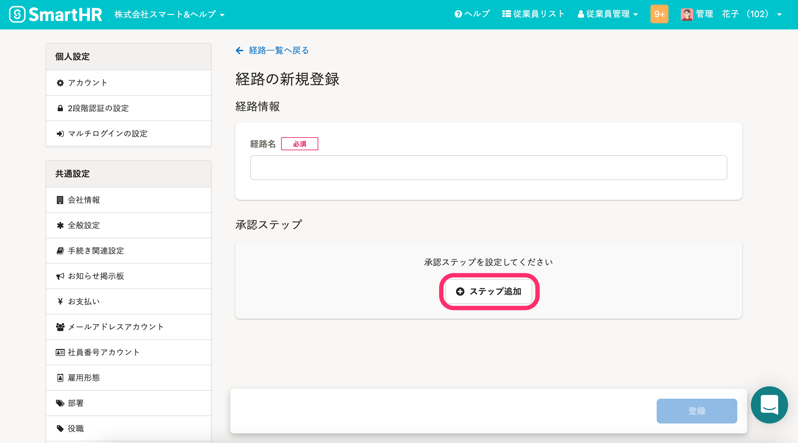
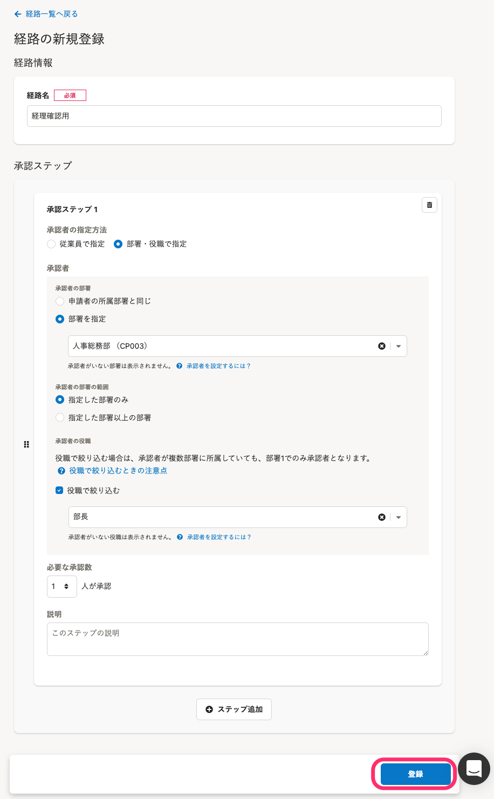
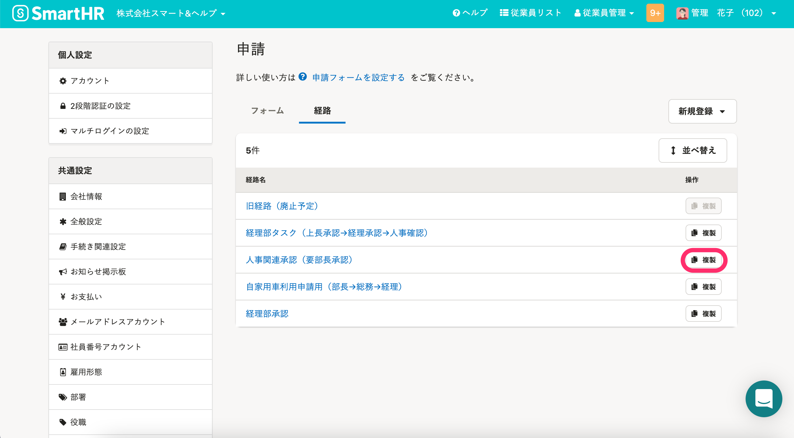
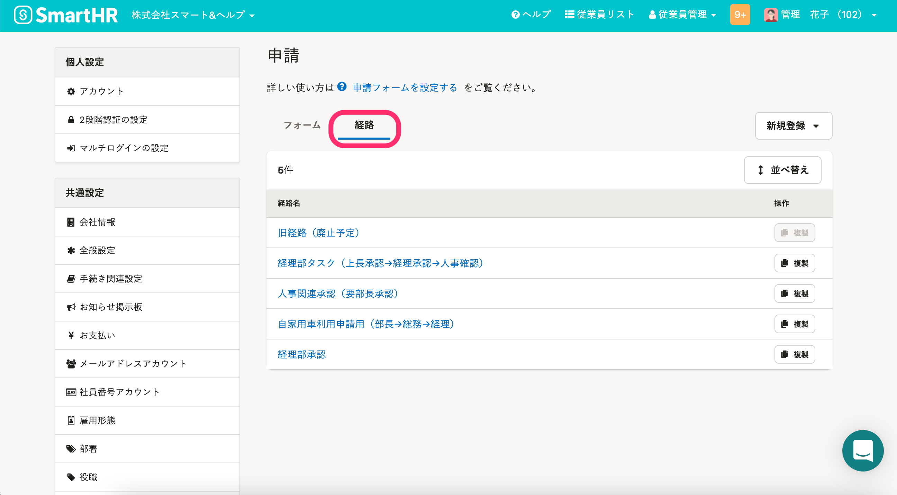
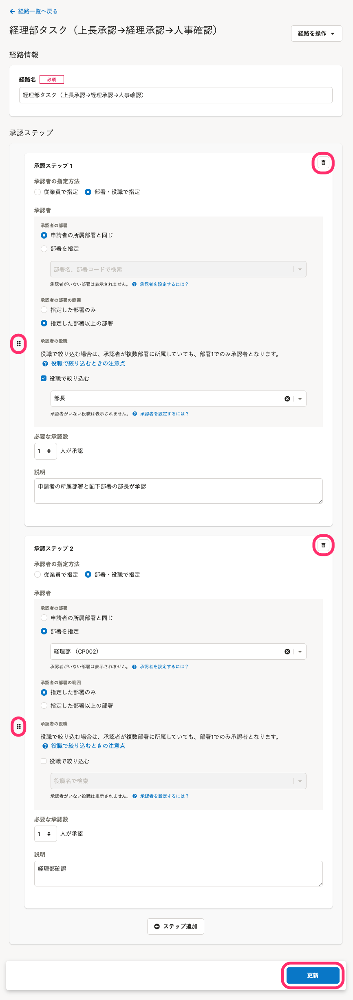
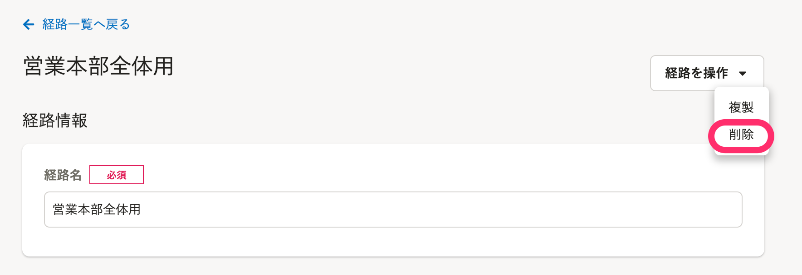
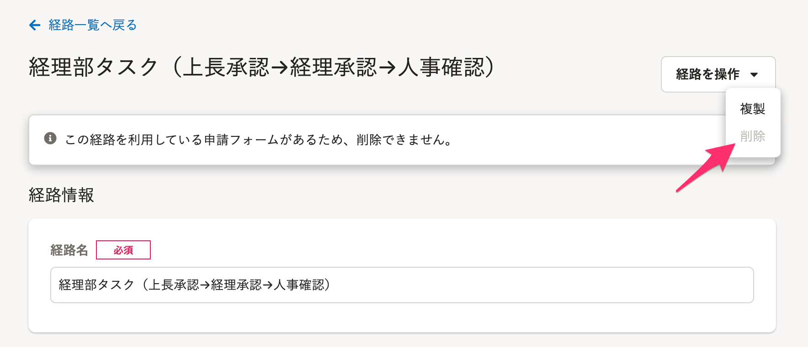

申請に利用する経路の新規登録、編集および削除方法を説明します。

# ［申請］の設定

## 画面右上のアカウント名 >［共通設定］>［申請］をクリック

画面右上の **［アカウント名▼］** をクリックして開くメニューから **［共通設定］** を選び、画面左のリストにある  **［申請］** をクリックすると、 **［申請］** 設定画面へ移動します。

## 承認経路を管理できる権限

### フォームと経路の操作権限を持つカスタム権限も申請設定を操作できます

「管理者」「事務担当者」以外に、 **［申請フォームと経路の作成や削除］** の  **［作成］、［更新］、［削除］** が有効になっているカスタム権限のアカウントも、申請の設定画面を操作できます。

カスタム権限の場合、画面右上の **［アカウント名▼］** をクリックして開くメニューから  **［個人設定］** をクリックすると、画面左のリストにある **［申請］** が表示されます。

:::related
[申請機能を管理者として利用するための権限設定](https://knowledge.smarthr.jp/hc/ja/articles/360026262453)
:::

# 承認経路を新規作成する

## 1.［新規登録］>［経路を新規登録］をクリック

画面右上にある **［新規登録］>**  **［経路を新規登録］** をクリックすると、  **［経路の新規登録］** 画面が表示されます。

## 2.［+ ステップ追加］をクリックし、［承認ステップ］を追加

 **［経路名］** を入力後、 **［承認ステップ］** を追加します。

 **［+ ステップ追加］** をクリックすると、 **［承認ステップ］** の設定画面が表示されます。

## 3\. 承認ステップを設定し、［登録］をクリック

 **［承認ステップ］** では、承認者を指定します。

承認者の指定方法は2つ。

- [従業員で指定](https://knowledge.smarthr.jp/hc/ja/articles/1500002676741)
- [部署と役職で指定](https://knowledge.smarthr.jp/hc/ja/articles/360061287294)

いずれかを選択して、承認者を指定します。

承認者の指定方法は別ページで説明しているので、そちらをご確認ください。

:::related
[承認者を従業員で指定する](https://knowledge.smarthr.jp/hc/ja/articles/1500002676741)
[承認者を部署と役職で指定する](https://knowledge.smarthr.jp/hc/ja/articles/360061287294)
:::

承認ステップは **［承認ステップ1］** から **［承認ステップ10］** まで**最大10ステップ追加でき**、数字の昇順で進んでいきます。

すべての承認ステップの追加を終えたら、 **［登録］** をクリックします。

 **［経路］** 一覧画面に経路が追加されます。

:::tips
### 経路の複製から、新規作成する
 **［経路一覧］** から承認経路をコピーし、新たな経路を作成できます。
作成済みの経路の一部を流用して、経路作成の手間を省略できます。

:::

# 承認経路を編集する

:::alert
承認経路のうち、「旧経路（廃止予定）」は、編集・削除できません。
旧経路（廃止予定）に関する説明はこちらをご確認ください。
[旧経路（廃止予定）はどんな経路ですか？](https://knowledge.smarthr.jp/hc/ja/articles/360055621113)
:::

## 1\. 編集したい経路名をクリック

申請設定画面の **［経路］** タブをクリックすると、登録済みの承認経路一覧が表示されます。

編集したい経路名をクリックして、経路の **［編集］** 画面に移動します。

## 2\. 内容を編集し、［更新する］をクリック

編集画面では以下を変更できます。

- 承認ステップごとの**承認者の指定方法**
    - **承認者**
    - **必要な承認数**
- 承認ステップごとの**説明**
- 経路への**ステップ追加・削除**
- 経路内の**ステップの並び替え**

承認ステップの削除は  をクリック。

承認ステップの並び替えは  をドラッグアンドドロップします。

内容を編集し、 **［更新］** をクリックします。

:::alert
経路の変更内容は、更新後に依頼、申請される分から反映されます。
すでに **［提出待ち］［承認待ち］［差し戻し］** いずれかのステータスの申請に利用中の承認経路は、経路情報を更新しても反映されません。
承認者の異動などで経路を変更する必要が生じた場合には、経路を更新して従業員への申請の依頼からやり直してください。
:::

# 承認経路を削除する

## 1\. 削除する経路名をクリック

申請設定画面の **［経路］** タブをクリックすると、登録済みの承認経路一覧が表示されます。

削除したい経路名をクリックして、経路の編集画面に移動します。

## 2\. 右上の［...］メニュー >［削除］をクリック

画面右上にある **［…］メニュー** の **［削除］** をクリックしてください。

:::alert
フォームに紐付けられている経路は削除できません。
経路を削除する前に、フォームの編集画面で紐付けを解除してください。

:::
