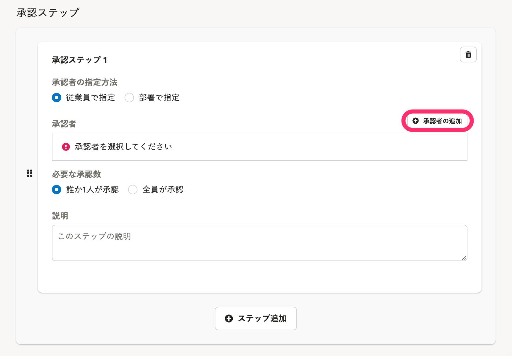
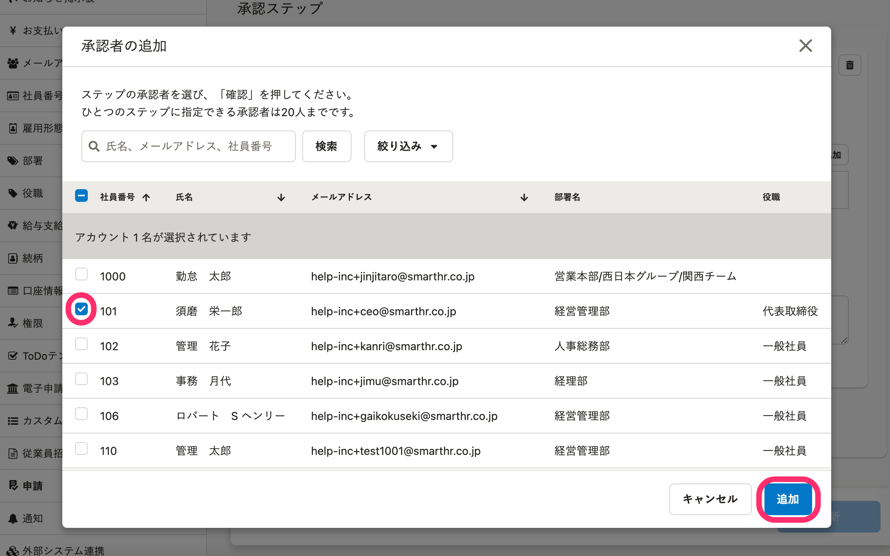
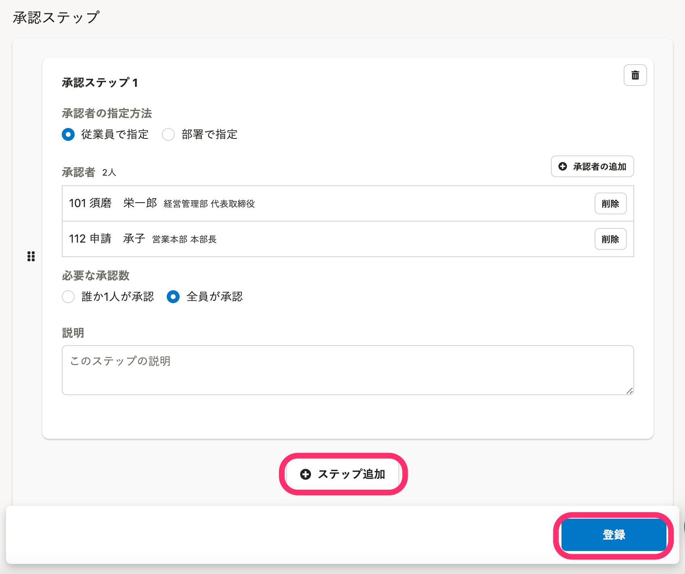

承認経路の新規作成、編集方法は、[承認経路を管理する](https://knowledge.smarthr.jp/hc/ja/articles/360053832734)で説明しています。

ここでは、承認者の指定方法のうちの1つ、**従業員で指定する**場合の設定について説明します。

管理者の場合でも、承認経路に含まれていなければ承認できません。

:::related
[承認者を部署で指定する](https://knowledge.smarthr.jp/hc/ja/articles/360061287294)
:::

# 1\. 承認者の指定方法に［従業員で指定］を選択

経路作成画面で  **［+ ステップ追加］**  をクリックすると、承認ステップの設定画面が表示されます。

承認者の指定方法  **［従業員で指定］**  のラジオボタンを選択します。

**従業員で指定** を選択した場合、設定する項目は、以下の通りです。

| 項目名 | 説明 |
| --- | --- |
| 承認者 |   申請を承認するアカウントを追加します。   |
| 必要な承認数 |   承認ステップを完了するために必要な承認数を選択します。   |
| 説明（任意） | 承認ステップの説明文を記入します。 |

# 2\. ［+ 承認者の追加］をクリック

承認者を指定します。

 **［+ 承認者の追加］**  をクリックして、承認者の追加画面を表示します。

# 3\. 承認者を選択し、［追加］をクリック

承認者の追加画面で、承認者にしたいアカウントを選択し、 **［追加］**  をクリックします。

1つの承認ステップに追加できる承認者は、**最大20人まで**です。

承認者の追加画面には、申請を承認するための権限が付与されているアカウントが表示されます。

:::related
[申請機能を管理者として利用するための権限設定](https://knowledge.smarthr.jp/hc/ja/articles/360026262453)
:::

# 4\. 必要な承認数を設定する

ステップを完了するために **必要な承認数** を選択します。

-  **［誰か1名が承認］**  ：承認ステップに追加された承認者のうち1名が承認をすると、承認ステップが完了します。
-  **［全員が承認］**  ：承認ステップに追加された承認者の全員が承認をすると、承認ステップが完了します。

承認者を従業員で指定する設定は以上です。

経路の新規作成、編集方法は、[承認経路を管理する](https://knowledge.smarthr.jp/hc/ja/articles/360053832734)でご確認ください。
